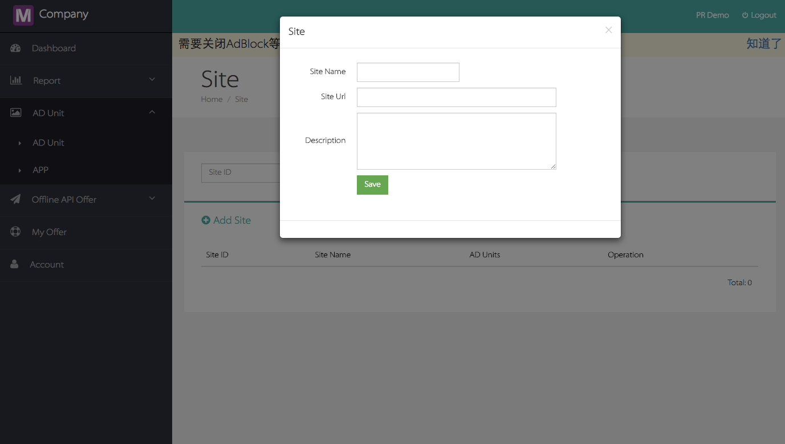
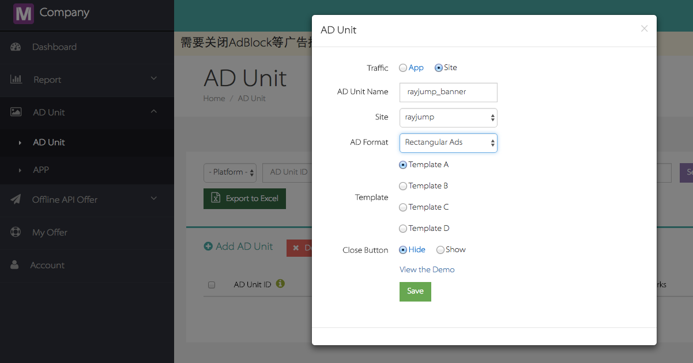
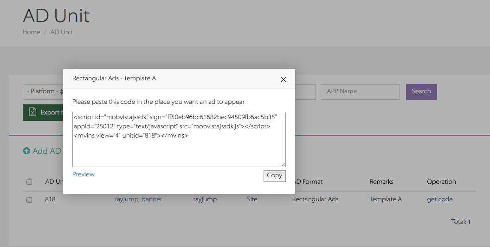

# Vijs H5视频广告SDK集成文档
  
##1 概述
本文档描述了Web开发者如何接入MobVista H5视频SDK产品。  
MobVista H5视频SDK提供了2种集成方式让开发者把广告集成到页面找那个，同时每条广告会以视频以及Endcard两种广告形式来组合，而其中视频广告分激励性和激励性视频。   
##2 集成准备
###2.1 申请账号
开发者从MobVista运营人员获取到账号、密码后，登录[M系统后台](http://mmonetization.com/user/login )
###2.2 新建Site
开发者在后台中，添加一个[Site](http://mmonetization.mobvista.com/app/site)


###2.2 新建AD Unit
在[AD Unit](http://mmonetization.mobvista.com/unit)中添加一个新的广告单元，并选择刚刚新建的site作为所属站点,选择对应的广告模板


###2.3 Get Code
在对应的广告单元选项中，点击**Get Code**获取广告代码

By DOM Tag
此集成方式比较适合咨询类网站，开发者根据具展示的需求来设定展示的触发事件，SDK将会监听当前页面的window对应的事件，事件被触发后，广告将开始展示。如果没有设定展示的事件，广告将在加载完毕后自动触发展示
  

or

By JS Tag
此集成方式比较适合交互型网站，如游戏网站。开发者在注册好广告位后将会获得一个广告对象，当用户需要在特定场景下展示时，只需调用该广告对象的方法即可触发


## 3 初始化SDK
###3.1 植入代码
把 Get Code中获得的代码放置到你的网页中：
```html

    <nav class="b-nav">
        <p>
            <a href="http://touch.m.rayjump.com/leavemsg.php?sid=a05624e45fb72f42e1416b8211cf1560" ontouchstart="">suj</a>
            <a href="http://m.rayjump.com/topics.php?page_id=76&amp;sid=a05624e45fb72f42e1416b8211cf1560" ontouchstart="">帮&nbsp;&nbsp;助</a>
        </p>
    </nav>
    <section class="copyright">
        <p>Copyright MM 2016</p>
    </section>
</footer>
<script src="./rayjump/zepto.min.js"></script>
<script src="./rayjump/underscore.min.js"></script>
<script src="./rayjump/iscroll5.min.js"></script>
<script src="./rayjump/fastclick.min.js"></script>
<script src="./rayjump/mod_countdown.min.js"></script>
<script src="./rayjump/mod_suggest.min.js"></script>
<script src="./rayjump/mdd_index.min.js"></script>
<script src="./rayjump/js_tracker.js"></script>


<!-- copy these code on your web page start -->
<script type="text/javascript" src="http://vijs.rayjump.com/bin/vijs.js" onload="Vijs.init(this);" sign="105d93d991325adfeaf15ed641bdf8f7" appid="31609"></script>

<script type="text/javascript">
 if(window.Vijs) window.myAd11564 = Vijs.setAD({
  'unitid':11564,
  loadedCallback:function(){
   console.log('load success')
  },
  rewardedCallback:function(reward_name,reward_amount){
   console.log(reward_amount);
  }
 });

 function showAd11564(){
  window.myAd11564 && window.myAd11564.show();
 }
</script>
<!-- copy these code on your web page end -->

<button onclick="myAd.showAd11564();">Show AD</button>
</body></html>

```


### 3.2 相关参数
```html
<script type="text/javascript" src="http://vijs.rayjump.com/vijs.js"  
			onload="Vijs.init(this);"
			sign="ff50eb96bc61682bec94509fb6ac5b35" 
			appid="25012" 
			unitid="818" 
			trigger-event-show="myadshow" 
			android_id="aaaaaaaa" 
			imei="5287099835748392" 
			gaid="91571573-38d4-49b1-b754-db375730cf890" ></script>

<script type="text/javascript">
var myAd = Vijs.setAD({
	'unitid':31327,
	loadedCallback:function(unitid){
		console.log('load success')
	},
	rewardedCallback:function(reward_name,reward_amount,unitid){
		console.log(reward_name);
		console.log(reward_amount);
	}
});
</script>

```

 |属性名称|属性作用|  注意事项  |
| ------------- |:-------------:| :--------|
| DOM Tag |  |  |
| src | 保留字段 | 标注SDK的引用路径，请务必保留该字段以及内容，否则SDK将不会运行 |
| onload | 保留字段 | 触发SDK初始化的字段，请务必保留该字段以及内容，否则SDK将不会运行 |
| sign | JSDDK的程序签名 | 通过Get Code获取，一个site对应一个sign |
| appid  | 对应site的id   | 通过Get Code获取，一个site对应一个appid |
| unitid | 广告单元的id | 在新建AD Unit时生成，可以在Get Code中获取 |
| trigger-event-show | 广告触发事件 | 声名该事件后，SDK会监听当前页面的window对象的对应事件，当事件被触发时，广告会触发展示 |
| android_id | 用户设备的安卓id |  此选项非必填，对于有能力获取该信息的开发者可以把对应设备的android id信息输入到该属性中 |
| imei | 设备imei信息 | 此选项非必填，对于有能力获取该信息的开发者可以把对应设备的imei信息输入到该属性中 |
| gaid | 设备gaid信息 | 此选项非必填，对于有能力获取该信息的开发者可以把对应设备的gaid信息输入到该属性中 |
|  |  |  |
| DOM Tag |  |  |
| Vijs.setAD | 广告位注册方法 | 向SDK注册对应的广告位 |
| 输入参数 |  |  |
| unitd | 广告位id |  |
| loadedCallback | 广告加载回调 | 当广告加载成功后，该字段的注册方法将会被回调，并返回对应的广告位id |
| rewardedCallback | 奖励回调 | 当用户完成激励视频的浏览任务后，SDK将触发对应的激励，如果用户设置了服务端回调，SDK将通知服务端去触发回调。当用户希望在程序本身回调，将注册这个字段，SDK将会触发该方法，并返回reward_name,reward_amount,unitid这三个字段来告诉开发者对应奖励所需的信息 |


### 3.3 展示效果
当把Get Code中的代码粘贴到页面中后，运行该页面将如图所示的出现红框所示的广告：


### 3.5 其它说明
同一页面可同时防止多段广告代码，不同的广告单元将在收益报表中分别展示于各自所属的site收入报表内。
 
  
  
## 4 广告类型
当前版本SDK只提供一种广告形式，其展示方式为视频广告+Endcard广告


### 4.1 视频广告-激励性视频
该广告允许开发者鼓励用户去把视频完整看完，从而SDK会触发奖励条件，开发者可以通过服务端以及客户端回调


### 4.2 视频广告-非激励性视频
该类型视频只做一般展示

             
## 5 集成建议  
1.以上广告优先使用在移动端访问的场合  <br/>
2.开发者可以根据自身站点的特性来选择不同的集成方式<br/>
3.原理上同一个页面内，集成多个广告单元能提高广告的展示次数，但过多的广告展示会导致用户反感，因此建议根据页面的实际情况来添加广告 <br/>

## 6 常见问题 

### 6.1 集成问题  
1.能否修改script标签上的属性？  
 答：除了标签上的src、onload属性不能修改以及appid、sign属性用来确认开发者身份以外，其他属性开发者可根据业务需要进行调整修改

 ***
2.为什么不返回广告数据？  
答：  请确保一下情况没有发生：<br/>
a、擅自把get code中的内容修改,导致认证失效<br/>
b、在Mintegral上设定app的平台，与实际投放的平台不符<br/>
c、当前页面展示的广告次数过多，考虑到用户体验，系统可能停止推送广告<br/>
d、触发广告展示的事件没有正确注册或者触发<br/>


### 6.2 广告相关问题  

1.我的集成代码都按要求复制粘贴了，可为什么依然不展示广告  
答：我们的广告为了提高转化率，减少无用展示，引入了自动排重功能。在特定时间内，如果广告被展示超过指定的次数后，SDK将会标记该广告，然后在这段时间内，将不会展示对应广告。而当短时间内，所有的广告都被展示完毕而且次数超过系统约定次数后，将短时间内没有广告返回，然后就不会有广告展示了。  
***

2、服务器返回{"status":-1,"msg":"EXCEPTION_RETURN_EMPTY"}  
答：  
a、可能是没有开通广告源，需要运营开通广告源<br/>
b、运营后台配置有误，需运营配合正确设置  
***  

3、返回的广告为什么有的是中文，但是手机设置是英文？  
答：和语言无关，和网络IP有关  
***

6、 为什么每次返回的广告都是一样的？  
答：Mobvista的广告是以小时级别更新的


## 7 ChangeLog    
**V1.0.0**  
1、实现基本功能。


