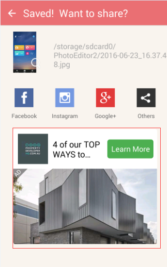
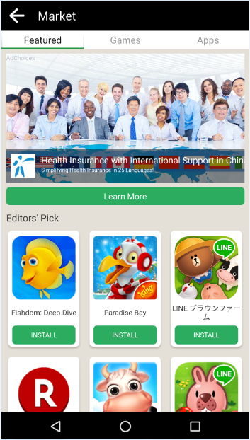

# Android开发文档
  
##1 概述
本文档描述了Android开发者如何集成MobVista SDK产品。  
MobVista SDK提供了三种广告形式，包括：Native(原生广告)、AppWall（广告墙）、Rewarded Video（激励性视频）。   
##2 集成准备
###2.1 申请账号
开发者从MobVista运营人员处获取账号、密码后，登录[M系统后台](http://mmonetization.com/user/login )
###2.2 API Key
开发者每个账号都有对应的API Key，请求广告时需要用到该参数，它可以从M系统后台获取。  
登录M系统后台，在AD Unit -> App界面，可以查看到该账号的API Key，如图所示：  
   
###2.3 App id
开发者每创建一个应用后，系统会自动生成App id，可在AD Unit -> App界面查看到已创建的应用以及对应的App id，如图所示：  

###2.4 Unit id
开发者每创建一个广告位后，系统会自动生成Unit id，可在AD Unit -> AD Unit界面查看到已创建的广告位以及对应的Unit id，如图所示：  


## 3 初始化SDK
### 3.1 将MobVista SDK添加至您的项目
MobvistaSDK可以从Mobvsita运营获取，SDK包含多个jar包  


 |jar包名|jar作用|  是否必须  |
| ------------- |:-------------:| :--------:|
| mobvista_common.jar | 公共基础包 | 是 |
| mobvista_native.jar  | native广告功能包   |   否 |
| mobvista_appwall.jar | appwall广告的功能包 |   否 |
| mobvista_reward.jar | reward广告的功能包 |   否 |
| mobvista_native_ex.jar | 轮播控件的功能包 |   否 |
| mobvista_download.jar | 下载部分的功能包 |   否 |

每种广告形式对应一个jar（common包是公共基础包，是必须要添加的）
如果要实现某种功能，必须要添加对应的jar包。例如要集成的是appwall形式的广告，需要放mobvista_common.jar、mobvista_appwall.jar 以及并列的res文件夹下的资源到项目中。   
**集成有第三方广告源的，请将对应的第三方广告源的jar也放入项目中**
**mobvista SDK仅支持admob SDK的8.1.0版本**
### 3.2 初始化
请将初始化代码请放在在Application中：
```java
      MobVistaSDK sdk = MobVistaSDKFactory.getMobVistaSDK(); Map<String,String> map = sdk.getMVConfigurationMap("APPID","APPKEY"); 
      sdk.init(map, this);
```
### 3.3 AndroidManifest.xml 配置

打开 AndroidManifest.xml，配置以下内容：

**必要权限**
```java
    <uses-permission android:name="android.permission.INTERNET" />
    <uses-permission android:name="android.permission.WRITE_EXTERNAL_STORAGE"/>
```


**非必要权限**
```java
    <uses-permission android:name="android.permission.ACCESS_WIFI_STATE" />
    <uses-permission android:name="android.permission.READ_PHONE_STATE" />
    <uses-permission android:name="android.permission.ACCESS_NETWORK_STATE" />
    <uses-permission android:name="android.permission.ACCESS_COARSE_LOCATION" />
    <uses-permission android:name="android.permission.ACCESS_FINE_LOCATION" />
```
**如果接入admob广告源，请添加以下内容**
```java
      <meta-data  
        android:name="com.google.android.gms.version"
        android:value="@integer/google_play_services_version" />
      <activity android:name="com.google.android.gms.ads.AdActivity"     
         android:configChanges="keyboard|keyboardHidden|
         orientation|screenLayout|uiMode|screenSize|   
         smallestScreenSize"
         android:theme="@android:style/Theme.Translucent" />
```
**如果使用了mobvista_down.jar，请添加以下内容**  
    
```java
       <service android:name="com.mobvista.msdk.shell.MVService" >
        <intent-filter>
            <action android:name="com.mobvista.msdk.download.action" />
        </intent-filter>
       </service>
```
     


### 3.4 代码混淆
如果需要混淆应用代码，可以做如下操作：
```java
    -keepattributes Signature   
    -keepattributes *Annotation*   
    -keep class com.mobvista.** {*; }  
    -keep interface com.mobvista.** {*; }  
    -keep class android.support.v4.** { *; }  
    -dontwarn com.mobvista.**   
    -keep class **.R$* { public static final int mobvista*; }
```
### 3.5 其它说明
如果希望提高初始化速度， 请在init方法调用前将MobVistaConstans.INIT_UA_IN置为false。该方法的使用提高了初始化的速度，但是可能会使请求广告的速度变慢。  
如果需要在native广告被点击的时候，显示loading页，请将MobVistaConstans.NATIVE_SHOW_LOADINGPAGER 置为true。
 
  
  
## 4 原生广告接入
集成后的可能效果  
  
### 4.1 接入流程
**请将mobvista_common.jar mobvista_native.jar以及和jar并列的res文件下的文件复制到相应位置**  
**1、确保SDK已经在Application中初始化成功**  
**2、广告的预加载**  
在正式展示广告之前，提前将广告拉回本地，减少展示广告时的耗时，提升用户体验，提高广告收入
    
```java
     public void preloadNative() {
		MobVistaSDK sdk = MobVistaSDKFactory.getMobVistaSDK();
		Map<String, Object> preloadMap = new HashMap<String, Object>();
		//广告形式 必传
		preloadMap.put(MobVistaConstans.PROPERTIES_LAYOUT_TYPE,
				MobVistaConstans.LAYOUT_NATIVE);
		//FB广告位ID 集成了就传
		preloadMap.put(MobVistaConstans.ID_FACE_BOOK_PLACEMENT,
				"facebook的id");
		//MV 广告位 ID 必传
		preloadMap.put(MobVistaConstans.PROPERTIES_UNIT_ID, "mobvista的unitid");
		//Admob广告位ID 集成了就传
		preloadMap.put(MobVistaConstans.ID_ADMOB_UNITID,
				"admob的unitid");
		//是否预加载图片
		preloadMap.put(MobVistaConstans.PREIMAGE, true)	
        //请求广告条数
		preloadMap.put(MobVistaConstans.PROPERTIES_AD_NUM, 2);	
		//调用预加载
		sdk.preload(preloadMap);
	}
```  

**3、广告加载**  
在要展示广告的时候，调用下面的代码。该方法会优先取本地缓存广告提升广告展示速度，如果没有则会请求服务器拉取广告。同时，会有相关回调在这里调用

    
```java
    public void loadNative() {
	Map<String, Object> properties = MvNativeHandler
			.getNativeProperties(“mobvista的unitid”);
     //设置获取的广告个数，1-10个
	properties.put(MobVistaConstans.PROPERTIES_AD_NUM, 2);
	nativeHandle = new MvNativeHandler(properties, this);  
	nativeHandle.setAdListener(new NativeAdListener() {
		@Override
		public void onAdLoaded(List<Campaign> campaigns, int template) {}
		@Override
		public void onAdLoadError(String message) {}
		@Override
		public void onAdClick(Campaign campaign){}
		@Override
		public void onAdFramesLoaded(final List<Frame> list) {}
	});
	nativeHandle.setTrackingListener(new NativeTrackingListener() {
		@Override
		public void onStartRedirection(Campaign campaign, String url) {}
		@Override
		public void onRedirectionFailed(Campaign campaign, String url) {}
		@Override
		public void onFinishRedirection(Campaign campaign, String url) {}
		@Override
		public void onDownloadStart(Campaign campaign) {}
		@Override
		public void onDownloadFinish(Campaign campaign) {}
		@Override
		public void onDownloadProgress(int progress) {}
		@Override
		public boolean onInterceptDefaultLoadingDialog() {
			return false;
		}
		@Override
		public void onShowLoading(Campaign campaign) {}
		@Override
		public void onDismissLoading(Campaign campaign) {}
	});
		nativeHandle.load();
}
```
**4、拉取后preload**  
在onAdLoaded(List<Campaign> campaigns, int template){}中获取load结果，并调用preload方法  
**5、注册广告**  
在要展示广告的时候，调用 MvNativeHandler 的registerView方法，给广告注册点击事件
**6、回收资源**  
在activity的onDestroy()中调用MvNativeHandler的release方法释放资源。


  
### 4.2 多模板功能  
多模板是native广告的一种子形式，是基于native完成的。
```java   
    nativeHandle.addTemplate(new Template(MobVistaConstans.TEMPLATE_BIG_IMG, 1));
    nativeHandle.addTemplate(new Template(MobVistaConstans.TEMPLATE_MULTIPLE_IMG, 1)); 
``` 
数字1是ad_num，开发者可以自定义  
MobVistaConstans.TEMPLATE_BIG_IMG表示大图模板，MobVistaConstans.TEMPLATE_MULTIPLE_IMG表示多图模板；   
该参数表示该广告位支持的类型，可以同时使用。如果广告位支持两种模板，可以通过NativeAdListener的onAdLoaded(List<Campaign> campaigns, int template)中的temlate参数来判断返回的模板类型   
多模板和native的大部分是一样的。只有以下几个地方需要变动（具体实现可参考的demo中的NativeMultemplateActivity类）：  
  
a、在preload的时候，多模板要添加native_info参数，具体写法如下：  

```java
     List<Template> list = new ArrayList<Template>();
		//支持大图模板，请求一条大图广告，条数可由开发者定义
		list.add(new Template(MobVistaConstans.TEMPLATE_BIG_IMG, 1));
		//支持多图模板，请求3条多图。条数可由开发者定义
		list.add(new Template(MobVistaConstans.TEMPLATE_MULTIPLE_IMG, 3));
		preloadMap.put(MobVistaConstans.NATIVE_INFO,
				MvNativeHandler.getTemplateString(list));
     `  
```
 b、在load的时候，有两个地方需要修改：  
（1）、请求前也需要添加native_info参数，写法如下：  
  
```java
         //支持大图模板，请求一条大图广告（只支持1条）
		nativeHandle.addTemplate(new Template(
				MobVistaConstans.TEMPLATE_BIG_IMG, 1));
		//支持多图模板，请求3条多图。（支持1-10条）
		nativeHandle.addTemplate(new Template(
				MobVistaConstans.TEMPLATE_MULTIPLE_IMG, 3));  
   
```
（2）、在onAdLoaded这个回调方法中需要改成如下结构  

```java
        if (campaigns != null && campaigns.size() > 0) {
	    campaign = campaigns.get(0);
					
		if (campaign.getType() == MobVistaConstans.AD_TYPE_ADMOB){//是admob类型
			//在这里处理admob相关的	
		} else if (campaign.getType() == 7) {//是mytarget类型的广 告
			//在这里处理mytarget相关的
		} else {//是api或者是FB广告
			//针对大图模板做处理
			if (template == MobVistaConstans.TEMPLATE_BIG_IMG) {
				//如果需要使用FB的控件，在这里需要判断                        
                              if(campaign.getType() == 
                                 MobVistaConstans.AD_TYPE_FACEBOOK){
                                 //使用FB的控件，显示FB的广告   
                                 }	
                             }
			//针对多图模板做处理
			if (template == MobVistaConstans.TEMPLATE_MULTIPLE_IMG) {}			
				}
			}  
 
```
### 4.3 轮播控件
  
轮播控件，可以帮助开发者用帧的轮播来展示广告。  
与native广告相比，需要做以下调整：  
**请将mobvista_common.jar mobvista_native.jar mobvista_native_ex.jar以及和jar并列的res文件下的文件复制到相应位置**  
a、添加轮播控件并处理控件相关内容  
 

```java
     <com.mobvista.msdk.mvnativeextensions.rollingbc.
     view.MVNativeRollView
        android:id="@+id/rolling"
        android:layout_width="match_parent"
        android:layout_height="wrap_content"
        android:gravity="center"
         />  
  
```
**获取控件对象、设置控件宽度**  
setFrameWidth(600);  
//如果需要设置每一帧的内部宽度的话，请调用该方法，不调用的话，默认占屏幕宽度的9/10 
 
**给控件对象添加滑动监听方法**  
  
```java
      rbcv.setFilpListening(new FilpListener() {

			@Override
			public void filpEvent(int position) {}
		});`

```
b、在MvNativeHandler对象的map中添加以下语句  
```java
properties.put(MobVistaConstans.PROPERTIES_AD_FRAME_NUM, 3);
```  
其中3表示的是需要的帧数，每一帧的广告数，根据native_info（参考native的基础用法）返回

c、将load和preload方法替换为loadFrame();和preloadFrame(Map<String,Object> ads);  

d、返回广告在onAdFramesLoaded(final List<Frame> list)中，广告处理代码可参考demo：
     
```java    
         @Override
			public void onAdFramesLoaded(final List<Frame> list) {}
  
```

## 5 广告墙接入
集成后的效果：  

### 5.1 接入流程  
**请将mobvista_common.jar mobvista_appwall.jar以及和jar并列的res文件下的文件复制到相应位置**

**1、确保sdk初始化完成** 
**2、预加载墙广告数据**  
在打开appwall之前，在Activity的onResume()中调用该方法，提升打开速度  

```java
     /**
	 * 对appwall做预加载，建议开发者使用，会提高收入
	 */
	public void preloadWall(){
		MobVistaSDK sdk = MobVistaSDKFactory.getMobVistaSDK();
		Map<String,Object> preloadMap = new HashMap<String,Object>();
		preloadMap.put(MobVistaConstans.PROPERTIES_LAYOUT_TYPE, MobVistaConstans.LAYOUT_APPWALL);
		preloadMap.put(MobVistaConstans.PROPERTIES_UNIT_ID, "unitid");
		sdk.preload(preloadMap);
	}
      
```

**3 墙加载广告**  
调用该方法，设置入口。用户点击入口就会进入appwall
  
```java  
      public void loadHandler(){
		Map<String,Object> properties = MvWallHandler.getWallProperties("mobvista的unitid");		
		properties.put(MobVistaConstans.PROPERTIES_WALL_STATUS_COLOR, R.color.mobvista_green);
		properties.put(MobVistaConstans.PROPERTIES_WALL_NAVIGATION_COLOR,  R.color.mobvista_green); 
		properties.put(MobVistaConstans.PROPERTIES_WALL_TITLE_BACKGROUND_COLOR, R.color.mobvista_green);
		mvHandler = new MvWallHandler(properties, this, nat);//nat为点击事件的vg，请确保改vg的点击事件不被拦截
		//customer entry layout begin 该部分代码可以不用
		View view = getLayoutInflater().inflate(R.layout.customer_entry, null);
		view.findViewById(R.id.imageview).setTag(MobVistaConstans.WALL_ENTRY_ID_IMAGEVIEW_IMAGE);
		view.findViewById(R.id.newtip_area).setTag(MobVistaConstans.WALL_ENTRY_ID_VIEWGROUP_NEWTIP);
		mvHandler.setHandlerCustomerLayout(view);
		//customer entry layout end */
		mvHandler.load();
	}
 
```     
 **4 AndroidManifest.xml添加以下内容**  
    如果集成AppWall 请引入以下Activity  
    
```java
    <!-- 如果墙需要集成沉浸式 请加一个theme -->
    <activity            android:name="com.mobvista.msdk.shell.MVActivity"
        android:configChanges="keyboard|orientation"
        android:screenOrientation="portrait"
        android:theme="@style/AppTheme2" >
        <intent-filter>
            <action android:name="android.intent.action.CREATE_SHORTCUT" />
            <category android:name="android.intent.category.DEFAULT" />
        </intent-filter>
    </activity>
    <!--如果配置墙沉浸式，请在res/values/style文件中添加以下样式-->  
    <style name="AppTheme2" parent="AppBaseTheme">
    <item name="android:windowNoTitle">true</item>
    <item name="android:windowTranslucentStatus">true</item>
    <item name="android:windowTranslucentNavigation">true</item></style>
```
### 5.2通过intent打开appwall
  
如果有自定义需求可以在intent的extra中按照传递unitid的方式传递过去
   
```java 
     /**
	 * 通过intent打开appwall
	 */
	public void openWall(){
		try {
			Map<String, Object> properties = MvWallHandler.getWallProperties("unitId");
			MvWallHandler mvHandler = new MvWallHandler(properties, HandlerActivity.this);
			mvHandler.startWall();
		} catch (Exception e) {
			Log.e("MVActivity", "", e);
		}
	}
```
## 6 激励性视频接入
### 6.1 接入流程  
**请将mobvista_common.jar mobvista_reward.jar以及和jar并列的res文件下的文件复制到相应位置**

**1、确保完成SDK初始化，并且将对应的mobvista的jar和集成的视频第三方的jar及相对应的res放入项目中**  

**2、请将图片资源放在res/drawable-hdpi中
**3、请在AndroidManifest.xml文件声明MVSDK激励性视频的Activity**
``` 
    <activity
    android:name="com.mobvista.msdk.reward.player.MVRewardVideoActivity"
    android:screenOrientation="landscape"
    android:theme="@android:style/Theme.NoTitleBar.Fullscreen" />
```


**如果集成applovin** 

- 请填写applovin的key  
    
    ```
      <meta-data
            android:name="applovin.sdk.key"
            android:value="你应用在applovin申请的key" />
    ```
-  添加applovin需要声明的Activity
     ```  <activity android:name="com.applovin.adview.AppLovinInterstitialActivity" />
        <activity android:name="com.applovin.adview.AppLovinConfirmationActivity" />```

**如果集成nativeX**  
     ```
    <activity
    android:name="com.google.android.gms.ads.AdActivity"
    android:configChanges="keyboard|keyboardHidden|orientation|screenLayout|uiMode|smallestScreenSize|screenSize"
    android:theme="@android:style/Theme.Translucent" />
    <activity
    android:name="com.nativex.monetization.activities.InterstitialActivity"
    android:configChanges="orientation|screenSize"
    android:hardwareAccelerated="true"
    android:theme="@android:style/Theme.Translucent.NoTitleBar.Fullscreen" />
    <activity
    android:name="com.nativex.videoplayer.VideoActivity"
    android:configChanges="orientation|screenSize" />
    ```
     
**4、创建MVRewardVideoHandler的对象**  
   
```java 
      mMvRewardVideoHandler = new MVRewardVideoHandler(this, "unitid");  

```
**4、给MVRewardVideoHandler对象设置回调**  


```java
         mMvRewardVideoHandler.setRewardVideoListener(new RewardVideoListener() {

			@Override
			public void onVideoLoadSuccess() {
				Log.e(TAG, "onVideoLoadSuccess");
			}

			@Override
			public void onVideoLoadFail() {
				Log.e(TAG, "onVideoLoadFail");
			}

			@Override
			public void onShowFail(String errorMsg) {
				Log.e(TAG, "onShowFail=" + errorMsg);
			}


			@Override
			public void onAdShow() {
				Log.e(TAG, "onAdShow");
			}

			@Override
			public void onAdClose(boolean isCompleteView, String RewardName,
					float RewardAmout) {
				Log.e(TAG, "reward info :" + "RewardName:" + RewardName
						+ "RewardAmout:" + RewardAmout);
				showDialog(RewardName, RewardAmout);
			}
 
           @Override
			public void onVideoAdClicked(String unitId) {
				Log.e(TAG, "onVideoAdClicked");
			}

		});

```
**5、调用MvRewardVideoHandler对象的load方法**


```java
     mMvRewardVideoHandler.load();

```
**6、在播放之前，判断视频是否ready，如果true，则播放，否则再次load。**  

**7、调用clearVideoCache可以清除视频缓存数据。** 

```java
      if (mMvRewardVideoHandler.isReady()) {
				mMvRewardVideoHandler.show("rewardid");
			}else{
				mMvRewardVideoHandler.load();
			}
```


             
## 7 集成建议  
1.在Application中初始化SDK  
2.在load成功后的onAdLoaded中进行preload,保证广告的展示速度,这样才能获取更好的收益  
3.register时一定要对ViewGroup，不要只对Button,保证广告的可点击区域，这个和收益挂很大挂钩  
4.广告展示布局的CTA按钮可以用TextView,如果用Button会拦截事件  
5.一个广告位对应一个MvNativeHandler,保证每个广告位的唯一性  
6.在APP首页进行墙的预加载  
7.如果想监听墙入口的事件，可以在墙入口ViewGroup设置onTouch事件

## 8 常见问题 

### 8.1 集成问题  
1.为什么没有展示FB的广告？  
 答：FB广告的广告展示必要的4个条件：  
a.手机安装FB客户端  
b.FB客户端是否登录成功  
c.是否成功翻墙  
d.libs中是否放有FBSDK.jar 
 ***
2.使用最新版FBSDK为什么register时会崩溃？  
答：  
a、请在libs中加一个android-support-v7-recyclerview.jar；  
b、请在libs中加一个android-support-v4.jar  
***  
3、 如果不集成admob或者myTarget还需要传入它们的unitId吗？  
答：不需要  
***
4、 如果是多渠道打包，获取不到资源怎么办？
答：SDK初始化Map中添加
```java
    map.put(MobVistaConstans.PACKAGE_NAME_MANIFEST, "AndroidManifest的package的值");
```


### 8.2 广告相关问题  

1.服务器返回content = {"status":-1203,"msg":"EXCEPTION_UNIT_NOT_FOUND_IN_APP, unitId: xxx"}  
答：load传入的unitId与appid不匹配  
***
2、服务器返回{"status":-1,"msg":"EXCEPTION_RETURN_EMPTY"}  
答：  
a、可能是没有开通广告源，需要运营开通广告源
b、运营后台配置有误，需运营配合正确设置  
***  
3、返回的广告为什么有的是中文，但是手机设置是英文？  
答：和语言无关，和网络IP有关  
***
4、为什么广告第一次跳转很慢？  
答：广告会经过多层302跳转，拿到最终链接进行跳转，NativeHandler可以接收到广告的跳转的结束，开发者可以在这个时间段设置Loadding对话框  
***
5、如何区分campaign的广告源  
答：type是该campaign属于哪个广告源
1为MVAPI
3为FB
6为Admob
7为myTarget  
***
6、 为什么每次返回的广告都是一样的？  
答：Mobvista的广告是以小时级别刷新的


## 9 API
### MobivstaSDK  ###

#### 类介绍 ####
> 用于执行SDK的初始化和预加载的操作

####  成员方法  ####
<table><tr><td bgcolor=#DCDCDC>public Map <font color=#00000 face="微软雅黑" size =4>getMVConfigurationMap</font>(String appId,String appKey)</td></tr></table>
> **用户生成一个带有AppId和AppKey的Map对象,用于传入init的Map参数**

**Parameters**

**appId** M系统后台的AppId

**appKey** M系统生成的AppKey

**Returns**

**返回一个带有appId和appKey的Map对象**

<table><tr><td bgcolor=#DCDCDC>public void <font color=#00000 face="微软雅黑" size =4>init</font>(Map map,Context context)</td></tr></table>
> **对SDK进行初始化操作**

**Parameters**

**Map** 带有appId和appkey的Map对象

**Context** 建议在Application中进行初始化，传入Application的上下文


<table><tr><td bgcolor=#DCDCDC>public void <font color=#00000 face="微软雅黑" size =4>preload</font>(Map map)</td></tr></table>
> **用于预加载native和appWall的数据**

**Parameters**

**Map** 带有appId和appkey的Map对象


### MvNativeHandler ###

#### 类介绍 ####
> 用于加载native广告，监听广告请求的回调，监听广告跳转的过程。  
***

#### 构造方法 ####
> public **MvNativeHandler**(Map map,Context context)
> 传入一个带有广告形式为native和unitId的Map，传入当前界面的context  
***

####  成员方法  ####
<table><tr><td bgcolor=#DCDCDC>public static Map <font color=#00000 face="微软雅黑" size =4>getNativeProperties</font>(String unitId)</td></tr></table>
> **用于生成一个带有unitId广告形式为native的Map，用于创建MvNativeHandler**

**Parameters**

**unitId** M系统后台的生成的广告位Id,用于标记广告位置

**Returns** 带有unitId和广告形式为native的Map  
***


<table><tr><td bgcolor=#DCDCDC>public boolean <font color=#00000 face="微软雅黑" size =4>load</font>()</td></tr></table>
> **用于加载native广告**

  **Parameters**  
无  
***
<table><tr><td bgcolor=#DCDCDC>public boolean <font color=#00000 face="微软雅黑" size =4>loadFrame</font>()</td></tr></table>
> **用于加载Frame广告**

  **Parameters**  
无  
***
<table><tr><td bgcolor=#DCDCDC>public void <font color=#00000 face="微软雅黑" size =4>registerView</font>(View view, Campaign campaign)</td></tr></table>
> **用于将view和campaign绑定到一起**

  **Parameters**  
**view** 广告的点击view，点击view，开始跳转到广告地址  
**campaign**  广告对象
***
  
<table><tr><td bgcolor=#DCDCDC>public void <font color=#00000 face="微软雅黑" size =4>registerView</font>(View view,List<View> views, Campaign campaign)</td></tr></table>
> **用于将view及views和campaign绑定到一起**

  **Parameters**  
**view** 广告的点击view，点击view，开始跳转到广告地址   
**views** 需要绑定到广告的所有view组成的list 
**campaign**  广告对象
***


<table><tr><td bgcolor=#DCDCDC>public void <font color=#00000 face="微软雅黑" size =4>release</font>()</td></tr></table>
> **用于释放占用的资源**

  **Parameters**  
无
***

  
<table><tr><td bgcolor=#DCDCDC>public void <font color=#00000 face="微软雅黑" size =4>setAdListener</font>(NativeAdListener adListener)</td></tr></table>
> **用于设置NativeAdListener**

  **Parameters**  
**adListener**  获取广告的结果监听

**simple**  


```java
       /**
       *native广告加载成功的回调方法，
       *campaigns 广告list
       *template 本次返回到广告的多模板类型
       *建议先判断 template 的值，区别广告模板（mobvista的有大图和多图两种模式，第三方广告源都是大图模式），如果需要可以在大图模式中区别广告源
       */
    	public void onAdLoaded(List<Campaign> campaigns, int template);

       /**
       *请求失败的时候回调，
       *message 返回的错误信息
       */
		public void onAdLoadError(String message);

        /**
       *广告被点击的时候回调，
       *campaign 被点击的广告
       */
		public void onAdClick(Campaign campaign);
  
        /**
       *native中的Frame广告加载成功的回调，
       *list frame广告的list
       */
		public void onAdFramesLoaded(List<Frame> list);
```
***


<table><tr><td bgcolor=#DCDCDC>public void <font color=#00000 face="微软雅黑" size =4>setTrackingListener</font>(NativeTrackingListener trackingListener)</td></tr></table>
> **用于设置点击广告后的事件监听（只对mobvista广告有效）**

  **Parameters**  
**trackingListener** 用户点击广告之后的各类事件的监听  
**simple**  
  

```java  
        /**
	     * 是否拦截默认的loading页
	     * 
	     */
	    public boolean onInterceptDefaultLoadingDialog();

        /**
	     *显示loading页 
         *campaign 在跳转的campaign
	     */
	    public void onShowLoading(Campaign campaign);

        /**
	     * 隐藏loading页
	     * campaign 在跳转的campaign
	     */
	    public void onDismissLoading(Campaign campaign);

		/**
	     * 开始跳转
	     * campaign 在跳转的campaign
	     * url 跳转地址
	     */
		public void onStartRedirection(Campaign campaign, String url);

        /**
	     * 结束跳转
	     * campaign 在跳转的campaign
	     * url 跳转地址
	     */
		public void onFinishRedirection(Campaign campaign, String url);


       /**
	     * 跳转失败
	     * campaign 在跳转的campaign
	     * url 跳转地址
	     */
		public void onRedirectionFailed(Campaign campaign, String url);

        /**
	     * 开始下载
	     * campaign 在下载的campaign
	     */
		public void onDownloadStart(Campaign campaign);

        /**
	     * 下载完成
	     * campaign 在下载的campaign
	     */
		public void onDownloadFinish(Campaign campaign);
		/**
		 * 回传下载的百分比
		 * progress 下载的进度
		 */
		public void onDownloadProgress(int progress);
```
***


<table><tr><td bgcolor=#DCDCDC>public void <font color=#00000 face="微软雅黑" size =4>setMustBrowser</font>(boolean isMustBrowser)</td></tr></table>
> **用于设置如果需要打开网页的时候，是否必须使用浏览器打开**

**Parameters**

**isMustBrowser** true表示必须用浏览器打开网页
***


<table><tr><td bgcolor=#DCDCDC>public static Map <font color=#00000 face="微软雅黑" size =4>addTemplate</font>(Template template)</td></tr></table>
> **用于添加模板信息**

**Parameters**

**Template** 多模板对象
***

###MvWallHandler###
***

####类介绍####
>appwall的管理类
***
####类构造####
> public **MvWallHandler** (Map<String, Object> properties, Context context,ViewGroup container)

> **用于构造MvWallHandler对象**

**Parameters**

**properties** 传入的参数，墙需要用到的各种值*   
**context** 上下文  
**container** appwall入口的ViewGroup,SDK将监听他的点击事件来出发打开appwall的事件
  
*可能用到的参数
  
|参数名(Key)|	值(Value)	|参数描述|
|:---------:|:--------------:|:-------:|
|PROPERTIES_WALL_TITLE_LOGO|	Bitmap	|自定义Title Logo图片|
|PROPERTIES_WALL_TITLE_BACKGROUND	|Bitmap|	自定义墙Title背景图片|
|PROPERTIES_WALL_TITLE_LOGO_ID	|Res id	|自定义Title Logo图片|
|PROPERTIES_WALL_TITLE_BACKGROUND_ID	|Res id	|自定义墙Title 背景图片|
|PROPERTIES_WALL_TITLE_BACKGROUND_COLOR	|Res id|	自定义墙Title 背景颜色|
|PROPERTIES_WALL_MAIN_BACKGROUND_ID	|Res id	|墙界面主背景颜色|
|PROPERTIES_WALL_TAB_BACKGROUND_ID	|Res id	|Tab背景颜色|
|PROPERTIES_WALL_TAB_INDICATE_LINE_BACKGROUND_ID	|Res id	|指示器背景颜色|
|PROPERTIES_WALL_BUTTON_BACKGROUND_ID	|Res id	|广告Button样式|
|PROPERTIES_WALL_STATUS_COLOR	|Res id|	沉浸式状态栏颜色|
|PROPERTIES_WALL_NAVIGATION_COLOR	|Res id|	沉浸式导航栏颜色|
***

####类方法####
<table><tr><td bgcolor=#DCDCDC>public static Map<String, Object> <font color=#00000 face="微软雅黑" size=4>getWallProperties</font>(String unitId)</td></tr></table>
> **用于获取一个包含unitId的Layout_Type类型为AppWALL的Map**

**Parameters**

**unitId** 传入的mobvista unitid  

***
<table><tr><td bgcolor=#DCDCDC>public void <font color=#00000 face="微软雅黑" size=4>setHandlerCustomerLayout</font>(View handlerCustomerLayout)</td></tr></table>
> **用于设置开发者自定义的墙入口**

**Parameters**

**handlerCustomerLayout** 用户传入的自定义的appwall入口  

***
 <table><tr><td bgcolor=#DCDCDC>public boolean <font color=#00000 face="微软雅黑" size=4>load</font>()</td></tr></table>
> **用于拉取appwall广告**

**Parameters**

**无**  

***

<table><tr><td bgcolor=#DCDCDC>public boolean <font color=#00000 face="微软雅黑" size=4>release</font>()</td></tr></table>
> **用于释放资源**

**Parameters**

**无**  

***


### MVRewardVideoHandler ###

#### 类介绍 ####
> 用于加载激励性视频广告

#### 构造方法 ####
> public **MvNativeHandler**(Context context,String unitId)
> 
> **传入当前Activity的Context,传入广告位Id**

####  成员方法  ####
<table><tr><td bgcolor=#DCDCDC>public void <font color=#00000 face="微软雅黑" size =4> Load（）</font></td></tr></table>
> **用于预加载激励性视频**  

**Parameters**

**无**  

***

<table><tr><td bgcolor=#DCDCDC>public boolean <font color=#00000 face="微软雅黑" size =4> isReady()</font></td></tr></table>
> **视频是否准备好播放**

**Parameters**

**无**  

**Returns** 返回true表示可以播放
***
**返回true代表有视频已准备好播放，返回false视频没有准备好播放**


<table><tr><td bgcolor=#DCDCDC>public void <font color=#00000 face="微软雅黑" size =4> show(String rewardId)</font></td></tr></table>
> **播放视频**
 
**Parameters**  

**rewardId** 激励ID，对应M系统后台配置的奖励信息
***
<table><tr><td bgcolor=#DCDCDC>public void <font color=#00000 face="微软雅黑" size =4> setRewardVideoListener</font>(RewardVideoListener listener)</td></tr></table>
> **播放视频**
 
**Parameters**  

**listener** 监听与视频广告有关的状态

**simple**

```java

    /**
	 * 当视频加载成功时
	 */
	public void onVideoLoadSuccess();
	/**
	 * 当视频下载失败后回调
	 */
	public void onVideoLoadFail();
	/**
	 * 当广告显示时回调
	 */
	public void onAdShow();
	/**
	 * 当广告关闭时回调
	 */
	public void onAdClose(boolean isCompleteView, String RewardName, float RewardAmout);
	/**
	 * 当视频播放错误时回调
	 */
	public void onShowFail(String errorMsg);
```
***

### Campaign ###

#### 类介绍 ####
> 广告的bean

#### 成员变量 ####

**TYPE_ICON** 加载的小图  
**TYPE_BIG** 加载的大图  
**id** 广告的id  
**packageName** 包名  
**appName** 应用名称  
**appDesc** app描述  
**size** app包大小  
**iconUrl** icon的url  
**imageUrl** 大图的url  
**rating** 星级（可能为空）  
**adCall** 按钮的显示内容（可能为空，如果为空可设置为install）  
**type** 广告源  
**subType** admob的子类型  
**iconDrawable** 提前下载的icon（需打开预下载方法）  
**bigDrawable** 提前下载的大图（需打开预下载方法）
***

### MobVistaConstans ###

#### 类介绍 ####
> 全局常量

#### 成员变量 ####

**ID_FACE_BOOK_PLACEMENT** facebook id的key  
**ID_MOBVISTA_APPID** mobvista appid 的key  
**ID_MOBVISTA_APPKEY** mobvista appkey 的key  
**ID_ADMOB_UNITID** admob unit 的key  
**ID_MY_TARGET_AD_UNITID** mytarget unitid 的key  
**LAYOUT_NATIVE** 请求的广告类型  native  
**LAYOUT_APPWALL** 请求的广告类型 appwall  
**PROPERTIES_UNIT_ID**  mobvista unitid  
**PROPERTIES_AD_NUM** 请求广告的数量  
**PROPERTIES_AD_FRAME_NUM** 请求帧的数量
**PROPERTIES_WALL_ENTRY** appwall入口的key  
**PROPERTIES_WALL_TITLE_BACKGROUND** appwall title的背景的key  
**PROPERTIES_WALL_TITLE_LOGO** appwall title的logo  
**PROPERTIES_WALL_TITLE_BACKGROUND_ID** appwall title 的背景图的id的key  
**PROPERTIES_WALL_TITLE_LOGO_ID** appwall title 的logo图的id的key  
**PROPERTIES_WALL_MAIN_BACKGROUND_ID** appwall 大背景图的id的key  
**PROPERTIES_WALL_TAB_BACKGROUND_ID** appwall tab 背景图id的key  
**PROPERTIES_WALL_BUTTON_BACKGROUND_ID** appwall中按钮的背景id的key  
**PROPERTIES_WALL_LOAD_ID** 
**PROPERTIES_WALL_TAB_INDICATE_LINE_BACKGROUND_ID** appwall中tab的下划线的背景的id的key  
**PROPERTIES_API_REUQEST_CATEGORY** 广告类型  
**API_REUQEST_CATEGORY_GAME** 广告类型中的游戏  
**API_REUQEST_CATEGORY_APP** 广告类型中的所有app
**WALL_ENTRY_ID_IMAGEVIEW_IMAGE** appwall入口的大图  
**WALL_ENTRY_ID_VIEWGROUP_NEWTIP** appwall入口更新的小点  
**TEMPLATE_BIG_IMG** 大图模式
**TEMPLATE_MULTIPLE_IMG** 多图模式  
**NATIVE_INFO** 多模板的key
**AD_TYPE_MV** 广告源是mobvista  
**AD_TYPE_FACEBOOK** 广告源是facebook  
**AD_TYPE_MYOFFER** 广告源是mobvista的myoffer  
**AD_TYPE_ADMOB** 广告源是admob   
**PREIMAGE** 是否预加载广告的key
**INIT_UA_IN** 如果不希望在初始化的时候，初始化ua，则将其置为false  
**CUSTOMER_HANDLE_CLICK** 针对lbe做的，控制是否要将结果处理权给开发者  
**NATIVE_SHOW_LOADINGPAGER** 是否展示loading页
**PACKAGE_NAME_MANIFEST** Android studio 多渠道打包需要传入的application id  
**PROPERTIES_WALL_STATUS_COLOR**   appwall中状态栏颜色的id
**PROPERTIES_WALL_NAVIGATION_COLOR**  appwall中导航栏颜色的id  
**PROPERTIES_WALL_TITLE_BACKGROUND_COLOR** appwall title的背景颜色  
**FB_MEDIA_CACHE_FLAG** 是否缓存facebook的视频广告


## 10 ChangeLog  
**V7.6.0**  
1、支持激励性视频；  
2、部分功能优化。
***
**V7.5.0**  
1、广告请求速度优化；  
2、缓存读取逻辑优化；
***
**V7.4.0**  
1、支持Native广告轮播；  
2、展示统计上报优化；  
3、支持广告图片提前下载。
***
**V7.3.0**  
1、支持多模板功能；  
2、聚合Mytarget广告源；  
3、支持墙内顶部大卡图广告轮播；  
4、Android 4.4机型应用墙支持沉浸式效果；  
5、修复已知Bug及性能优化。  
***
**V7.2.0**  
1、聚合Admob广告源；  
2、SDK性能优化。  
***
**V7.1.0**  
1、增加广告墙样式。
***  
**V7.0.0**  
1、实现基本功能。  


