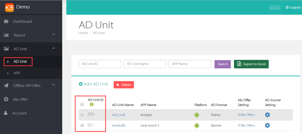

# iOS开发文档

**Mobvista MVSDK M**
    
## 1	MVSDK功能简介
1. Native接入形式，即通过MVSDK的接口获取数据并且由开发者自行选择如何显示广告。
2. Appwall接入形式，开发者不用关心如何展示广告，只需要提供Appwall的入口，点击之后直接进入广告墙的展示。
3. RewardVideo接入形式，为开发者提供视频广告的功能。
4. 聚合Facebook的Native广告。
5. 聚合AppLovin视频广告，NativeX视频广告。
6. RewardVideo接入形式，提供激励性的视频展示，会全屏展示视频广告，在播放结束后通知开发者奖励的内容。
7. **SDK最低支持iOS 7**
8. 经测试，植入我们MVSDK包大概增加1MB左右的大小。同时植入FBAudienceNetwork SDK和我们MVSDK，包大概增加1.7MB左右的大小。
9. 经测试，植入AppLovin SDK和我们MVSDK，包大概增加1.4MB左右的大小,同时植入NativeX SDK和我们MVSDK，包大概增加1.4MB左右的大小。


## 2 接入前的准备

### 2.1 申请账号

**1、申请账号**<br/><br/>
开发者从MobVista运营人员处获取到账号、密码后，登录M系统后台。(http://mmonetization.com/user/login)

**2、API Key**<br/><br/>
开发者每个账号都有对应的API Key，请求广告时需要用到该参数，它可以从M系统后台获取。 登录M系统后台，在AD Unit -> App界面，可以查看到该账号的API Key，如图所示：<br/>


**3、APP ID**<br/><br/>
开发者每创建一个应用后，系统会自动生成App id，可在AD Unit -> App界面查看到已创建的应用以及对应的App ID，如图所示：<br/>

 
 **4、Unit ID**<br/><br/>
 开发者每创建一个广告位后，系统会自动生成Unit ID，可在AD Unit -> AD Unit界面查看到已创建的广告位以及对应的Unit ID，如图所示：<br/>


### 2.2 导入MVSDK.framework到项目工程中

### 2.3 MVSDK分包集成

**说明：** 1.4.0及其以上版本，我们把一个总的framework拆分成多个小的framework，使集成更加灵活。如果只集成native形式的广告，只需要导入MVSDK.framework即可，大概增加**825KB**左右的大小；如果只集成appwall形式的广告，则需要导入MVSDK.framework和MVSDKAppWall.framework，大概增加**1.2MB**左右的大小；如果只集成激励性视频形式的广告，则需要导入MVSDK.framework和MVSDKReward.framework，大概增加**962KB**左右的大小；如果只集成OfferWall形式的广告，则需要导入MVSDK.framework和MVSDKOfferWall.framework，大概增加**965KB**左右的大小；如果只集成Interstitial形式的广告，则需要导入MVSDK.framework和MVSDKInterstitial.framework，大概增加**965KB**左右的大小。如果MVSDK.framework、MVSDKAppWall.framework、MVSDKReward.framework、MVSDKOfferWall.framework、MVSDKInterstitial.framework均导入，大概增加**1.4MB**左右的大小。MVSDK.framework作为基础包，必须导入。

### 2.4 添加依赖的系统库

**1、基本的静态库**<br/>

CoreGraphics.framework <br/>
Foundation.framework<br/>
UIKit.framework<br/>
libsqlite3.tbd (在Xccode7以下是libsqlite3.dylib)<br/>
libz.tbd (在Xcode7以下是libz.dylib)<br/>
AdSupport.framwork<br/>
StoreKit.framewrok<br/>
QuartzCore.framework<br/>
CoreLocation.framework<br/>
CoreTelephony.framework<br/>
MobileCoreServices.framework<br/>
Accelerate.framework<br/>

**2、Facebook需要添加的静态库**<br/>

SystemConfiguration.framework<br/>
CoreMotion.framework<br/>
AVFoundation.framework<br/>
CoreMedia.framework<br/>

**3、NativeX需要添加的静态库**<br/>

CoreGraphics.framework<br/>
Foundation.framework<br/>
UIKit.framework<br/>
MessageUI.framework<br/>
StoreKit.framewrok<br/>
MediaPlayer.framework<br/>
SystemConfiguration.framework<br/>
AdSupport.framwork<br/>
libsqlite3.0.dylib<br/>

**4、AppLovin需要添加的静态库**<br/>

AdSupport.framwork<br/>
AVFoundation.framework<br/>
CoreTelephony.framework<br/>
CoreGraphics.framework<br/>
CoreMedia.framework<br/>
StoreKit.framewrok<br/>
SystemConfiguration.framework<br/>
UIKit.framework<br/>
	
**注：Facebook广告集成教程：https://developers.facebook.com/docs/audience-network/getting-started?locale=zh_CN**
	
### 2.5 增加XCode的链接器参数  

在工程的Build Settings中，找到Other Linker Flags，增加一个flag：-ObjC，注意大小写。

### 2.6 允许http连接的操作  

由于iOS9的App Transport Security，还需要修改工程的info.plist文件，使其允许http连接。方法如下：
在info.plist文件里增加一个App Transport Security Settings的Dictionary，并给这个Dictionary添加一个key为Allow Arbitrary Loads的布尔值，设置为YES。
    
    
### 2.7 Facebook聚合特殊说明

Facebook 也需要iOS版本在7以上

## 3 初始化MVSDK    

在AppDelegate里的如下方法中调用MVSDK的初始化方法，传入在M系统后台得到的AppID和ApiKey。初始化时，MVSDK会从服务器拉取配置信息。

```objectivec
- (BOOL)application:(UIApplication *)application didFinishLaunchingWithOptions:(NSDictionary *)launchOptions{
	[[MVSDK sharedInstance] setAppID:@"appID” ApiKey:@“apiKey”];
}
```


## 4 Native接入形式 

集成后的效果：<br/>


### 4.1 接入流程

**1、初始化MVSDK，请参考MVSDK的初始化部分**

**2、需要导入的头文件**

```objectivec
#import <MVSDK/MVSDK.h>
```

**3、广告位的初始化**<br/><br/>
初始化时，需要传入对应的广告位的unitID和Facebook的placementID（如果不支持FB可不传）。其中可以通过template来制定广告的类型，我们提供了两种类型的模板可供选择，大图 MVAD_TEMPLATE_BIG_IMAGE和多图MVAD_TEMPLATE_ONLY_ICON，如果需要支持多种类型的广告，可以把所有的模板放在一个数组中。还可以通过autoCacheImage参数控制是否自动缓存图片。还可以通过adCategory参数控制广告类型，如果对广告类型没有特殊要求，填MVAD_CATEGORY_ALL(或者数字0)即可。最后的presentingViewController传入你需要展示广告的viewController，如果不传即默认为当前window的rootViewController。初始化时，需要设置相应的delegate。

```objectivec
//模板
MVTemplate *template1 = [MVTemplate templateWithType:MVAD_TEMPLATE_BIG_IMAGE adsNum:1];
MVTemplate *template2 = [MVTemplate templateWithType:MVAD_TEMPLATE_ONLY_ICON adsNum:10];
NSArray *temArr = @[template1, template2];

//初始化unitId
MVNativeAdManager *adManager = [[MVNativeAdManager alloc] initWithUnitID:unit_native fbPlacementId:fb_id supportedTemplates:temArr autoCacheImage:YES adCategory:0 presentingViewController:self];

adManager.delegate = self;
```

**4、预加载**<br/><br/>
预加载时，需要传入对应的广告位的unitID和Facebook的placementID（如果不支持FB可不传）。其中可以通过template来制定广告的类型，我们提供了两种类型的模板可供选择，大图 MVAD_TEMPLATE_BIG_IMAGE和多图MVAD_TEMPLATE_ONLY_ICON，如果需要支持多种类型的广告，可以把所有的模板放在一个数组中。还可以通过autoCacheImage参数控制是否自动缓存图片。还可以通过adCategory参数控制广告类型，如果对广告类型没有特殊要求，填MVAD_CATEGORY_ALL(或者数字0)即可。<br/><br/> 
预加载可提高数据显示速度，建议放在程序热启动的时候。

```objectivec
//模板
MVTemplate *template1 = [MVTemplate templateWithType:MVAD_TEMPLATE_BIG_IMAGE adsNum:1];
MVTemplate *template2 = [MVTemplate templateWithType:MVAD_TEMPLATE_ONLY_ICON adsNum:10];
NSArray *temArr = @[template1, template2];

//预加载
[[MVSDK sharedInstance] preloadNativeAdsWithUnitId:unit_native fbPlacementId:fb_id supportedTemplates:temArr autoCacheImage:YES adCategory:0];
```

**5、加载**<br/><br/>
在需要展示广告的页面加载广告，直接调用加载方法即可。

```objectivec
//加载广告
[adManager loadAds];
```

Native形式的模板类型广告必须实现的代理。

```objectivec
（1）Native load 成功回调后需要在如下方法中做相应操作
- (void)nativeAdsLoaded:(nullable NSArray *)nativeAds
{
    //回调成功，返回广告数据
}
- (void)nativeAdsFailedToLoadWithError:(nonnull NSError *)error
{
    //回调失败，做相应的处理
}

（2）广告跳转过程：
- (void)nativeAdDidClick:(nonnull MVCampaign *)nativeAd
{
	//用户点击广告
}
- (void)nativeAdClickUrlWillStartToJump:(nonnull NSURL *)clickUrl
{
	//网址开始解析
}
- (void)nativeAdClickUrlDidJumpToUrl:(nonnull NSURL *)jumpUrl
{
	//跳转到一个新的网址
}
- (void)nativeAdClickUrlDidEndJump:(nullable NSURL *)finalUrl
                             error:(nullable NSError *)error
{
	//点击后跳转到的最终的url
}                             
```

**6、广告的绑定**<br/><br/>
注册广告显示的view到MVSDK，后续用户在点击这个view的时候会直接跳转展示广告。

```objectivec
//将广告注册到View上
[adManager registerViewForInteraction:self.nativeDemoView withCampaign:self.currentAd];
```

**7、广告的解除绑定**<br/><br/>
如果需要将显示广告的view解除和广告的绑定。

```objectivec
//将view和广告解除绑定
[adManager unregisterView:self.nativeDemoView];
```

如果引入了FBAudienceNetwork.framework，MVSDK将会根据开发者后台配置决定是否请求Facebook广告，如果请求，MVSDK将会把数据转化成统一的数据结构MVCampaign返回。如果没有引入FBAudienceNetwork.framework，无论后台配置如何，都不会请求Facebook广告。

**返回的数据格式 MVCampaign**<br/><br/>
@property (nonatomic, copy  ) NSString       *adId;//广告id <br/>
@property (nonatomic, copy  ) NSString       *packageName;//软件appstore的appid <br/>
@property (nonatomic, copy  ) NSString       *appName;//app的名字 <br/>
@property (nonatomic, copy  ) NSString       *appDesc;//app的描述 <br/>
@property (nonatomic, copy  ) NSString       *appSize;//app的大小 <br/>
@property (nonatomic, copy  ) NSString       *iconUrl;//广告app的logo地址 **需要使用get方式请求图片**<br/>
@property (nonatomic, copy  ) NSString       *imageUrl;//广告的大图地址 **需要使用get方式请求图片**<br/>
@property (nonatomic, copy  ) NSString       *adCall;//广告点击按钮的描述文字 <br/>
@property (nonatomic, assign) MVAdSourceType type;//广告来源 <br/>
@property (nonatomic, assign) double      timestamp;//时间戳 <br/>
@property (nonatomic,assign) MVAdTemplateType dataTemplate;//广告的模板信息 <br/>


### 4.2 基础用法

**此用法已不建议使用** 基础用法是老版本中的方法，新版本中此方法仍然存在，但是已不建议使用，这里针对集成区别做简单介绍。

**1、初始化**<br/><br/> 
初始化时，需要传入对应的广告位的unitID和Facebook的placementID（如果不支持FB可不传）。其中可以通过numAdsRequested来传入请求的广告数，最大值为10，如果超过10，则只返回最大值。最后的presentingViewController传入你需要展示广告的viewController，如果不传即默认为当前window的rootViewController。初始化时，需要设置相应的delegate。

```objectivec
//初始化
MVNativeAdManager *adManager = [[MVNativeAdManager alloc] initWithUnitID:unit_native fbPlacementId:fb_id forNumAdsRequested:num presentingViewController:self];

adManager.delegate = self;
```

**2、预加载**<br/><br/>
预加载时，需要传入对应的广告位的unitID和Facebook的placementID（如果不支持FB可不传）。其中可以通过numAdsRequested来传入请求的广告数，最大值为10，如果超过10，则只返回最大值。<br/><br/>  
预加载可提高数据显示速度，建议放在程序热启动的时候。

```objectivec
//预加载
[[MVSDK sharedInstance] preloadNativeAdsWithUnitId:unit_native fbPlacementId:fb_id forNumAdsRequested:num];
```


   


## 5 Appwall接入形式

集成后的效果：<br/>


**Tips:**Appwall中的tab（Featured、Games、Apps）和描述语支持多语言功能，支持的语言有：英文、简体中文、繁体中文、俄语、印度尼西亚语、马来语、阿拉伯语、泰国语、德语、法语、乌尔都语、西班牙语、葡萄牙语、缅甸语、越南语、印度语、希腊语、意大利语、荷兰语、波兰语、克罗地亚语、斯洛文尼亚语、塞尔维亚语。

### 5.1 接入流程

**1、初始化MVSDK，请参考MVSDK的初始化部分**

**2、需要导入的头文件**

```objectivec
#import <MVSDK/MVSDK.h>
```

**说明：** 如果集成的是1.4.0及其以上版本，即分包集成，则需要导入以下头文件

```objectivec
#import <MVSDK/MVSDK.h>
#import <MVSDKAppWall/MVWallAdManager.h>
```

**3、初始化MVWallAdManager**<br/><br/>
初始化MVWallAdManager时，需传入对应的广告位的unitID，最后的presentingViewController传入你需要展示广告的viewController，如果不传即默认为当前window的rootViewController。默认为modal的方式展示AppWall。

```objectivec
//初始化
MVWallAdManager *adManager = [[MVWallAdManager alloc] initWithUnitID:unitid_wall presentingViewController:self];
```

如果你希望在UINavigationController里push出AppWall，也可以使用如下的方式：

```objectivec
//初始化
MVWallAdManager *adManager = [[MVWallAdManager alloc] initWithUnitID:unitid_wall withNavigationController:self];
```

**4、预加载**<br/><br/>
预加载时，需传入对应的广告位的unitID。<br/><br/> 
预加载可提高数据显示速度，**建议放在程序热启动的时候，即AppDelegate.m中的applicationDidBecomeActive方法中**。

```objectivec
- (void)applicationDidBecomeActive:(UIApplication *)application {
//预加载
[[MVSDK sharedInstance] preloadAppWallAdsWithUnitId:unitid_wall];
}
```

**5、设置墙入口**<br/><br/>
传过来的view可以是一个空view，由MVSDK来添加入口图片和小红点。开发者也可以将传过来的view其中的subview指定tag，从而让SDK替换其图片和控制小红点。
例如：将view其中一个子subview的tag设置为TAG_IMAGEVIEW，MVSDK将认为此view为入口图片的view，将在程序运行时替换其图片，如果将view其中另外一个子subview的tag设置为TAG_REDVIEW，MVSDK将认为此view为小红点的view，将在程序运行时依据小红点的规则控制其显隐。第一种方法较为简单方便，第二种方法更加灵活。<br/> 
**第一次安装应用，墙入口默认隐藏** 建议发版时隐藏入口，入口是否隐藏可由服务端控制。

```objectivec
//将view设置为App Wall入口
[adManager loadWallIconToView:self.appWallView withDefaultIconImage:[UIImage imageNamed:@"appwall-icon.jpg"]];
```

### 5.2 直接打开Appwall  

如果不想通过设置入口图片的方式调出Appwall，也可通过如下方法直接调出Appwall，只需添加到对应的点击事件中即可。

```objectivec
[wallManager showAppWall];
```

如果MVWallAdManager在程序中作为临时变量创建，当墙的入口加载到view中之后，当前MVWallAdManager占用的内存将随着view的销毁而销毁。如果MVWallAdManager是作为全局变量创建，墙的入口加载到view中之后，MVWallAdManager的retain count加1，若view销毁后，MVWallAdManager的retain count减1。   
      	

## 6 视频广告接入方法  

MVSDK提供了视频广告的功能，并且聚合了NativeX和AppLovin。所以，可以根据自己的需要，设置广告源信息，进而选择不引入或者引入相应的NativeX或者AppLovin的SDK包。

### 集成流程

**1、初始化MVSDK，请参考MVSDK的初始化部分**

**2、需要导入的头文件**

```objectivec
#import <MVSDK/MVSDK.h>
```

**说明：** 如果集成的是1.4.0及其以上版本，即分包集成，则需要导入以下头文件

```objectivec
#import <MVSDK/MVSDK.h>
#import <MVSDKReward/MVRewardAdManager.h>
#import <MVSDKReward/MVRewardAdInfo.h>
```

**3、请求视频广告**<br/><br/>
请求视频广告，需传入对应的广告位的unitID。

```objectivec
//请求视频广告
[[MVRewardAdManager sharedInstance] loadVideo:KRewardUnitID delegate:self];
```

请求视频广告必须实现的代理。

```objectivec
- (void)onVideoAdLoadSuccess:(nullable NSString *)unitId
{
	//视频广告加载成功的回调
}
- (void)onVideoAdLoadFailed:(nullable NSString *)unitId error:(nonnull NSError *)error
{
	//视频广告加载失败的回调
}
```

**4、展示视频广告**<br/><br/>
展示广告之前先判断广告是否已经下载成功，如果成功返回成功，则传入对应的untiId和viewController展示视频广告；如果返回失败，就放弃这次视频展示机会。

```objectivec
//展示广告之前检查视频广告是否已经下载成功
if ([[MVRewardAdManager sharedInstance] isVideoReadyToPlay:KRewardUnitID]) {

	//展示视频广告
    [[MVRewardAdManager sharedInstance] showVideo:KRewardUnitID withRewardId:KRewardID delegate:self viewController:self];
    }
```

展示视频广告必须实现的代理。


```objectivec
- (void)onVideoAdShowSuccess:(nullable NSString *)unitId
{
	//视频广告展示成功的回调
}
- (void)onVideoAdShowFailed:(nullable NSString *)unitId withError:(nonnull NSError *)error
{
	//视频广告展示失败的回调
}
- (void)onVideoAdClicked:(nullable NSString *)unitId
{
	//视频广告被点击的回调
}
- (void)onVideoAdDismissed:(NSString *)unitId withConverted:(BOOL)converted withRewardInfo:(MVRewardAdInfo *)rewardInfo
{
    if (rewardInfo) {
        
        //通过MVRewardAdShowDelegate来得到激励信息（MVRewardAdInfo）并通过MVRewardAdInfo来奖励用户
    }
}
```

**5、清除本地缓存**<br/><br/>
清除本地缓存的视频文件。

```objectivec
//清除本地缓存
[[MVRewardAdManager sharedInstance] cleanAllVideoFileCache];
```

## 7 OfferWall接入方法 

### 集成流程

**1、初始化MVSDK，请参考MVSDK的初始化部分**

**2、需要导入的头文件**

```objectivec
#import <MVSDK/MVSDK.h>
```

**说明：** 如果集成的是1.4.0及其以上版本，即分包集成，则需要导入以下头文件

```objectivec
#import <MVSDK/MVSDK.h>
#import <MVSDKOfferWall/MVOfferWallAdManager.h>
```

**3、广告位的初始化**<br/><br/>
初始化时，需要传入对应的广告位的unitID和userID，其中userID是开发者必须设置的参数，否则将会影响用户的积分获取。还可以通过adCategory参数控制广告类型，如果对广告类型没有特殊要求，填MVOFFERWALL_AD_CATEGORY_ALL(或者数字0)即可。

```objectivec
//初始化unitId
_offerWallAdManager = [[MVOfferWallAdManager alloc]initWithUnitID:KOfferWallUnitID userID:@"123456" adCategory:0];

//播放视频类广告时，用户点击关闭按钮时弹出的alert弹框
[_offerWallAdManager setAlertTipsWhenVideoClosed:@"停止播放不会增加积分哦" leftButtonTitle:@"关闭" rightButtonTitle:@"继续播放"];
```
**4、加载**<br/><br/>

加载OfferWall

```objectivec
//加载OfferWall类型广告
[_offerWallAdManager loadWithDelegate:self];
```
请求OfferWall类型的广告必须实现的代理

```objectivec
- (void) onOfferwallLoadSuccess
{
	//OfferWall类型广告加载成功的回调
}

- (void) onOfferwallLoadFail:(nonnull NSError *)error
{
	//OfferWall类型广告加载失败的回调
}
```

**5、展示**<br/><br/>

展示OfferWall时，showWithDelegate传入对应的delegate，presentingViewController传入你需要展示广告的viewController，如果不传即默认为当前window的rootViewController。默认为modal的方式展示OfferWall。

```objectivec
//展示OfferWall
[_offerWallAdManager showWithDelegate:self presentingViewController:self];
```

如果你希望在UINavigationController里push出OfferWall，也可以使用如下的方式：

```objectivec
//展示OfferWall
[_offerWallAdManager showWithDelegate:self withNavigationController:self];
```

展示OfferWall类型广告必须实现的代理。

```objectivec
- (void) offerwallShowSuccess
{
	//OfferWall广告展示成功的回调
}
- (void) offerwallShowFail:(nonnull NSError *)error
{
	//OfferWall广告展示失败的回调
}
- (void) onOfferwallClosed
{
   //OfferWall广告关闭的回调
}
- (void) onOfferwallCreditsEarnedImmediately:(nullable NSArray *)rewards
{
	//OfferWall广告中视频类型广告的奖励查询
}
- (void) onOfferwallAdClick
{
	//OfferWall广告被点击的回调
}
```

**6、查奖励**

用户可以查询奖励相关信息

```objectivec
//查询奖励
[_offerWallAdManager queryRewardsWithDelegate:self];
```

查询奖励需要实现的代理

```objectivec
- (void) onOfferwallCreditsEarned:(nullable NSArray *)rewards
{
	//有关奖励信息的回调
}
```

## 8 Interstitial接入方法 

### 集成流程

**1、初始化MVSDK，请参考MVSDK的初始化部分**

**2、需要导入的头文件**

```objectivec
#import <MVSDK/MVSDK.h>
```

**说明：** 如果集成的是1.4.0及其以上版本，即分包集成，则需要导入以下头文件

```objectivec
#import <MVSDK/MVSDK.h>
#import <MVSDKInterstitial/MVInterstitialAdManager.h>
```

**3、广告位的初始化**<br/><br/>

初始化时，需要传入对应的广告位的unitID，还可以通过adCategory参数控制广告类型，如果对广告类型没有特殊要求，填MVInterstitial_AD_CATEGORY_ALL(或者数字0)即可。

```objectivec
//初始化unitId
_interstitialAdManager = [[MVInterstitialAdManager alloc] initWithUnitID:KInterstitialUnitID adCategory:0];
```

**4、加载**<br/><br/>

加载Interstitial

```objectivec
//加载Interstitial类型广告
[_interstitialAdManager loadWithDelegate:self];
```

请求Interstitial类型的广告必须实现的代理

```objectivec
- (void) onInterstitialLoadSuccess
{
	//Interstitial类型广告加载成功的回调
}

- (void) onInterstitialLoadFail:(nonnull NSError *)error
{
	//Interstitial类型广告加载失败的回调
}
```

**5、展示**<br/><br/>

展示Interstitial时，showWithDelegate传入对应的delegate，presentingViewController传入你需要展示广告的viewController，如果不传即默认为当前window的rootViewController。默认为modal的方式展示Interstitial。

```objectivec
//展示Interstitial
[_interstitialAdManager showWithDelegate:self presentingViewController:self];
```

展示Interstitial类型广告必须实现的代理。

```objectivec
- (void) onInterstitialShowSuccess
{
	//Interstitial广告展示成功的回调
}
- (void) onInterstitialShowFail:(nonnull NSError *)error
{
	//Interstitial广告展示失败的回调
}
- (void) onInterstitialClosed
{
   //Interstitial广告关闭的回调
}
- (void) onInterstitialAdClick
{
	//Interstitial广告被点击的回调
}
```

## 9 集成建议

1. 在AppDelegate中初始化MVSDK。
2. 预加载建议放在程序热启动的时候，可提高数据显示速度。
3. 建议做app wall审核时隐藏的控制，避免因为app wall的原因审核被拒。
4. 如无特殊要求，建议用template类型集成Native。

## 10 常见问题

### 10.1 集成问题

**1、为什么没有展示Facebook的广告？**<br/>
答：Facebook广告的广告展示必要的4个条件：<br/>
a.手机安装Facebook客户端 <br/>
b.Facebook客户端是否登录成功 <br/>
c.是否成功翻墙 <br/>
d.是否导入FBAudienceNetwork.framework <br/>

---

**2、为什么要做preload？** <br/> 
答：preload预加载数据，提升load加载数据的效率，提升用户体验。<br/>    

---


### 10.2 广告相关问题

**1、为什么广告第一次跳转很慢？**<br/> 
答：由于跳转过程中要跳好多次，所以第一次会比较慢，第二次有了点击缓存，会快很多。开发者可以在这个时间段设置Loadding对话框。<br/>    

---

**2、Demo中的Facebook、Admob、AppLovin、NativeX分别是什么、有什么用？**<br/> 
答：均是广告的SDK，其中applovin和nativex是视频类广告，如果开发者不想集成，可以不考虑。 <br/>   

---

**3、为什么有时候拉取不到广告？**<br/> 
答：请查看AppID、ApiKey、unitID、placementID等信息是否填写正确，之后查看后台单子没有投放、投放状态是否正确。<br/>    

---

**4、为什么offer中出现了两种语言？**<br/> 
答：由于根据ip等信息判断区域，所以会返回对应区域的语言。又由于英文是通用语言，所以offer中会出现英文和对应区域的语言。<br/>    

---

**5、墙中install now按钮的展示语言能否更换？**<br/> 
答：暂时只支持英文。<br/>    

---

**6、为什么有时候app下载不下来？**<br/> 
答：由于appstore网络问题或者apple账号可能不是vpn去的国家，导致app不能下载。<br/>    

---

**7、广告源下发数量有多少？**<br/> 
答：某个地区的广告源数量为各个广告主想要投放此地区广告的数量总和，当请求的广告数超出此数量时，下发的广告数量以此地区广告数量总数为准。<br/>    

---


## 11 API

### MVSDK

#### 类介绍

> 用于执行MVSDK的初始化和预加载操作

#### 成员方法


```objectivec
+ (nonnull instancetype)sharedInstance;
```

> 单例方法，创建单例   

---

```objectivec
- (void)setAppID:(nonnull NSString *)appID ApiKey:(nonnull NSString *)apiKey;
```

> 设置AppId和ApiKey，初始化MVSDK


**Parameters**<br/>  

**appID**	M系统后台的AppId <br/> 
**apiKey**	M系统后台的ApiKey <br/> 

---


```objectivec
- (void)preloadNativeAdsWithUnitId:(nonnull NSString *)unitId
                     fbPlacementId:(nullable NSString *)fbPlacementId
                forNumAdsRequested:(NSUInteger)numAdsRequested;
```

> Native形式广告的预加载方法

**Parameters**<br/> 

**unitId**				广告位信息<br/> 
**fbPlacementId**		Facebook的ID信息<br/> 
**numAdsRequested**	预加载的广告数，最大值为10，如果超过最大值，则只返回最大值<br/>   

---


```objectivec
- (void)preloadNativeAdsWithUnitId:(nonnull NSString *)unitId
                     fbPlacementId:(nullable NSString *)fbPlacementId
                supportedTemplates:(nullable NSArray *)templates
                    autoCacheImage:(BOOL)autoCacheImage
                        adCategory:(MVAdCategory)adCategory;
```

> 模板类型的Native广告的预加载方法

**Parameters**<br/> 

**unitId**				广告位信息<br/> 
**fbPlacementId**		Facebook的ID信息<br/> 
**templates**			我们提供了两种类型的模板可供选择，大图 MVAD_TEMPLATE_BIG_IMAGE和多图MVAD_TEMPLATE_ONLY_ICON，如果需要支持多种类型的广告，可以把所有的模板放在一个数组中<br/> 
**autoCacheImage**	是否自动缓存图片<br/> 
**adCategory**			控制广告类型，如果对广告类型没有特殊要求，填MVAD_CATEGORY_ALL(或者数字0)即可<br/> 

---


```objectivec
- (void)preloadNativeFramesWithUnitId:(nonnull NSString *)unitId
                        fbPlacementId:(nullable NSString *)fbPlacementId
              supportedFrameTemplates:(nullable NSArray *)templates
                       autoCacheImage:(BOOL)autoCacheImage
                           adCategory:(MVAdCategory)adCategory
                             frameNum:(NSUInteger)frameNum;
```

> 轮播类型的Native广告的预加载方法

**Parameters**<br/> 

**unitId**				广告位信息<br/> 
**fbPlacementId**		Facebook的ID信息<br/> 
**templates**			我们提供了两种类型的模板可供选择，大图 MVAD_TEMPLATE_BIG_IMAGE和多图MVAD_TEMPLATE_ONLY_ICON，如果需要支持多种类型的广告，可以把所有的模板放在一个数组中<br/> 
**autoCacheImage**	是否自动缓存图片<br/> 
**adCategory**			控制广告类型，如果对广告类型没有特殊要求，填MVAD_CATEGORY_ALL(或者数字0)即可<br/> 
**frameNum**			预加载的帧数，最大值为10，如果超过最大值，则只返回最大值<br/> 

---


```objectivec
- (void)preloadAppWallAdsWithUnitId:(nonnull NSString *)unitId;
```

> Appwall广告的预加载方法

**Parameters**<br/> 

**unitId**				广告位信息<br/> 

---

### MVNativeAdManager

#### 类介绍

> Native形式广告的集成

#### 属性

属性 | 含义
-------| -----
delegate | 遵守MVNativeAdManagerDelegate协议的代理

#### 常规数据类型


```objectivec
typedef NS_ENUM(NSInteger, MVAdCategory) {
    MVAD_CATEGORY_ALL  = 0,
    MVAD_CATEGORY_GAME = 1,
    MVAD_CATEGORY_APP  = 2,
};
```

> 控制广告类型，其中，MVAD_CATEGORY_ALL不限制类型，MVAD_CATEGORY_GAME为游戏类广告，MVAD_CATEGORY_APP为应用类广告，可根据需要进行选择。如果对广告类型没有特殊要求，填MVAD_CATEGORY_ALL(或者数字0)即可

---

#### 成员方法

```objectivec
- (nonnull instancetype)initWithUnitID:(nonnull NSString *)unitId
                         fbPlacementId:(nullable NSString *)fbPlacementId
                    forNumAdsRequested:(NSUInteger)numAdsRequested
              presentingViewController:(nullable UIViewController *)viewController;
```

> 初始化Native形式的广告

**Parameters**<br/> 

**unitId**				广告位信息<br/> 
**fbPlacementId**		Facebook的ID信息<br/> 
**numAdsRequested**	Native形式广告的请求数量，最大值为10，如果超过最大值，则按最大值处理<br/> 
**viewController**	传入需要展示广告的viewController，如果不传即默认为当前window的rootViewController<br/> 

**Returns**<br/> 

**返回初始化后的Native形式的广告**<br/> 

---

```objectivec
- (nonnull instancetype)initWithUnitID:(nonnull NSString *)unitId
                         fbPlacementId:(nullable NSString *)fbPlacementId
                    supportedTemplates:(nullable NSArray *)templates
                        autoCacheImage:(BOOL)autoCacheImage
                            adCategory:(MVAdCategory)adCategory
              presentingViewController:(nullable UIViewController *)viewController;
```

> 初始化Native形式的广告（带模板）

**Parameters**<br/> 

**unitId**				广告位信息<br/> 
**fbPlacementId**		Facebook的ID信息<br/> 
**templates**			我们提供了两种类型的模板可供选择，大图 MVAD_TEMPLATE_BIG_IMAGE和多图MVAD_TEMPLATE_ONLY_ICON，如果需要支持多种类型的广告，可以把所有的模板放在一个数组中<br/> 
**autoCacheImage**	是否缓存缓存图片<br/> 
**adCategory**			控制广告类型，如果对广告类型没有特殊要求，填MVAD_CATEGORY_ALL(或者数字0)即可<br/> 
**viewController**	传入你需要展示广告的viewController，如果不传即默认为当前window的rootViewController<br/> 

**Returns**<br/> 

**返回初始化后的Native形式的模板类型的广告**<br/> 

---

```objectivec
- (void)loadAds;
```

> Native形式广告加载

---

```objectivec
- (nonnull instancetype)initWithUnitID:(nonnull NSString *)unitId
                         fbPlacementId:(nullable NSString *)fbPlacementId
                              frameNum:(NSUInteger)frameNum
                    supportedTemplates:(nullable NSArray *)templates
                        autoCacheImage:(BOOL)autoCacheImage
                            adCategory:(MVAdCategory)adCategory
              presentingViewController:(nullable UIViewController *)viewController;
```

> 初始化Native形式的广告（带轮播）

**Parameters**<br/> 

**unitId**				广告位信息<br/> 
**fbPlacementId**		Facebook的ID信息<br/> 
**frameNum**			请求的帧数量<br/> 
**templates**			我们提供了两种类型的模板可供选择，大图 MVAD_TEMPLATE_BIG_IMAGE和多图MVAD_TEMPLATE_ONLY_ICON，如果需要支持多种类型的广告，可以把所有的模板放在一个数组中<br/> 
**autoCacheImage**	是否缓存缓存图片<br/> 
**adCategory**			控制广告类型，如果对广告类型没有特殊要求，填MVAD_CATEGORY_ALL(或者数字0)即可<br/> 
**viewController**	传入你需要展示广告的viewController，如果不传即默认为当前window的rootViewController<br/> 

**Returns**<br/> 

**返回初始化后的Native形式的轮播广告**<br/> 

---

```objectivec
- (void)loadFrames;
```

> Native形式的轮播广告加载

```objectivec
- (void)registerViewForInteraction:(nonnull UIView *)view
                      withCampaign:(nonnull MVCampaign *)campaign;
```

> 注册广告，将campaign和UIView关联起来

**Parameters**<br/> 

**view**				展示广告的view<br/> 
**campaign**		包含广告信息的campaign<br/> 

---
  

```objectivec
- (void)unregisterView:(nonnull UIView *)view;
```

> 将campaign和UIView解除关联

**Parameters**<br/> 

**view**				展示广告的view<br/> 

---


```objectivec
- (void)registerViewForInteraction:(nonnull UIView *)view
                withClickableViews:(nonnull NSArray *)clickableViews
                      withCampaign:(nonnull MVCampaign *)campaign;
```

> 注册广告，将campaign和UIVIew关联起来

**Parameters**<br/> 

**view**					展示广告的view<br/> 
**clickableViews**	创建的可点击的UIView数组，例如image、button等<br/> 
**campaign**			包含广告信息的campaign<br/> 

---


```objectivec
- (void)unregisterView:(nonnull UIView *)view clickableViews:(nonnull NSArray *)clickableViews;
```

> 将campaign和UIView解除关联

**Parameters**<br/> 

**view**					展示广告的view<br/> 
**clickableViews**	创建的可点击的UIView数组，例如image、button等<br/> 

---

### MVNativeAdManagerDelegate

#### 类介绍

> MVNativeAdManager的协议方法，包括了广告是否下载成功以及点击跳转的相关回调信息

#### 成员方法

```objectivec
- (void)nativeAdsLoaded:(nullable NSArray *)nativeAds;
```

> 成功加载native形式广告的回调

**Parameters**<br/> 

**nativeAds**			包含native形式广告的数组(MVCampaign)<br/> 

---


```objectivec
- (void)nativeAdsFailedToLoadWithError:(nonnull NSError *)error;
```

> 失败加载native形式广告的回调

**Parameters**<br/> 

**error**				失败的错误信息<br/> 

---


```objectivec
- (void)nativeFramesLoaded:(nullable NSArray *)nativeFrames;
```

> 成功加载native形式的轮播广告的回调

**Parameters**<br/> 

**nativeFrames**		包含native形式的帧类型的数组(MVFrame)<br/> 

---


```objectivec
- (void)nativeFramesFailedToLoadWithError:(nonnull NSError *)error;
```

> 失败加载native形式的轮播广告的回调

**Parameters**<br/> 

**error**				失败的错误信息<br/> 

--- 


```objectivec
- (void)nativeAdDidClick:(nonnull MVCampaign *)nativeAd;
```

> 广告被用户点击

**Parameters**<br/> 

**nativeAd**			被用户点击的MVCampaign类型的广告<br/> 

---


```objectivec
- (void)nativeAdClickUrlWillStartToJump:(nonnull NSURL *)clickUrl;
```

> 开始解析广告的url

**Parameters**<br/> 

**clickUrl**			广告的点击网址<br/> 

---


```objectivec
- (void)nativeAdClickUrlDidJumpToUrl:(nonnull NSURL *)jumpUrl;
```

> 广告由一个网址跳到新的网址

**parameters**<br/> 

**jumpUrl**				跳转中的网址<br/> 

---


```objectivec
- (void)nativeAdClickUrlDidEndJump:(nullable NSURL *)finalUrl
                             error:(nullable NSError *)error;
```

> 跳转最终的url

**Parameters**<br/> 

**finalUrl**			点击最终的url<br/> 
**error**				跳转时产生的错误信息<br/> 

---

### MVCampaign

#### 类介绍

> 返回的数据格式

#### 属性

属性 | 含义
-------| -----
adId   | 广告的ID信息
packageName | 包名
appName | app名称
appDesc | app描述信息
appSize | app大小
iconUrl | icon图标地址
imageUrl | 图片地址
adCall | 显示在点击按钮上的字符串
type | 广告源类型
timestamp| 时间戳
dataTemplate | 模板

#### 常规数据类型

```objectivec
typedef NS_ENUM(NSInteger, MVAdSourceType) {
    MVAD_SOURCE_API_OFFER = 1,
    MVAD_SOURCE_MY_OFFER  = 2,
    MVAD_SOURCE_FACEBOOK  = 3,
    MVAD_SOURCE_MOBVISTA  = 4,
    MVAD_SOURCE_PUBNATIVE = 5,
    MVAD_SOURCE_ADMOB     = 6,
    MVAD_SOURCE_MYTARGET  = 7,
    MVAD_SOURCE_NATIVEX   = 8,
    MVAD_SOURCE_APPLOVIN  = 9,
};
```

> 数据源类型

---

```objectivec
typedef NS_ENUM(NSInteger, MVAdTemplateType) {
    MVAD_TEMPLATE_BIG_IMAGE  = 2,
    MVAD_TEMPLATE_ONLY_ICON  = 3,
};
```

> 我们提供了两种类型的模板来制定广告的类型，大图 MVAD_TEMPLATE_BIG_IMAGE和多图 MVAD_TEMPLATE_ONLY_ICON。如果展示的Native既需要icon图标也需要image，则应选择MVAD_TEMPLATE_BIG_IMAGE类型；如果展示的Native只需要icon图标，则选MVAD_TEMPLATE_ONLY_ICON即可。

---

#### 成员方法


```objectivec
- (void)loadIconUrlAsyncWithBlock:(void (^)(UIImage *image))block;
```

> 通过block异步获取icon图标

**Parameters**<br/> 

**block**		block方式处理icon图标<br/> 

---


```objectivec
- (void)loadImageUrlAsyncWithBlock:(void (^)(UIImage *image))block;
```

> 通过block异步获取图片

**Parameters**<br/> 

**block**		block方式处理图片<br/> 

---

### MVTemplate

#### 类介绍

> 通过模板的方式定制广告类型

#### 属性

属性 | 含义
------- | -----
templateType | 模板类型
adsNum | 请求的广告数

#### 成员方法

```objectivec
+ (MVTemplate *)templateWithType:(MVAdTemplateType)templateType adsNum:(NSUInteger)adsNum;
```

> 用模板的方式设置想要展示的广告类型

**Parameters**<br/> 

**templateType**		模板类型<br/> 
**adsNum**				请求数量<br/> 

**Returns**<br/> 

**想要展示的广告类型和请求数量**<br/> 

---


### MVWallAdManager

#### 类介绍

> Appwall形式广告的集成

#### 成员方法


```objectivec
- (nonnull instancetype)initWithUnitID:(nonnull NSString *)unitId
              presentingViewController:(nullable UIViewController *)viewController;
```

> 初始化MVWallAdManager，默认为modal的方式展示AppWall。

**Parameters**<br/> 

**unitId**				广告位信息<br/> 
**viewController**	传入你需要展示广告的viewController，如果不传即默认为当前window的rootViewController<br/> 

**Returns**<br/>

**返回初始化后的MVWallAdManager**

---


```objectivec
- (nonnull instancetype)initWithUnitID:(nonnull NSString *)unitId
              withNavigationController:(nullable UINavigationController *)navController;
```

> 初始化MVWallAdManager，在UINavigationController里push出AppWall

**Parameters**<br/> 

**unitId**				广告位信息<br/> 
**navController**		传入你需要展示广告的navController，如果不传即默认为当前window的rootViewController<br/> 

**Returns**<br/>

**返回初始化后的MVWallAdManager**

---


```objectivec
- (void)showAppWall;
```

> 直接调出Appwall，只需添加到对应的点击事件中即可

---

```objectivec
- (void)loadWallIconToView:(nonnull UIView *)view withDefaultIconImage:(nonnull UIImage *)image;
```

> 设置墙入口，用户通过点击墙入口，进入Appwall

**Parameters**<br/> 

**view**				用于展示墙入口的UIView<br/> 
**image**			墙入口显示的图片<br/> 

---


```objectivec
- (void)setAppWallNavBarTintColor:(nonnull UIColor *)color;
```

> 设置Appwall的顶部导航栏背景色

**Parameters**<br/> 

**color**		 颜色<br/> 

--- 


```objectivec
- (void)setAppWallNavBarBackgroundImage:(nonnull UIImage *)image;
```

> 设置Appwall顶部导航栏背景图片

**Parameters**<br/> 

**image**			图片<br/> 

---


```objectivec
- (void)setAppWallTitle:(nonnull NSString *)title
             titleColor:(nonnull UIColor *)color;
```

> 设置Appwall顶部导航栏标题以及标题颜色

**Parameters**<br/> 

**title**			标题<br/> 
**color**			颜色<br/> 

---


```objectivec
- (void)setAppWallTitleImage:(nonnull UIImage *)image;
```

> 设置Appwall顶部导航栏的标题图片

**Parameters**<br/> 

**iamge**			图片<br/> 

---


```objectivec
- (void)setAppWallCloseButtonImage:(nonnull UIImage *)image
                  highlightedImage:(nullable UIImage *)highlightedImage;
```

> 设置Appwall的返回按钮的图片以及点击时的图片

**Parameters**<br/> 

**image**					图片<br/> 
**highlightedImage**	点击时的图片<br/> 

---

### MVRewardAdManager

#### 类介绍

> 视频广告接入形式

#### 成员方法

```objectivec
+ (nonnull instancetype)sharedInstance;
```

> 单例方法，创建单例

---

```objectivec
- (void)loadVideo:(nonnull NSString *)unitId delegate:(nullable id <MVRewardAdLoadDelegate>)delegate;
```

> 加载视频广告

**Parameters**<br/> 

**unitId**			广告位信息<br/> 
**delegate**		遵守MVRewardAdLoadDelegate协议的代理<br/> 

---


```objectivec
- (void)showVideo:(nonnull NSString *)unitId withRewardId:(nonnull NSString *)rewardId delegate:(nullable id <MVRewardAdShowDelegate>)delegate viewController:(nonnull UIViewController*)viewController;
```

> 展示视频广告

**Parameters**<br/> 

**unitId**					广告位信息<br/> 
**rewardId**				奖励ID<br/> 
**delegate**				遵守MVRewardAdShowDelegate协议的代理<br/> 
**viewController**		传入你需要展示广告的viewController，如果不传即默认为当前window的rootViewController<br/> 

---


```objectivec
- (BOOL)isVideoReadyToPlay:(nonnull NSString *)unitId;
```

> 视频广告是否已经下载完成准备展示

**Parameters**<br/> 

**unitId**				广告位信息<br/> 

**Returns** <br/> 

**如果返回YES，则视频广告已经下载完成可以展示；否则返回NO**<br/> 

---

```objectivec
- (void)cleanAllVideoFileCache;
```

>清除本地缓存的视频文件

---

### MVRewardAdLoadDelegate

#### 类介绍

> MVRewardAdManager的协议方法，包含了视频广告下载成功与否的回调

#### 成员方法

```objectivec
- (void)onVideoAdLoadSuccess:(nullable NSString *)unitId;
```

> 视频加载成功的回调

**Parameters**<br/> 

**unitId**			广告位信息<br/> 

---


```objectivec
- (void)onVideoAdLoadFailed:(nullable NSString *)unitId error:(nonnull NSError *)error;
```

> 广告加载失败的回调

**Parameters**<br/> 

**unitId**			广告位信息<br/> 
**error**			加载失败的错误信息<br/> 

---

### MVRewardAdShowDelegate

#### 类介绍

> MVRewardAdManager的协议方法，包含了视频广告展示成功与否的回调

#### 成员方法

```objectivec
- (void)onVideoAdShowSuccess:(nullable NSString *)unitId;
```

> 视频广告展示成功的回调

**Parameters**<br/> 

**unitId**			广告位信息<br/> 

---


```objectivec
- (void)onVideoAdShowFailed:(nullable NSString *)unitId withError:(nonnull NSError *)error;
```

> 视频广告展示失败的回调

**Parameters**<br/> 

**unitId**			广告位信息<br/> 
**error**			展示失败的错误信息<br/> 

---

```objectivec
- (void)onVideoAdClicked:(nullable NSString *)unitId;
```

> 视频广告被点击的回调

**Parameters**<br/>

**unitId**			广告位信息<br/> 

---

```objectivec
- (void)onVideoAdDismissed:(nullable NSString *)unitId withConverted:(BOOL)converted withRewardInfo:(nullable MVRewardAdInfo *)rewardInfo;
```

> 广告展示完成后，返回给用户的奖励信息

**Parameters**<br/> 

**unitId**			广告位信息<br/> 
**converted**		是否给用户奖励<br/> 
**rewardInfo**		奖励的相关信息<br/> 

---


### MVRewardAdInfo

#### 类介绍

> 奖励信息

#### 属性

属性 | 含义
------- | -----
rewardId | 奖励ID
rewardName | 奖励名称
rewardAmount | 奖励数量


### MVOfferWallAdManager

#### 类介绍

> OfferWall类型广告接入形式

#### 常规数据类型


```objectivec
typedef NS_ENUM(NSInteger, MVOfferWallAdCategory) {
    MVOFFERWALL_AD_CATEGORY_ALL  = 0,
    MVOFFERWALL_AD_CATEGORY_GAME = 1,
    MVOFFERWALL_AD_CATEGORY_APP  = 2,
};
```

> 控制广告类型，其中，MVOFFERWALL_AD_CATEGORY_ALL不限制类型，MVOFFERWALL_AD_CATEGORY_GAME为游戏类广告，MVOFFERWALL_AD_CATEGORY_APP为应用类广告，可根据需要进行选择。如果对广告类型没有特殊要求，填MVOFFERWALL_AD_CATEGORY_ALL(或者数字0)即可

---

#### 成员方法   

```objectivec
- (nonnull instancetype)initWithUnitID:(nonnull NSString *)unitId userID:(nullable NSString *)userId adCategory:(MVOfferWallAdCategory)adCategory;
```

> 初始化OfferWall形式的广告

**Parameters**<br/> 

**unitId**			广告位信息<br/> 
**userId**		   用户的userId<br/> 
**adCategory**		控制广告类型，如果对广告类型没有特殊要求，填MVOFFERWALL_AD_CATEGORY_ALL(或者数字0)即可<br/>

**Returns**<br/> 

**返回初始化后的OfferWall形式的广告** 

---

```objectivec
- (void)loadWithDelegate:(nullable id <MVOfferWallAdLoadDelegate>) delegate;
```

> 加载OfferWall形式的广告

**Parameters**<br/> 

**delegate**			遵守MVOfferWallAdLoadDelegate协议的代理<br/> 

---

```objectivec
- (void)showWithDelegate:(nullable id <MVOfferWallAdShowDelegate>)delegate presentingViewController:(nullable UIViewController *)viewController;
```

> 展示OfferWall形式的广告

**Parameters**<br/> 

**delegate**			遵守MVOfferWallAdShowDelegate协议的代理<br/> 
**viewController**	传入你需要展示广告的viewController，如果不传即默认为当前window的rootViewController<br/> 

---

```objectivec
- (void)showWithDelegate:(nullable id <MVOfferWallAdShowDelegate>)delegate
  withNavigationController:(nullable UINavigationController *)navController;
```

> 展示OfferWall形式的广告

**Parameters**<br/> 

**delegate**			遵守MVOfferWallAdShowDelegate协议的代理<br/> 
**navController**		传入你需要展示广告的navController，如果不传即默认为当前window的rootViewController<br/> 

---

```objectivec
- (void)setAlertTipsWhenVideoClosed:(nullable NSString *)alertContent leftButtonTitle:(nullable NSString*)leftTitle rightButtonTitle:(nullable NSString*)rightTitle;
```

> 播放视频广告时，点击关闭按钮，弹出的alert弹框

**Parameters**<br/> 

**alertContent**			弹框的提示内容<br/> 
**leftTitle**				左侧按钮的描述信息<br/> 
**rightTitle**				右侧按钮的描述信息<br/>
---

```objectivec
- (void)queryRewardsWithDelegate:(nullable id <MVOfferWallQueryRewardsDelegate>)delegate;
```

> 查询奖励信息

**Parameters**<br/> 

**delegate**			遵守MVOfferWallQueryRewardsDelegate协议的代理<br/> 
---

```objectivec
- (void)setOfferWallTitle:(nonnull NSString *)title
               titleColor:(nonnull UIColor *)color;
```

> 设置OfferWall顶部导航栏标题以及标题颜色

**Parameters**<br/> 

**title**			标题<br/> 
**color**			颜色<br/> 
---

```objectivec
- (void)setOfferWallNavBarTintColor:(nonnull UIColor *)color;
```

> 设置OfferWall的顶部导航栏背景色

**Parameters**<br/> 

**color**		 颜色<br/> 
---

```objectivec
- (void)setOfferWallNavBarBackgroundImage:(nonnull UIImage *)image;
```

> 设置OfferWall顶部导航栏背景图片

**Parameters**<br/> 

**image**			图片<br/> 
---

```objectivec
- (void)setOfferWallTitleImage:(nonnull UIImage *)image;
```

> 设置OfferWall顶部导航栏的标题图片

**Parameters**<br/> 

**iamge**			图片<br/> 
---

```objectivec
- (void)setOfferWallCloseButtonImage:(nonnull UIImage *)image highlightedImage:(nullable UIImage *)highlightedImage;
```

> 设置OfferWall的返回按钮的图片以及点击时的图片

**Parameters**<br/> 

**image**					图片<br/> 
**highlightedImage**	点击时的图片<br/> 
---


### MVOfferWallAdLoadDelegate

#### 类介绍

> MVOfferWallAdManager的协议方法，包含了OfferWall广告下载成功与否的回调

#### 成员方法       

```objectivec
- (void) onOfferwallLoadSuccess;
```

> OfferWall加载成功的回调

---

```objectivec
- (void) onOfferwallLoadFail:(nonnull NSError *)error;
```

> OfferWall加载失败的回调

**Parameters**<br/> 

**error**					加载失败的错误信息<br/> 
---  

### MVOfferWallAdShowDelegate

#### 类介绍

> MVOfferWallAdManager的协议方法，包含了OfferWall广告展示成功与否的回调

#### 成员方法       

```objectivec
- (void) offerwallShowSuccess;
```

> OfferWall展示成功的回调

---

```objectivec
- (void) offerwallShowFail:(nonnull NSError *)error;
```

> OfferWall展示失败的回调

**Parameters**<br/> 

**error**					展示失败的错误信息<br/> 
--- 

```objectivec
- (void) onOfferwallClosed;
```

> OfferWall关闭的回调

---

```objectivec
- (void) onOfferwallCreditsEarnedImmediately:(nullable NSArray *)rewards;
```

> OfferWall视频类广告奖励信息的回调

**Parameters**<br/> 

**rewards**					奖励信息<br/> 
---

```objectivec
- (void) onOfferwallAdClick;
```

> OfferWall中广告点击的回调
 
---

### MVOfferWallQueryRewardsDelegate

#### 类介绍

> MVOfferWallAdManager的协议方法，包含了OfferWall查询积分的回调

#### 成员方法       

```objectivec
- (void) onOfferwallCreditsEarned:(nullable NSArray *)rewards;
```

> OfferWall下载类广告奖励信息的回调

**Parameters**<br/> 

**rewards**					奖励信息<br/> 
---


### MVInterstitialAdManager

#### 类介绍

> Interstitial类型广告接入形式

#### 常规数据类型


```objectivec
typedef NS_ENUM(NSInteger, MVInterstitialAdCategory) {
    MVInterstitial_AD_CATEGORY_ALL  = 0,
    MVInterstitial_AD_CATEGORY_GAME = 1,
    MVInterstitial_AD_CATEGORY_APP  = 2,
};
```

> 控制广告类型，其中，MVInterstitial_AD_CATEGORY_ALL不限制类型，MVInterstitial_AD_CATEGORY_GAME为游戏类广告，MVInterstitial_AD_CATEGORY_APP为应用类广告，可根据需要进行选择。如果对广告类型没有特殊要求，填MVInterstitial_AD_CATEGORY_ALL(或者数字0)即可

---

#### 成员方法   

```objectivec
- (nonnull instancetype)initWithUnitID:(nonnull NSString *)unitId adCategory:(MVInterstitialAdCategory)adCategory;
```

> 初始化Interstitial形式的广告

**Parameters**<br/> 

**unitId**			广告位信息<br/> 
**adCategory**		控制广告类型，如果对广告类型没有特殊要求，填MVInterstitial_AD_CATEGORY_ALL(或者数字0)即可<br/>

**Returns**<br/> 

**返回初始化后的Interstitial形式的广告** 

---

```objectivec
- (void)loadWithDelegate:(nullable id <MVInterstitialAdLoadDelegate>) delegate;
```

> 加载Interstitial形式的广告

**Parameters**<br/> 

**delegate**			遵守MVInterstitialAdLoadDelegate协议的代理<br/> 

---

```objectivec
- (void)showWithDelegate:(nullable id <MVInterstitialAdShowDelegate>)delegate presentingViewController:(nullable UIViewController *)viewController;
```

> 展示Interstitial形式的广告

**Parameters**<br/> 

**delegate**			遵守MVInterstitialAdShowDelegate协议的代理<br/> 
**viewController**	传入你需要展示广告的viewController，如果不传即默认为当前window的rootViewController<br/> 

---


### MVInterstitialAdLoadDelegate

#### 类介绍

> MVInterstitialAdManager的协议方法，包含了Interstitial广告下载成功与否的回调

#### 成员方法       

```objectivec
- (void) onInterstitialLoadSuccess;
```

> Interstitial加载成功的回调

---

```objectivec
- (void) onInterstitialLoadFail:(nonnull NSError *)error;
```

> Interstitial加载失败的回调

**Parameters**<br/> 

**error**					加载失败的错误信息<br/> 
---  


### MVInterstitialAdShowDelegate

#### 类介绍

> MVInterstitialAdManager的协议方法，包含了Interstitial广告展示成功与否的回调

#### 成员方法       

```objectivec
- (void) onInterstitialShowSuccess;
```

> Interstitial展示成功的回调

---

```objectivec
- (void) onInterstitialShowFail:(nonnull NSError *)error;
```

> Interstitial展示失败的回调

**Parameters**<br/> 

**error**					展示失败的错误信息<br/> 
--- 

```objectivec
- (void) onInterstitialClosed;
```

> Interstitial关闭的回调

---

```objectivec
- (void) onInterstitialAdClick;
```

> Interstitial中广告点击的回调
 
---
      
                 
              
## 12 changeLog

版本号 | changeLog | 发布时间
------|-----------|------
1.4.13 | 修复读取本地日志时可能会出现的问题 | 2016年12月15日
1.4.12 | 修复部分bug | 2016年12月9日
1.4.11 | 修复webview相关问题 | 2016年12月8日
1.4.10 | 修复webview相关问题 | 2016年12月7日
1.4.9 | 1.MVSDK支持OfferWall的广告形式<br/>2.MVSDK支持Interstitial的广告形式<br/>3.修复开发者正常webview页面无法弹出alert提示 | 2016年12月2日
1.4.8 | 1.修复部分bug | 2016年11月8日
1.4.7 | 1.支持https协议<br/>2.支持本地化语言<br/>3.性能优化以及bug修复<br/> | 2016年11月1日
1.4.6 | 激励性视频支持边下边播和下载完再播 | 2016年10月20日
1.4.5<br/>(stable) | 去除MVSDK中会影响苹果审核的方法 | 2016年9月26日
1.4.4 | MVSDK自定义展示Appwall上的大卡图 | 2016年9月20日
1.4.3 | 修复跳转中间可能会出现的问题 | 2016年9月14日
1.4.2 | 1.将数据库操作放到子线程，提高UI效率<br/>2.AppWall适配iPad界面，支持iPad设备旋转 | 2016年9月2日
1.4.1 | MVSDK原生支持激励性视频的广告形式 | 2016年8月31日
1.4.0 | MVSDK支持分包集成 | 2016年7月28日
1.3.10 | 修复跳转中间可能会出现的问题 | 2016年9月8日
1.3.9 | 1.将数据库操作放到子线程，提高UI效率<br/>2.AppWall适配iPad界面，支持iPad设备旋转 | 2016年9月2日
1.3.8 | 修复跳转中间可能会出现的问题 | 2016年7月27日
1.3.7 | 增强了MVSDK稳定性 | 2016年7月18日
1.3.6 | 1.服务端可控制墙和shuffle广告的切换<br/>2.上报功能的优化 | 2016年7月1日
1.3.5 | 优化了预加载流程 | 2016年6月22日
1.3.4 | 解决了广告跳转时可能会出现的bug | 2016年6月17日
1.3.3 | 修复了点击跳转时的超时问题 | 2016年6月15日
1.3.2 | 增强了MVSDK稳定性 | 2016年6月8日
1.3.1 | AppWall入口是否隐藏可由服务端控制 | 2016年5月23日
1.3.0 | 聚合了NativeX和AppLovin的激励性视频广告 | 2016年5月11日
1.2.6 | 1.请求优化<br/>2.缓存逻辑优化 | 2016年4月6日
1.2.5 | 修复了多线程偶发的请求相关bug | 2016年3月31日
1.2.4 | 修复了传viewController为nil时可能会产生的bug | 2016年3月21日
1.2.3 | 请求接口优化 | 2016年3月16日
1.2.2 | registerview新增API，支持同时注册多个view | 2016年3月9日
1.2.0 | 1.增加轮播控件并聚合fb<br/>2.墙大卡位置点击按钮闪动控制<br/>3.增加图片自动缓存功能<br/>4.轮播统计日志上传广告位展示pv | 2016年3月7日
1.1.1 | 修复部分潜在bug | 2016年3月2日
1.1.0 | 1.增加缓存时间由服务端控制<br/>2.墙中增加fb轮播<br/>3.增加多模板的概念 | 2016年2月29日
1.0.3 | 修复部分bug | 2016年1月28日
1.0.2 | 增加墙的push方式，迁移数据库，ios6兼容 | 2016年1月22日
1.0.1 | 新增registview去重逻辑 | 2016年1月14日
1.0.0 | 提供native和墙的广告展现形式 | 2016年1月5日


