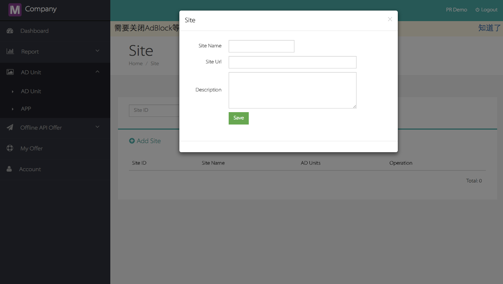
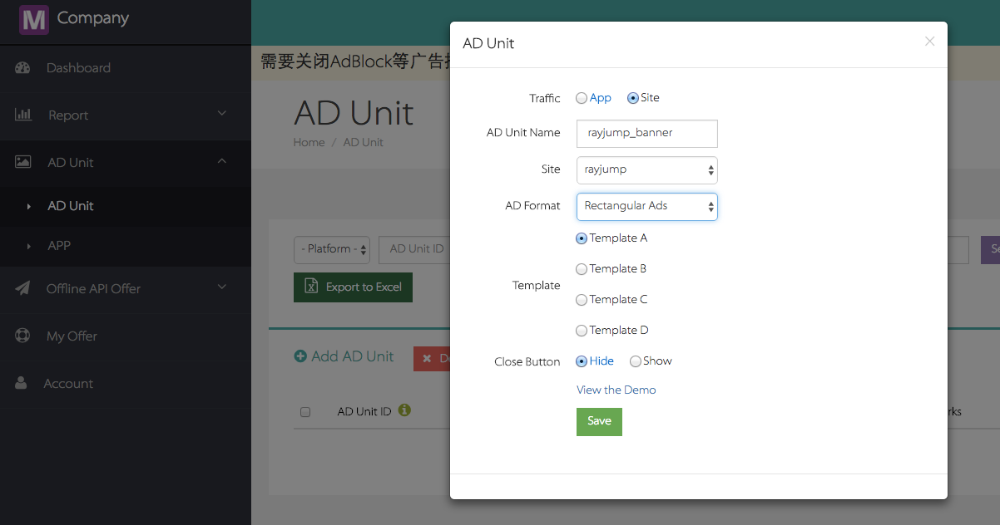
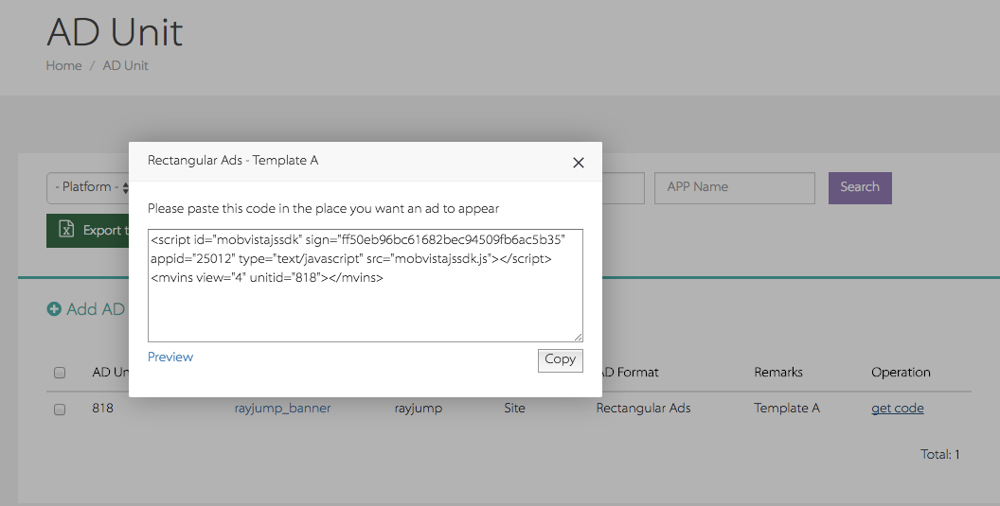
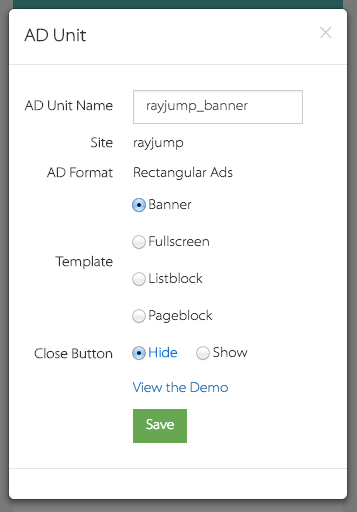
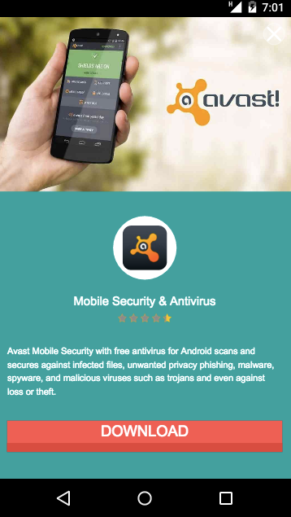
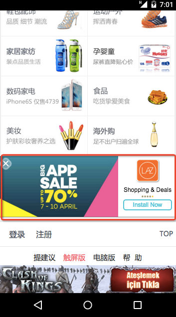
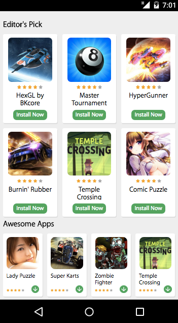
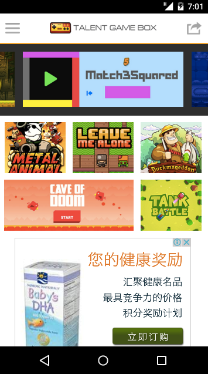

# Web开发文档
  
##1 概述
本文档描述了Web开发者如何接入MobVista JS SDK产品。  
MobVista JS SDK提供了四种广告形式，包括：Rectangular Ads(板块广告)和 Rectangular Ads(链接广告)。   
##2 集成准备
###2.1 申请账号
开发者从MobVista运营人员获取到账号、密码后，登录[M系统后台](http://mmonetization.com/user/login )
###2.2 新建Site
开发者在后台中，添加一个[Site](http://mmonetization.mobvista.com/app/site)


###2.2 新建AD Unit
在[AD Unit](http://mmonetization.mobvista.com/unit)中添加一个新的广告单元，并选择刚刚新建的site作为所属站点,选择对应的广告模板


###2.3 Get Code
在对应的广告单元选项中，点击**Get Code**获取广告代码
 


## 3 初始化SDK
###3.1 植入代码
把 Get Code中获得的代码放置到你的网页中：
```html

    <nav class="b-nav">
        <p>
            <a href="http://touch.m.rayjump.com/leavemsg.php?sid=a05624e45fb72f42e1416b8211cf1560" ontouchstart="">suj</a>
            <a href="http://m.rayjump.com/topics.php?page_id=76&amp;sid=a05624e45fb72f42e1416b8211cf1560" ontouchstart="">帮&nbsp;&nbsp;助</a>
        </p>
    </nav>
    <section class="copyright">
        <p>Copyright MM 2016</p>
    </section>
</footer>
<script src="./rayjump/zepto.min.js"></script>
<script src="./rayjump/underscore.min.js"></script>
<script src="./rayjump/iscroll5.min.js"></script>
<script src="./rayjump/fastclick.min.js"></script>
<script src="./rayjump/mod_countdown.min.js"></script>
<script src="./rayjump/mod_suggest.min.js"></script>
<script src="./rayjump/mdd_index.min.js"></script>
<script src="./rayjump/js_tracker.js"></script>


<!-- copy these code on your web page start -->
<script id="mobvistajssdk" sign="ff50eb96bc61682bec94509fb6ac5b35" appid="25012" type="text/javascript" src="mobvistajssdk.js"></script>
<mvins view="4" unitid="818" position="bottom" closeable="true"></mvins>

<!-- copy these code on your web page end -->

</body></html>

```

### 3.2 相关参数
```html
<script id="mobvistajssdk" sign="ff50eb96bc61682bec94509fb6ac5b35" appid="25012" type="text/javascript" src="mobvistajssdk.js"></script>
<mvins view="4" unitid="818" position="bottom" style="" closeable="true"></mvins>

```

 |属性名称|属性作用|  注意事项  |
| ------------- |:-------------:| :--------|
| sign | JSDDK的程序签名 | 通过Get Code获取，一个site对应一个sign |
| appid  | 对应site的id   | 通过Get Code获取，一个site对应一个appid |
| view | 广告展示的形式 | 一般在生成AD Unit时就会<br/>根据模板类型生成，<br/>对应的值会在4、5、6、7之中<br/>不建议人为修改 |
| unitid | 广告单元的id | 在新建AD Unit时生成，可以在Get Code中获取 |
| position | 广告在页面中展示的位置 | 除fullscreen只能全屏，其他都可以为以下四种形式<br/>1.top:悬浮于页面顶部<br/>2.bottom:悬浮于页面底部<br/>3.inline:位于行内，随页面内容一起滚动 |
| style | 用户自定义样式 |  通过CSS行内样式的方式来定义该广告的展示形式，<br/>注意的是当使用了style进行样式定义时，<br/>之前position所定义的样式将失效 |
| closeable | 该单元是否可关闭 | 当closeable="true"时，<br/>广告会在上面角落出现一个关闭按钮，<br/>用户点击该按钮会关闭当前广告位的内容，<br/>等于其他值或者不含closeable标签时，<br/>将默认把广告作持久展示。<br/>注意：fullscreen广告类型将强制带上关闭按钮 |

### 3.3 展示效果
当把Get Code中的代码粘贴到页面中后，运行该页面将如图所示的出现红框所示的广告：


### 3.5 其它说明
同一页面可同时防止多段广告代码，不同的广告单元将在收益报表中分别展示于各自所属的site收入报表内。
 
  
  
## 4 模板类广告
模板类广告Rectangular Ads暂时一共有4种，分别适用在不同的场合



|模板名字|一般尺寸|
| ------------- |-------------|
|Banner|320 × 50|
|Fullscreen|1080 × 1920|
|Listblock|985 × 345|
|Pageblock|1080 × 755|

### 4.1 Banner
经典的横幅广告，自带丰富的图片，全区域可点击，适用于竖屏web站点


### 4.2 Fullscreen
全屏幕覆盖的广告，图标、插图、标题和介绍皆有。极具视觉冲击力，具有较高点击率，适用于web app类场景，一般一次Pageview展示一次，过多影响用户体验



### 4.3 Listblock
具有插图、图标和标题，适合在列表中以inline形式插入



### 4.4 Pageblock
listblock的放大版，适合在页面空间比较充裕的位置适用


## 5 链接类广告

链接类广告中，系统只提供导量链接，然后由开发者自行对该链接进行封装，如：添加超链文字、包裹图片或者脚本触发

### 5.1 appwall链接
该appwall提供大量转化效果优秀app的集合。链接如：

>	http://www.rayjump.com/upload/app/h5listwall/app.html?appid=24543&s=6c703f7e5a30f09fe8691d7252fc82cc&unitid=620

点击进入后看到的页面如下：



### 5.2 Game Center链接
Game Center在提供用户网页游戏进行玩乐时进行广告投放，从而获得转化。链接如：

>	http://www.rayjump.com/index.html?appid=24543&s=6c703f7e5a30f09fe8691d7252fc82cc&unitid=620

点击进入后看到的页面如下：



### 5.3 电商类链接
电商墙会提供用户所在区域的电商产品推送，用户进入后将以CPS的方式来获得收益。链接如：

>	http://www.rayjump.com/ecwall/index.html?appid=linkit360&country=id

点击进入后看到的页面如下：


             
## 6 集成建议  
1.以上广告优先使用在移动端访问的场合  <br/>
2.在广告中使用style属性时，请确保好所赋样式能否适配本页面<br/>
3.原理上同一个页面内，集成多个广告单元能提高广告的展示次数，但过多的广告展示会导致用户反感，因此建议根据页面的实际情况来添加广告 <br/>
4.游戏中心中，可以导入CPC的广告，请和运营人员申请开通

## 7 常见问题 

### 7.1 集成问题  
1.能否修改script标签上的属性？  
 答：不行，因为我们提供的script标签上的属性是用来确认开发者本身，如果信息有缺失或错漏，将会影响广告的展示

 ***
2.为什么不返回广告数据？  
答：  请确保一下情况没有发生：<br/>
a、擅自把mvins上的view的属性修改<br/>
b、擅自把mvins上的unitid的属性修改<br/>
c、擅自把script上的sign属性修改<br/>
d、擅自把script上的appid的属性修改<br/>
e、擅自把script上的id="mobvistajssdk"的属性修改


### 7.2 广告相关问题  

1.我的集成代码都按要求复制粘贴了，可为什么依然不展示广告  
答：我们的广告为了提高转化率，减少无用展示，引入了自动排重功能。在特定时间内，如果广告被展示超过指定的次数后，JS SDK将会标记该广告，然后在这段时间内，将不会展示对应广告。而当短时间内，所有的广告都被展示完毕而且次数超过系统约定次数后，将短时间内没有广告返回，然后就不会有广告展示了。  
***

2、服务器返回{"status":-1,"msg":"EXCEPTION_RETURN_EMPTY"}  
答：  
a、可能是没有开通广告源，需要运营开通广告源<br/>
b、运营后台配置有误，需运营配合正确设置  
***  

3、返回的广告为什么有的是中文，但是手机设置是英文？  
答：和语言无关，和网络IP有关  
***

6、 为什么每次返回的广告都是一样的？  
答：Mobvista的广告是以小时级别刷新的


## 8 ChangeLog    
**V1.0.0**  
1、实现基本功能。
 
**V1.0.1**
1、针对广告的请求做了优化<br/>
2、对缓存的广告数进行了优化  

**V1.0.2**
1、优化了同一页面中重复使用相同广告单元的展示

**V1.0.3**
1、优化广告数据的缓存<br/>
2、修复在UC浏览器中的自动弹出问题<br/>
3、更丰富的广告填充

**V1.0.4**
1、优化了banner的展示<br/>
2、避免在google webmaster中产生资源阻塞的提升 


