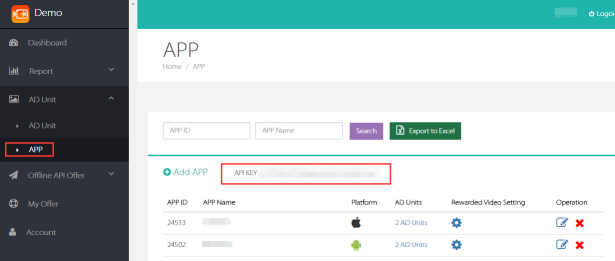
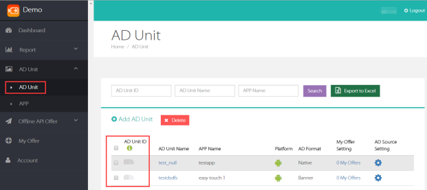
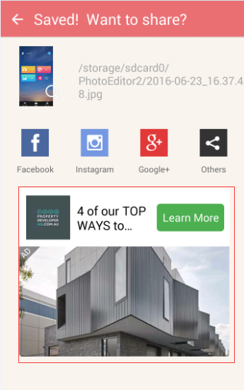
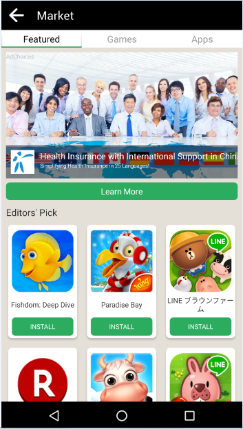

# Mobvista SDK Integration - Android
  
##1 Overview
This document describes how to integrate Mobvista SDK.  
Mobvista SDK provides three different ad forms: native ads, appwall and rewarded video.
  
##2 Preparation
###2.1 Create M-system account
Get the account login information(account name & password) from mobvista OM（Operation Manager),then [login](http://mmonetization.com/user/login ).

###2.2 API Key
Each m-system account has a corresponding API Key, and the key will be needed for requesting ads. It can be obtained from the account as follows: Login m-system —> Ad unit —> App:  
 
 
###2.3 App id
M-system will automatically generate a corresponding app id for each app the developer creates. Get it here: Login m-system —> Ad unit —> App:  


###2.4 Unit id
Unit id is autimatically generated in m-system. Get it here: Login m-system —> Ad unit —> Ad unit:  


## 3 SDK Initialization
### 3.1 Add the Mobvista SDK to your Project
OM from Mobvista will send you the SDK package, which contains multiple .jars.


 |.jar name|.jar function|  required (Y/N) |
| ------------- |:-------------:| :--------:|
| mobvista_common.jar | basic functions | Y |
| mobvista_native.jar  | native ads pack   |   N |
| mobvista_appwall.jar | appwall pack |   N |
| mobvista_reward.jar | rewarded video ads pack|   N |
| mobvista_native_ex.jar | ads carousel view pack |   N |
| mobvista_download.jar | download pack |   N |

mobvista_common.jar，the basic function package，is required to be added into your project.If you want to implement other functions, you must add the corresponding jar packages. For example, to integrate Mobvista appwall, you need to add mobvista_common. jar, mobvista_appwall. jar and its parallel res folder into the project.  
 
**If you integrate with a third-party ad source, please add the corresponding third-party ad source jar to the project as well. Please note that for admob ads,  
mobvista SDK only supports its version of 8.1.0**

### 3.2 Initialization
Put the initiating codes into Application
```java
      MobVistaSDK sdk = MobVistaSDKFactory.getMobVistaSDK(); Map<String,String> Map = sdk.getMVConfigurationMap("APPID","APPKEY"); 
      sdk.init(Map, this);
```
### 3.3 AndroidManifest.xml Configuration

Open AndroidManifest.xml，configurate the folloing contents：

**Necessary Permissions**
```java
    <uses-permission android:name="android.permission.INTERNET" />
    <uses-permission android:name="android.permission.WRITE_EXTERNAL_STORAGE"/>
```


**unnecessary Permissions**
```java
    <uses-permission android:name="android.permission.ACCESS_WIFI_STATE" />
    <uses-permission android:name="android.permission.READ_PHONE_STATE" />
    <uses-permission android:name="android.permission.ACCESS_NETWORK_STATE" />
    <uses-permission android:name="android.permission.ACCESS_COARSE_LOCATION" />
    <uses-permission android:name="android.permission.ACCESS_FINE_LOCATION" />
```
**Add the below content if you integrate with Admob**  

```java
      <meta-data  
        android:name="com.google.android.gms.version"
        android:value="@integer/google_play_services_version" />
      <activity android:name="com.google.android.gms.ads.AdActivity"     
         android:configChanges="keyboard|keyboardHidden|
         orientation|screenLayout|uiMode|screenSize|   
         smallestScreenSize"
         android:theme="@android:style/Theme.Translucent" />
```
**If "mobvista_down jar" has been used, please add the following content**  
    
```java
       <service android:name="com.mobvista.msdk.shell.MVService" >
        <intent-filter>
            <action android:name="com.mobvista.msdk.download.action" />
        </intent-filter>
       </service>
```
     


### 3.4 Codes Obfuscation
If you need to obfuscate the application codes, you can operate as follows:
```java
    -keepattributes Signature   
    -keepattributes *Annotation*   
    -keep class com.mobvista.** {*; }  
    -keep interface com.mobvista.** {*; }  
    -keep class android.support.v4.** { *; }  
    -dontwarn com.mobvista.**   
    -keep class **.R$* { public static final int mobvista*; }
```
### 3.5 More Instructions
If you want to improve the initialization speed, please set MobVistaConstans.INIT_UA_IN as "false" before calling the init method. And subsequently, this will affect the ads loading speed.If the loading page needs to be displayed after clicking an ad, please set MobVistaConstans. NATIVE_SHOW_LOADINGPAGER as "true".

  
## 4 Native Ads Integration
Native ads sample:  
  
### 4.1 Integrated process
**Please copy mobvista_common.jar, mobvista_native.jar and its parallel res file to the corresponding position.** 

**1、You should have successfully initialized mobvista SDK in the application**  
**2、You should have called the preload interface**  

Preload：You can cache the ads data before display, then use the cache data for the next impression. This helps to reduce ads loading time, improve user experience and increase your revenue as well.
    
```java
     public void preloadNative() {
		MobVistaSDK sdk = MobVistaSDKFactory.getMobVistaSDK();
		Map<String, Object> preloadMap = new HashMap<String, Object>();
		//ads forms parameter（required）
		preloadMap.put(MobVistaConstans.PROPERTIES_LAYOUT_TYPE,
				MobVistaConstans.LAYOUT_NATIVE);
		//Facebook Placement id (required if integrated)
		preloadMap.put(MobVistaConstans.ID_FACE_BOOK_PLACEMENT,
				"facebook的id");
		//Mobvista ad unit id (required)
		preloadMap.put(MobVistaConstans.PROPERTIES_UNIT_ID, "mobvista的unitid");
		//Admob unit id (required if integrated)
		preloadMap.put(MobVistaConstans.ID_ADMOB_UNITID,
				"admob的unitid");
		//Image preloaded
		preloadMap.put(MobVistaConstans.PREIMAGE, true)	
        //Ad number you requested
		preloadMap.put(MobVistaConstans.PROPERTIES_AD_NUM, 2);	
		//call preload method
		sdk.preload(preloadMap);
	}
```  

**3、You should have called ads load method.**  
Call the method below to load ads; this will take the local preload cache data first to improve ads loading speed; and it will request for more ads if no more cache here. Meanwhile, there will be a relevant callback.d
    
```java
    public void loadNative() {
	Map<String, Object> properties = MvNativeHandler
			.getNativeProperties(“mobvista的unitid”);
     //Setup requesting ads number，1-10
	properties.put(MobVistaConstans.PROPERTIES_AD_NUM, 2);
	nativeHandle = new MvNativeHandler(properties, this);  
	nativeHandle.setAdListener(new NativeAdListener() {
		@Override
		public void onAdLoaded(List<Campaign> campaigns, int template) {}
		@Override
		public void onAdLoadError(String message) {}
		@Override
		public void onAdClick(Campaign campaign){}
		@Override
		public void onAdFramesLoaded(final List<Frame> list) {}
	});
	nativeHandle.setTrackingListener(new NativeTrackingListener() {
		@Override
		public void onStartRedirection(Campaign campaign, String url) {}
		@Override
		public void onRedirectionFailed(Campaign campaign, String url) {}
		@Override
		public void onFinishRedirection(Campaign campaign, String url) {}
		@Override
		public void onDownloadStart(Campaign campaign) {}
		@Override
		public void onDownloadFinish(Campaign campaign) {}
		@Override
		public void onDownloadProgress(int progress) {}
		@Override
		public boolean onInterceptDefaultLoadingDialog() {
			return false;
		}
		@Override
		public void onShowLoading(Campaign campaign) {}
		@Override
		public void onDismissLoading(Campaign campaign) {}
	});
		nativeHandle.load();
}
```
**4、You should have called the preload method after successfully loading ads.**  
Get the load result in onAdLoaded(List<Campaign> campaigns, int template){} and then call the preload method in it as well.  
**5、You should have registered the ads before display.**  
Call registerView method within MvNativeHandler, registering click event for the ads.  
**6、You should recycle resouces.**  
In Activity onDestroy(), call the release method within MvNativeHandler to release resources.
 
### 4.2 Multi-templates  
Multi-templates is extensionally formed by native ads.
```java   
    nativeHandle.addTemplate(new Template(MobVistaConstans.TEMPLATE_BIG_IMG, 1));
    nativeHandle.addTemplate(new Template(MobVistaConstans.TEMPLATE_MULTIPLE_IMG, 1)); 
``` 
The figure "1" refers to ad_num, customized by the developers.
MobVistaConstans.TEMPLATE_BIG_IMG, refers to the big image template.
MobVistaConstans.TEMPLATE_MULTIPLE_IMG,refers to the multiple images template. 

Big image template and multi-templates can be 
alternatively displayed in the same ad unit; and you can use the parameter "template" in onAdLoaded(List<Campaign> campaigns, int template) of NativeAdListener, to identify which template is retured. But multi-templates, almost the same as native ads implementation, needs a few changes here (for specific implementation, you can take NativeMultemplateActivity in the demo as a reference): 
  
a、Add native_info into multi-template implementation codes during preloading; the specific method is as follows:

```java
     List<Template> list = new ArrayList<Template>();
		//support big image template, requesting for one ad ("1" is a variable value, customized by developers)
		list.add(new Template(MobVistaConstans.TEMPLATE_BIG_IMG, 1));
		//support multi-templates, requesting for 3 ads ("3" is a variable value, customized by developers)
		list.add(new Template(MobVistaConstans.TEMPLATE_MULTIPLE_IMG, 3));
		preloadMap.put(MobVistaConstans.NATIVE_INFO,
				MvNativeHandler.getTemplateString(list));
     `  
```
 b、Two changes in load:  
（1）、Add native_info before requesting ads.  
  
```java
    //support big image template, requesting for one ad ("1" is a variable value, customized by developers)
		nativeHandle.addTemplate(new Template(
				MobVistaConstans.TEMPLATE_BIG_IMG, 1));
		//support multi-templates, requesting for 3 ads ("3" is a variable value, customized by developers)
		nativeHandle.addTemplate(new Template(
				MobVistaConstans.TEMPLATE_MULTIPLE_IMG, 3));  
``` 

（2）、 Adjust the callback method codes structure in onAdLoaded as follows.

```java
        if (campaigns != null && campaigns.size() > 0) {
	    campaign = campaigns.get(0);			
		if (campaign.getType() == MobVistaConstans.AD_TYPE_ADMOB){//referring to admob ad source here
			//processing for admob events
		} else if (campaign.getType() == 7) {//referring to mytarget ad source here
			//processing for mytarget events
		} else {// referring to API or Facebook ads ad source here
			//processing for big image template
			if (template == MobVistaConstans.TEMPLATE_BIG_IMG) {
				//identifying facebook ad source if using facebook views here
                              if(campaign.getType() == 
                                 MobVistaConstans.AD_TYPE_FACEBOOK){
                                 //displaying facebook ads with facebook views   
                                 }	
                             }
			//processing for multi-templates
			if (template == MobVistaConstans.TEMPLATE_MULTIPLE_IMG) {}			
				}
			} 
```
### 4.3 Rolling Ads View
  
Rolling view helps to display ads in frames.
A little bit different from native ads implementation, it needs several changes here:
 
**Copy mobvista_common.jar, mobvista_native.jar, mobvista_native_ex.jar and the parallel res folder into the corresponding position.** 
 
a、Add rolling view and process the related content. 

```java
     <com.mobvista.msdk.mvnativeextensions.rollingbc.
     view.MVNativeRollView
        android:id="@+id/rolling"
        android:layout_width="match_parent"
        android:layout_height="wrap_content"
        android:gravity="center"
         /> 
```
**Access the view object, setting up the width of the view.**  
setFrameWidth(600);  
//If you need to set up the internal width of each frame, please call the method above, or it will be set as the default width as 9/10 of the screen.
 
**Add slide monitoring method to the view object.**  
  
```java
      rbcv.setFilpListening(new FilpListener() {
			@Override
			public void filpEvent(int position) {}
		});
```
b、Add the following codes into MvNativeHandler object Map.
```java
properties.put(MobVistaConstans.PROPERTIES_AD_FRAME_NUM, 3);
```  
“3” represents the required number of the frames; ads number for each frame returns by native_info (taking native ads implementation as reference)

c、Replace the load and the preload method for loadFrame (); and preloadFrame (Map < String, Object > ads);

d、Check the returned ads data in the callback of onAdFramesLoaded(final List<Frame> list), and the specific data processing method is in the demo as a reference：
     
```java    
         @Override
			public void onAdFramesLoaded(final List<Frame> list) {}  
```

## 5 Appwall Integration
Appwall sample：  


### 5.1 Integration Process  
**Please copy mobvista_common.jar, mobvista_appwall.jar and the parallel res file to the corresponding position.**

**1、You should have successfully initialized mobvista SDK.** 
**2、You should have preloaded ads data for the appwall.**  
To improve the loading speed for appwall, please on onResume() call the below method before open it.

```java
     /**
	 * Preloading the appwall can improve the revenue for you.
	 */
	public void preloadWall(){
		MobVistaSDK sdk = MobVistaSDKFactory.getMobVistaSDK();
		Map<String,Object> preloadMap = new HashMap<String,Object>();
		preloadMap.put(MobVistaConstans.PROPERTIES_LAYOUT_TYPE, MobVistaConstans.LAYOUT_APPWALL);
		preloadMap.put(MobVistaConstans.PROPERTIES_UNIT_ID, "unitid");
		sdk.preload(preloadMap);
	}     
```

**3 Load the appwall.**  
Call the below method, and you need to design the appwall entrance yourself on the product interface; users will click the entrance, then jump to the appwall.
  
```java  
      public void loadHandler(){
		Map<String,Object> properties = MvWallHandler.getWallProperties("mobvista的unitid");		
		properties.put(MobVistaConstans.PROPERTIES_WALL_STATUS_COLOR, R.color.mobvista_green);
		properties.put(MobVistaConstans.PROPERTIES_WALL_NAVIGATION_COLOR,  R.color.mobvista_green); 
		properties.put(MobVistaConstans.PROPERTIES_WALL_TITLE_BACKGROUND_COLOR, R.color.mobvista_green);
		mvHandler = new MvWallHandler(properties, this, nat);//nat is vg for the click event, please make sure the click event of vg won't be intercepted.
		
		//customer entry layout begin 
this part is not required
		View view = getLayoutInflater().inflate(R.layout.customer_entry, null);
		view.findViewById(R.id.imageview).setTag(MobVistaConstans.WALL_ENTRY_ID_IMAGEVIEW_IMAGE);
		view.findViewById(R.id.newtip_area).setTag(MobVistaConstans.WALL_ENTRY_ID_VIEWGROUP_NEWTIP);
		mvHandler.setHandlerCustomerLayout(view);
		//customer entry layout end */
		mvHandler.load();
	}
```     
 **4 Add the below content for AndroidManifest.xml**  
    Import the below Activity for integrating the appwall
    
```java
    Please add a theme if the appwall nee
    <!-- Add a theme for a immersive appwall -->
    <activity            android:name="com.mobvista.msdk.shell.MVActivity"
        android:configChanges="keyboard|orientation"
        android:screenOrientation="portrait"
        android:theme="@style/AppTheme2" >
        <intent-filter>
            <action android:name="android.intent.action.CREATE_SHORTCUT" />
            <category android:name="android.intent.category.DEFAULT" />
        </intent-filter>
    </activity>
    <!--Add the below style in res/values/style file for a immersive appwall -->  
    <style name="AppTheme2" parent="AppBaseTheme">
    <item name="android:windowNoTitle">true</item>
    <item name="android:windowTranslucentStatus">true</item>
    <item name="android:windowTranslucentNavigation">true</item></style>
```
### 5.2 Open appwall through intent
  
If you have customized requirements, you can pass them by extra in intent, the same way as passing unitid.
 
```java 
     /**
	 * open the appwall via intent
	 */
	public void openWall(){
		try {
			Map<String, Object> properties = MvWallHandler.getWallProperties("unitId");
			MvWallHandler mvHandler = new MvWallHandler(properties, HandlerActivity.this);
			mvHandler.startWall();
		} catch (Exception e) {
			Log.e("MVActivity", "", e);
		}
	}
```
## 6 Rewarded video integration
### 6.1 Integration process  
**Please copy mobvista_common.jar, mobvista_reward.jar and the parallel res file to the corresponding position.**  

**1、You should have successfully initiated mobvista sdk and put the corresponding mobvista jar and the third party video ads jar into your project.**  
**2、Please image res copy to res/drawable-hdpi 
**3、Please on AndroidManifest.xml file statement MVSDK RewardVideo Activity**
``` 
    <activity
    android:name="com.mobvista.msdk.reward.player.MVRewardVideoActivity"
    android:screenOrientation="landscape"
    android:theme="@android:style/Theme.NoTitleBar.Fullscreen" />
```


**If integrated applovin** 

- Please fill in applovin the key  
    
    ```
      <meta-data
            android:name="applovin.sdk.key"
            android:value="you application on applovin apply key" />
    ```
- Please add applovin need the Activity
     ```  <activity android:name="com.applovin.adview.AppLovinInterstitialActivity" />
        <activity android:name="com.applovin.adview.AppLovinConfirmationActivity" />```

**If integrated nativeX**  
     ```
    <activity
    android:name="com.google.android.gms.ads.AdActivity"
    android:configChanges="keyboard|keyboardHidden|orientation|screenLayout|uiMode|smallestScreenSize|screenSize"
    android:theme="@android:style/Theme.Translucent" />
    <activity
    android:name="com.nativex.monetization.activities.InterstitialActivity"
    android:configChanges="orientation|screenSize"
    android:hardwareAccelerated="true"
    android:theme="@android:style/Theme.Translucent.NoTitleBar.Fullscreen" />
    <activity
    android:name="com.nativex.videoplayer.VideoActivity"
    android:configChanges="orientation|screenSize" />
    ```
   
**2、Create MVRewardVideoHandler Object**  
   
```java 
      mMvRewardVideoHandler = new MVRewardVideoHandler(this, "unitid");
```  
**4、Set the callback for MVRewardVideoHandler object.**  


```java
         mMvRewardVideoHandler.setRewardVideoListener(new RewardVideoListener() {
			@Override
			public void onVideoLoadSuccess() {
				Log.e(TAG, "onVideoLoadSuccess");
			}
			@Override
			public void onVideoLoadFail() {
				Log.e(TAG, "onVideoLoadFail");
			}
			@Override
			public void onShowFail(String errorMsg) {
				Log.e(TAG, "onShowFail=" + errorMsg);
			}
			@Override
			public void onAdShow() {
				Log.e(TAG, "onAdShow");
			}
			@Override
			public void onAdClose(boolean isCompleteView, String RewardName,
					float RewardAmout) {
				Log.e(TAG, "reward info :" + "RewardName:" + RewardName
						+ "RewardAmout:" + RewardAmout);
				showDialog(RewardName, RewardAmout);
			}
           @Override
			public void onVideoAdClicked(String unitId) {
				Log.e(TAG, "onVideoAdClicked");
			}
		});
```
**5、Call the load method for MvRewardVideoHandler object.**


```java
     mMvRewardVideoHandler.load();
```  
**6、You should identify whether the video is ready or not before it is played; if true, then it will be played, or it will be loaded again.**  


```java
      if (mMvRewardVideoHandler.isReady()) {
				mMvRewardVideoHandler.show("rewardid");
			}else{
				mMvRewardVideoHandler.load();
			}
```
**7、call the clearVideoCache method Clear cache data.**  

             
## 7 Integration Suggestions  
1. Initialize the SDK in Application;
2. Call preload in onAdLoaded event after the success of load to improve the ads display speed and get the revenue growth;
3. You must call register to ViewGroup, not only to the button, guaranteeing the clickable region of the ads; this is deeply related with your revenue;
4. You can use TextView to display the CTA buttons; do not use Button which will intercept events;
5. Each ad unit corresponds to a MvNativeHandler, ensuring the uniqueness of each ad unit;
6. Call preload for the appwall when users entering the homepage of the app;
7. You can set onTouch event in ViewGroup at the appwall entrance, to listening to the entrance events.


## 8 FAQs
### 8.1   Integration Questions

1 .Why no Facebook ads being displayed here?
A: there are 4 necessary conditions for Facebook ads display.

a. Install the facebook app in your phone

b.Log in the facebook app successfully  

c.Connect a workable VPN if needed

d. Add FacebookSDK.jar in libs
 ***
2 . Why the app crashes when calling the register method, using the latest facebook SDK?  
A:   
a. Please   add “android-support-v7-recyclerview.jar” into libs  
b. Please add “android-support-v4.jar” into libs

***  

3 . Should we have to transmit the untit ld of “admob” or “myTarget” if not integrating them? 
  
A: no need 

***
4 . How to obtain SDK resource for multi-channel packages?

A：Add the below codes into Map during SDK initialization:
  
```java
    Map.put(MobVistaConstans.PACKAGE_NAME_MANIFEST,  the value of "AndroidManifest’s package") into Map.
```


### 8.2 Ads Questions  

1 .Why the server returned  
content = {"status":-1203,"msg":"EXCEPTION_UNIT_NOT_FOUND_IN_APP, unitId: xxx"}  
A：Unit ID and appid don't match each other when loading.
***
2 .Why the server returned  
{"status":-1,"msg":"EXCEPTION_RETURN_EMPTY"}  
A：  
a. Ad resource is not imported yet; turn to Mobvista OM to deal with this;  
b. Wrong operational configuration in M-system; turn to Mobvista OM to correct it.
 
***  
3 .Why the ads are returned in Chinese even the phone language is English?   
A: It is related to the network IP, and nothing to do with the phone language.   
***
4 .Why the ads jump slowly for the first time?  
A: The ads will jump for several times in 302 jump type, then to the final url; and NativeHandler gets the jump result; you can setup a loading dialog from the very begining of this process.  
***
5 .How to distinguish the ad source?  
A: It depends on the value the parameter "type" returns.  
Value "1" refers to Mobvista API ads;  
Value "3" refers to Facebook;  
Value "6" refers to Admob;  
Value "7" refers to myTarget;   
***  
6 .Why the ads are the same for each return?  
A: Mobvista ads refreshs hourly. 

  
  
## 9 API
### MobivstaSDK  ###

#### Class Introduction ####
> used for SDK initialization and preload

####  Member Method  ####
<table><tr><td bgcolor=#DCDCDC>public Map <font color=#00000 face="Microsoft YaHei" size =4>getMVConfigurationMap</font>(String appId,String appKey)</td></tr></table>
> **A Map object will be generated within AppID and AppKey, to import Map parameter of init.**

**Parameters**

**appId** M-system AppId

**appKey** M-system AppKey

**Returns**

**Return a Map object within AppId and AppKey**

<table><tr><td bgcolor=#DCDCDC>public void <font color=#00000 face="Microsoft YaHei" size =4>init</font>(Map Map,Context context)</td></tr></table>
> **Initialize SDK**

**Parameters**

**Map** Map object within AppId and AppKey

**Context** Suggestion: Initialize in Application, and pass in the Application context.


<table><tr><td bgcolor=#DCDCDC>public void <font color=#00000 face="Microsoft YaHei" size =4>preload</font>(Map Map)</td></tr></table>
> **Implement to preload native ads and the appwall**

**Parameters**

**Map** Map object within AppId and AppKey


### MvNativeHandler ###

#### Classic Introduction ####
> Used to load native ads, listening to the callback of ads request and the ads jump process.
***

#### Constructor ####
> public **MvNativeHandler**(Map Map,Context context)
> Pass in a Map within native ads form and its ad unit ID and the context of the current interface.
***

####  Member Method  ####
<table><tr><td bgcolor=#DCDCDC>public static Map <font color=#00000 face="Microsoft YaHei" size =4>getNativeProperties</font>(String unitId)</td></tr></table>
> **Used to generate a Map within native ads form and its ad unit ID, to create MvNativeHandler**

**Parameters**

**unitId** M-system ad unit ID for marking ads position

**Returns** a Map within native ads form and its ad unit ID
***


<table><tr><td bgcolor=#DCDCDC>public boolean <font color=#00000 face="Microsoft YaHei" size =4>load</font>()</td></tr></table>
> **Used to loading native ads**

  **Parameters**  
Non  
***
<table><tr><td bgcolor=#DCDCDC>public boolean <font color=#00000 face="Microsoft YaHei" size =4>loadFrame</font>()</td></tr></table>
> **Used to loading frame ads**

  **Parameters**  
Non  
***
<table><tr><td bgcolor=#DCDCDC>public void <font color=#00000 face="Microsoft YaHei" size =4>registerView</font>(View view, Campaign campaign)</td></tr></table>
> **Used to binding view and campaign**

  **Parameters**  
**view** jump to the ads final url, clicking the view
**campaign**  ads object
***
  
<table><tr><td bgcolor=#DCDCDC>public void <font color=#00000 face="Microsoft YaHei" size =4>registerView</font>(View view,List<View> views, Campaign campaign)</td></tr></table>
> **Used to binding view, views and campaign**

  **Parameters**  
**view** jump to the ads final url, clicking the view
**views** a list for all the binding view
**campaign**  ads object
***


<table><tr><td bgcolor=#DCDCDC>public void <font color=#00000 face="Microsoft YaHei" size =4>release</font>()</td></tr></table>
> **Used to releasing the occupied resources**

  **Parameters**  
Non
***

  
<table><tr><td bgcolor=#DCDCDC>public void <font color=#00000 face="Microsoft YaHei" size =4>setAdListener</font>(NativeAdListener adListener)</td></tr></table>
> **Used to setting NativeAdListener**

  **Parameters**  
**adListener**  Listening to the ads-obtained results

**simple**  


```java
       /**
       *the callback method of native ads load success
       *campaigns  ads list
       *template template types returned
       *Suggestion: You can read the template value first to identify ads templates (big image for mobvista ads/ multiple images for mobvista ads/ big image for the third party ad source); and you can identify ad source in big image template as well if needed.
       */
    	public void onAdLoaded(List<Campaign> campaigns, int template);
       /**
       *callback if ads request failed，
       *message wrong message returned
       */
		public void onAdLoadError(String message);
        /**
       *callback if ads have been clicked
       *campaign ads clicked
       */
		public void onAdClick(Campaign campaign); 
        /**
       *callback if Frame ads loaded successfully,
       *list list of frame ads
       */
		public void onAdFramesLoaded(List<Frame> list);
```
***


<table><tr><td bgcolor=#DCDCDC>public void <font color=#00000 face="Microsoft YaHei" size =4>setTrackingListener</font>(NativeTrackingListener trackingListener)</td></tr></table>
> **Used for events listening after ads being clicked (exclusive for mobvista ads)**

  **Parameters**  
**trackingListener** Listening to other events after users clicking ads 
**simple**  
  

```java  
        /**
	     * whether the default loading page been intercepted
	     * 
	     */
	    public boolean onInterceptDefaultLoadingDialog();
        /**
	     *display loading page
         *campaign campaign processing to jump
	     */
	    public void onShowLoading(Campaign campaign);
        /**
	     * hide loading page
	     * campaign campaign processing to jump
	     */
	    public void onDismissLoading(Campaign campaign);
		/**
	     * starting to jump 
	     * campaign campaign processing to jump
	     * url jumping url
	     */
		public void onStartRedirection(Campaign campaign, String url);
        /**
	     * jump ended
	     * campaign campaign processing to jump
	     * url jumping url
	     */
		public void onFinishRedirection(Campaign campaign, String url);
       /**
	     * jump failed
	     * campaign campaign processing to jump
	     * url jumping url
	     */
		public void onRedirectionFailed(Campaign campaign, String url);
        /**
	     * staring to download
	     * campaign campaign being downloaded
	     */
		public void onDownloadStart(Campaign campaign);
        /**
	     * download ended
	     * campaign campaign being downloaded
	     */
		public void onDownloadFinish(Campaign campaign);
		/**
		 * callback download percentage progress
		 * progress download progress
		 */
		public void onDownloadProgress(int progress);
```
***


<table><tr><td bgcolor=#DCDCDC>public void <font color=#00000 face="Microsoft YaHei" size =4>setMustBrowser</font>(boolean isMustBrowser)</td></tr></table>
> **Used to identifying whether to open the web within a browser if needed**

**Parameters**

**isMustBrowser** true represents must-opening the web within a browser
***


<table><tr><td bgcolor=#DCDCDC>public static Map <font color=#00000 face="Microsoft YaHei" size =4>addTemplate</font>(Template template)</td></tr></table>
> **Used to adding template information**

**Parameters**

**Template** Multi-template object
***

###MvWallHandler###
***

####Class Introduction####
>Management class for the appwall
***
####Class Formation####
> public **MvWallHandler** (Map<String, Object> properties, Context context,ViewGroup container)

> **Used to construct MvWallHandler object**

**Parameters**

**properties** parameters passed in and various values the appwall needed*   
**context** context  
**container** trigger the open event of the appwall after listening the click event of the appwall entrance ViewGroup
  
*parameters may be used
  
|Key|	Value	|Description|
|:---------:|:--------------:|:-------:|
|PROPERTIES_WALL_TITLE_LOGO|	BitMap	|custom Title Logo image|
|PROPERTIES_WALL_TITLE_BACKGROUND	|BitMap|	custom Title background image|
|PROPERTIES_WALL_TITLE_LOGO_ID	|Res id	|custom Title Logo image|
|PROPERTIES_WALL_TITLE_BACKGROUND_ID	|Res id	|custom Title background image|
|PROPERTIES_WALL_TITLE_BACKGROUND_COLOR	|Res id|	custom Title background color|
|PROPERTIES_WALL_MAIN_BACKGROUND_ID	|Res id	|custom main background color|
|PROPERTIES_WALL_TAB_BACKGROUND_ID	|Res id	|Tab background color|
|PROPERTIES_WALL_TAB_INDICATE_LINE_BACKGROUND_ID	|Res id	|indicator backgroud color|
|PROPERTIES_WALL_BUTTON_BACKGROUND_ID	|Res id	|Button forms|
|PROPERTIES_WALL_STATUS_COLOR	|Res id|	immersive status bar color|
|PROPERTIES_WALL_NAVIGATION_COLOR	|Res id|	immersive navigation bar color|
***

####Classic Method####
<table><tr><td bgcolor=#DCDCDC>public static Map<String, Object> <font color=#00000 face="Microsoft YaHei" size=4>getWallProperties</font>(String unitId)</td></tr></table>
> **Used to obtaining a Map with AppWALL (Layout_Type) and its unitID**

**Parameters**

**unitId** passing in mobvista unitid  

***
<table><tr><td bgcolor=#DCDCDC>public void <font color=#00000 face="Microsoft YaHei" size=4>setHandlerCustomerLayout</font>(View handlerCustomerLayout)</td></tr></table>
> **Used to setting up the customized appwall entrance**

**Parameters**

**handlerCustomerLayout** passing in the customized appwall entrance  

***
 <table><tr><td bgcolor=#DCDCDC>public boolean <font color=#00000 face="Microsoft YaHei" size=4>load</font>()</td></tr></table>
> **Used to obtaining ads for the appwall**

**Parameters**

**Non**  

***

<table><tr><td bgcolor=#DCDCDC>public boolean <font color=#00000 face="Microsoft YaHei" size=4>release</font>()</td></tr></table>
> **Used to releasing resources**

**Parameters**

**Non**  

***


### MVRewardVideoHandler ###

####Class Introduction ####
> Used to loading rewared video ads

#### Constructor ####
> public **MvNativeHandler**(Context context,String unitId)
> 
> **Importing the context of the current Activity and the ad unit ID**

#### Member Method  ####
<table><tr><td bgcolor=#DCDCDC>public void <font color=#00000 face="Microsoft YaHei" size =4> Load（）</font></td></tr></table>
> **Used to preloading rewarded video**  

**Parameters**

**Non**  

***

<table><tr><td bgcolor=#DCDCDC>public boolean <font color=#00000 face="Microsoft YaHei" size =4> isReady()</font></td></tr></table>
> **Used to identify whether it is ready to play the video**

**Parameters**

**Non**  

**Returns** play the video if the callback value is true
***
**true means ready to play; false means no**


<table><tr><td bgcolor=#DCDCDC>public void <font color=#00000 face="Microsoft YaHei" size =4> show(String rewardId)</font></td></tr></table>
> **Play the video**
 
**Parameters**  

**rewardId** rewarded ID, corresponds to the rewarded information configured in M-system
***
<table><tr><td bgcolor=#DCDCDC>public void <font color=#00000 face="Microsoft YaHei" size =4> setRewardVideoListener</font>(RewardVideoListener listener)</td></tr></table>
> **Play the video**
 
**Parameters**  

**listener** listening to the related video playing status

**simple**

```java
    /**
	 * video loaded succesfully
	 */
	public void onVideoLoadSuccess();
	/**
	 * callback for load failure
	 */
	public void onVideoLoadFail();
	/**
	 * callback for ads displayed
	 */
	public void onAdShow();
	/**
	 * callback for ads ended
	 */
	public void onAdClose(boolean isCompleteView, String RewardName, float RewardAmout);
	/**
	 * callback for play error
	 */
	public void onShowFail(String errorMsg);
```
***

### Campaign ###

#### Class Introduction ####
> ads bean

#### Member Variable ####

**TYPE_ICON** small image loaded  
**TYPE_BIG** big image loaded  
**id** ad id
**packageName** name of package 
**appName** name of application  
**appDesc** description of application  
**size** size of application  
**iconUrl** url for icon  
**imageUrl** url for big image  
**rating** rating stars (possibly null)  
**adCall** content in the button (set as "install" if null)
**type** ad source  
**subType** sub type of admob ads  
**iconDrawable** icon loaded in advance (call the preload method) 
**bigDrawable** big image loaded in advance (call the preload method)
***

### MobVistaConstans ###

#### Class Introduction ####
> Global Constant 

#### Member Variable ####

**ID_FACE_BOOK_PLACEMENT** key for facebook placement id
**ID_MOBVISTA_APPID** key for mobvista appid 
**ID_MOBVISTA_APPKEY** key for mobvista appkey 
**ID_ADMOB_UNITID** key for admob unit id
**ID_MY_TARGET_AD_UNITID** key for mytarget unitid 
**LAYOUT_NATIVE** native ads form 
**LAYOUT_APPWALL** appwall ads form  
**PROPERTIES_UNIT_ID**  mobvista unitid  
**PROPERTIES_AD_NUM** ads number requested  
**PROPERTIES_AD_FRAME_NUM** ads frames requested
**PROPERTIES_WALL_ENTRY** key for the appwall entrance  
**PROPERTIES_WALL_TITLE_BACKGROUND** key for appwall title background 
**PROPERTIES_WALL_TITLE_LOGO** logo for appwall title
**PROPERTIES_WALL_TITLE_BACKGROUND_ID** key for appwall title background id  
**PROPERTIES_WALL_TITLE_LOGO_ID** key for appwall title  logo id
**PROPERTIES_WALL_MAIN_BACKGROUND_ID** key for appwall main backgroun id  
**PROPERTIES_WALL_TAB_BACKGROUND_ID** key for appwall tab background id 
**PROPERTIES_WALL_BUTTON_BACKGROUND_ID** key for appwall button background id
**PROPERTIES_WALL_LOAD_ID** 
**PROPERTIES_WALL_TAB_INDICATE_LINE_BACKGROUND_ID** key for appwall tab indicate line color id
**PROPERTIES_API_REUQEST_CATEGORY** ads categories
**API_REUQEST_CATEGORY_GAME** category game
**API_REUQEST_CATEGORY_APP** category app
**WALL_ENTRY_ID_IMAGEVIEW_IMAGE** big image of appwall entrance  
**WALL_ENTRY_ID_VIEWGROUP_NEWTIP** red pot for appwall refreshing
**TEMPLATE_BIG_IMG** big image template
**TEMPLATE_MULTIPLE_IMG** multiple images template
**NATIVE_INFO** key for multi-template
**AD_TYPE_MV** mobvista ad source  
**AD_TYPE_FACEBOOK** facebook ad source  
**AD_TYPE_MYOFFER** myoffer ad source from mobvista
**AD_TYPE_ADMOB** admob ad source   
**PREIMAGE** key for preload
**INIT_UA_IN** set false if not initializing ua
**CUSTOMER_HANDLE_CLICK** define whether to pass the results handling to developers
**NATIVE_SHOW_LOADINGPAGER** define whether to display loading page
**PACKAGE_NAME_MANIFEST** import application id for multi-channels packaging in Android studio
**PROPERTIES_WALL_STATUS_COLOR**   color id of appwall status bar
**PROPERTIES_WALL_NAVIGATION_COLOR**  color id of appwall navigation bar 
**PROPERTIES_WALL_TITLE_BACKGROUND_COLOR** color of appwall title backgound  
**Facebook_MEDIA_CACHE_FLAG** define whether to cache facebook video ads


## 10 ChangeLog  
**V7.6.0**  
1、Supporting for rewarded video;  
2、Optimizing for part of functions.
***
**V7.5.0**  
1、Improving ads requesting speed; 
2、Optimizing cache reading logic;
***
**V7.4.0**  
1、Supporting native ads carousel;  
2、Optimizing impression data statistics and reporting;
3、Supporting to load ads images in advance.
***
**V7.3.0**  
1、Supporting multi-templates;  
2、Integrating with Mytarget; 
3、Supporting big image ads carousel in appwall;
4、Supporting immersive appwall for Android 4.4 phones;
5、Fixing the known bugs and optimizing functions. 
***
**V7.2.0**  
1、Integrating with Admob;  
2、Optimizing SDK functions. 
***
**V7.1.0**  
1、Increasing appwall.
***  
**V7.0.0**  
1、Realizing the basic function.


