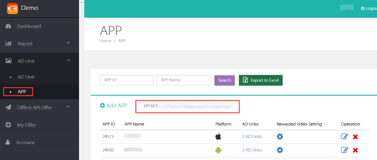

# MVSDK Integration for iOS

**Mobvista MVSDK M**
    
## 1	Mobvista SDK Function Introduction
1. Native ads inegration helps you to obtain the ads data through Mobvista SDK interface and you can choose how to display ads in your apps.
2. Appwall integration provides the whole display design for all ads; you just need to design an appwall entrance in your application for users cliking and jumping to the wall.
3. RewardVideo provides you with the function of the video.
4. MVSDK has integrated with Facebook audience network SDK for native ads.
5. MVSDK has integrated with Applovin SDK and NativeX SDK for video ads.
6. MVSDK supports rewarded video ads form. displaying the ads in a full screen format，and showing users the rewarded content you provide after video playing.
7. **MVSDK requires iOS 7 or later.**
8. After the test. MVSDK package is about 1 MB in size; 1.7MB together with FacebookAudienceNetwork SDK.
9. After the test. MVSDK package is about 1.4 MB in size together with Applovin SDK; 1.4 MB together with NativeX SDK.


## 2 Preparation

### 2.1 Create M-system account

**1、M-system account applying**<br/><br/>
Get the account login information(account name & password) from mobvista OM（Operation Manager).then login.(http://mmonetization.com/user/login )
  
  **2、API Key**<br/><br/>Each m-system account has a corresponding API Key. and The key will be needed for requesting ads. It can be obtained from the account as follows: Login m-system —> Ad unit —> App:<br/>


**3、APP ID**<br/><br/>
M-system will automatically generate a corresponding app id for each app the developer creates. Get it here: Login m-system —> Ad unit —> App:<br/>

 
 **4、Unit ID**<br/><br/>
Unit id is autimatically generated in m-system if you have created an ads displaying position and have configured it into M-system. Get it here: Login m-system —> Ad unit —> Ad unit:<br/>


### 2.2 Importing MVSDK.framewrk into your project

### 2.3 MVSDK support flexible integration

**Instruction：** In 1.4.0 and the above, we divide one big framework to multiple small frameworks which make integration more flexible. If only integrate native, you need importing MVSDK.framework, about **825KB** in size; If only integrate Appwall, you need importing MVSDK.framework and MVSDKAppWall.framework, about **1.2MB** in size; If only integrate video ads, you need importing MVSDK.framework and MVSDKReward.framework, about **962KB** in size.If only integrate OfferWall ads, you need importing MVSDK.framework and MVSDKOfferWall.framework, about **965KB** in size；If only integrate Interstitial ads, you need importing MVSDK.framework and MVSDKInterstitial.framework, about **965KB** in size. If you import all them is about **1.4MB** in size. MVSDK.framework as basic package must be imported.

### 2.4 Add Dependent Libraries

**1、Basic Static Libraries**<br/>

CoreGraphics.framework <br/>
Foundation.framework<br/>
UIKit.framework<br/>
libsqlite3.tbd (It's libsqlite3.dylib below Xcode7)<br/>
libz.tbd (It'slibz.dylib below Xcode7)<br/>
AdSupport.framwork<br/>
StoreKit.framewrok<br/>
QuartzCore.framework<br/>
CoreLocation.framework<br/>
CoreTelephony.framework<br/>
MobileCoreServices.framework<br/>
Accelerate.framework<br/>

**2、Static Libraries for Facebook native ads**<br/>

SystemConfiguration.framework<br/>
CoreMotion.framework<br/>
AVFoundation.framework<br/>
CoreMedia.framework<br/>

**3、Static Libraries for NativeX video ads**<br/>

CoreGraphics.framework<br/>
Foundation.framework<br/>
UIKit.framework<br/>
MessageUI.framework<br/>
StoreKit.framewrok<br/>
MediaPlayer.framework<br/>
SystemConfiguration.framework<br/>
AdSupport.framwork<br/>
libsqlite3.0.dylib<br/>

**4、Static Libraries for Applovin video ads**<br/>

AdSupport.framwork<br/>
AVFoundation.framework<br/>
CoreTelephony.framework<br/>
CoreGraphics.framework<br/>
CoreMedia.framework<br/>
StoreKit.framewrok<br/>
SystemConfiguration.framework<br/>
UIKit.framework<br/>
	
**Note：Tutorial for Facebook Audience Network SDK Integration：https://developers.facebook.com/docs/audience-network/getting-started?locale=zh_CN**
	
### 2.5 Add linker parameter for XCode
Find Other Linker Flags in Buid Settings. and add here a flag: -ObjC (please pay attention to the case).

### 2.6 Allow the operation of the HTTP connection  

Due to the App Transport Security of iOS 9. you need to modify the project info.plist file. making it allow HTTP connection. The specific method is as follows:  
Add a App Transport Security Settings Dictionary in the info.plist file; and add a Allow Arbitrary Loads key with its boolean value (setting as "YES") for this Dictionary.    
    
### 2.7 Special Instructions for Facebook SDK Integration

Facebook Audience Network SDK requires iOS 7.0 or later.

## 3 MVSDK Initialization

Please call MVSDK integration method in the below codes in AppDelegate. passing in AppID and API key. MVSDK will get the configuration info from the server. 

```objectivec
- (BOOL)application:(UIApplication *)application didFinishLaunchingWithOptions:(NSDictionary *)launchOptions{
	[[MVSDK sharedInstance] setAppID:@"appID” ApiKey:@“apiKey”];
}
```


## 4 Native ads integration

Native ads sample：<br/>


### 4.1 Integrated Process

**1、Initializing MVSDK with the above method (check the third part of this document. MVSDK Initialization)**

**2、Importing the header file**

```objectivec
#import <MVSDK/MVSDK.h>
```

**3、Initializing ad unit**<br/><br/>
You need to pass in the ad unit ID and its corresponding Facebook placement ID (unnecessary if not integrating Facebook ads here) for initialization. <br/><br/>The parameter "template" decides the ads form returned. MVSDK provides two different native ads templates: MVAD_TEMPLATE_BIG_IMAGE for big image template and MVAD_TEMPLATE_ONLY_ICON for multi-templates. You can put these two templates into one array. <br/><br/>Besides. "autoCacheImage" controls whether to cache the ads images automatically;<br/><br/>"adCategory" controls the advertising app category and if no special requirements here please set it as MVAD_CATEGORY_ALL(or figure "0");<br/><br/>"presentingViewController". please pass in the ads viewController; it will be the default setting (rootViewController for the current window) if you don't pass it in.<br/><br/>At last. you need to set the related delegate for inialization.

```objectivec
//sample
MVTemplate *template1 = [MVTemplate templateWithType:MVAD_TEMPLATE_BIG_IMAGE adsNum:1];
MVTemplate *template2 = [MVTemplate templateWithType:MVAD_TEMPLATE_ONLY_ICON adsNum:10];
NSArray *temArr = @[template1, template2];

//unitId initialization
MVNativeAdManager *adManager = [[MVNativeAdManager alloc] initWithUnitID:unit_native fbPlacementId:fb_id supportedTemplates:temArr autoCacheImage:YES adCategory:0 presentingViewController:self];

adManager.delegate = self;
```

**4、Preload**<br/><br/>
You need to pass in the ad unit ID and its corresponding Facebook placement ID (unnecessary if not integrating Facebook ads here) for preload. <br/><br/>The parameter "template" decides the ads form returned. MVSDK provides two different native ads templates: MVAD_TEMPLATE_BIG_IMAGE for big image template and MVAD_TEMPLATE_ONLY_ICON for multi-templates. You can put these two templates into one array.<br/><br/>Besides. "autoCacheImage" controls whether to cache the ads images automatically;<br/><br/>"adCategory" controls the advertising app category and if no special requirements here please set it as MVAD_CATEGORY_ALL(or figure "0").<br/><br/>Preload helps to improve the ads loading speed. It is suggested to call it when users switch between foreground and background.

```objectivec
//sample
MVTemplate *template1 = [MVTemplate templateWithType:MVAD_TEMPLATE_BIG_IMAGE adsNum:1];
MVTemplate *template2 = [MVTemplate templateWithType:MVAD_TEMPLATE_ONLY_ICON adsNum:10];
NSArray *temArr = @[template1, template2];

//preload
[[MVSDK sharedInstance] preloadNativeAdsWithUnitId:unit_native fbPlacementId:fb_id supportedTemplates:temArr autoCacheImage:YES adCategory:0];
```

**5、Load**<br/><br/>
Call the load method in ads displaying page.

```objectivec
//Load ads
[adManager loadAds];
```

The delegate method is needed to implemented for native templates ads.

```objectivec
（1）Process in the below method after Native load calls back
- (void)nativeAdsLoaded:(nullable NSArray *)nativeAds
{
    //Ads data returned after successful callback  
    }
- (void)nativeAdsFailedToLoadWithError:(nonnull NSError *)error
{
    //Process with a callback error 
}

（2）Ads jumping progress
- (void)nativeAdDidClick:(nonnull MVCampaign *)nativeAd
{
	//users clicking the ads
}
- (void)nativeAdClickUrlWillStartToJump:(nonnull NSURL *)clickUrl
{
	//url translating
}
- (void)nativeAdClickUrlDidJumpToUrl:(nonnull NSURL *)jumpUrl
{
	//jumping to a new address
}
- (void)nativeAdClickUrlDidEndJump:(nullable NSURL *)finalUrl
                             error:(nullable NSError *)error
{
	//jumping to the final url after clicking  
	}                             
```

**6、Ads binding**<br/><br/>
Register ads view into MVSDK. and ads will be displayed after users clicking the view.

```objectivec
//Register view for the ads
[adManager registerViewForInteraction:self.nativeDemoView withCampaign:self.currentAd];
```

**7、Ads unbinding**<br/><br/>
Unbind ads view and ads data if needed.

```objectivec
//unbinding ads view and ads data
[adManager unregisterView:self.nativeDemoView];
```

If FBAudienceNetwork.framework is introduced. MVSDK will decide whether to request for Facebook ads according to your settings in M-system; if sending a request. MVSDK will return a unified data structure --- MVCampaign; if no FBAudienceNetwork.framework introduced here. Facebook ads won't be requested whatever the M-system setting is.<br/><br/>
**Returned data structure. MVCampaign**<br/><br/>
@property (nonatomic. copy  ) NSString       *adId;//ad id <br/>
@property (nonatomic. copy  ) NSString       *packageName;//appid <br/>
@property (nonatomic. copy  ) NSString       *appName;//app name <br/>
@property (nonatomic. copy  ) NSString       *appDesc;//app desription <br/>
@property (nonatomic. copy  ) NSString       *appSize;//app size <br/>
@property (nonatomic. copy  ) NSString       *iconUrl;//app icon url **need to use the get method request images**<br/>
@property (nonatomic. copy  ) NSString       *imageUrl;//app big image url **need to use the get method request images**<br/>
@property (nonatomic. copy  ) NSString       *adCall;//character string for the click button <br/>
@property (nonatomic. assign) MVAdSourceType type;//ad source <br/>
@property (nonatomic. assign) double      timestamp;//timestamp <br/>
@property (nonatomic.assign) MVAdTemplateType dataTemplate;//template info <br/>


### 4.2 Basic Method

**The method is not suggested to use for now.** The basic method is in both the old MVSDK version and the new MVSDK version; but it is not recommended to use here.

**1、Initialization**<br/><br/> 
You need to pass in the ad unit ID and its corresponding Facebook placement ID (unnecessary if not integrating Facebook ads here) for initialization.<br/><br/>The parameter "numAdsRequested" indicates the ads number you requested; the maximum number is 10 and it will only be 10 if the returned ads exceed 10.<br/><br/>For "presentingViewController". please pass in the ads viewController; it will be the default setting (rootViewController for the current window) if you don't pass it in.<br/><br/>At last. you need to set the related delegate for inialization.

```objectivec
//Initializing
MVNativeAdManager *adManager = [[MVNativeAdManager alloc] initWithUnitID:unit_native fbPlacementId:fb_id forNumAdsRequested:num presentingViewController:self];

adManager.delegate = self;
```

**2、Preload**<br/><br/>
You need to pass in the ad unit ID and its corresponding Facebook placement ID (unnecessary if not integrating Facebook ads here) for preload.<br/><br/>The parameter "numAdsRequested" indicates the ads number you requested; the maximum number is 10 and it will only be 10 if the returned ads exceed 10.<br/><br/>Preload helps to improve the ads loading speed. It is suggested to call it when users switch between foreground and background.

```objectivec
//Preload
[[MVSDK sharedInstance] preloadNativeAdsWithUnitId:unit_native fbPlacementId:fb_id forNumAdsRequested:num];
```


## 5 Appwall Integration
Appwall sample：<br/>


**Tips:**The tab（Featured、Games、Apps） and description of Appwall support multiple language features. Supported languages: English,Chinese Simplified,Chinese Traditional,Russian,Indonesian,Malay,Arabic,Thai,German,France,Pakistan,Spanish-Mexico	,PORTUGAL-Brazil,Burmese,Vietnam,India,Greek,Italian,Nederlands,Polish,Serbo-Croat,Slovene,Serbian.

### 5.1 Integration Progress

**1、Initializing MVSDK with the above method (check the third part of this document. MVSDK Initialization)**<br/><br/>

**2、Importing header file**

```objectivec
#import <MVSDK/MVSDK.h>
```

**Instruction：** If you integrate 1.4.0 and the above, you need to import the following header files 

```objectivec
#import <MVSDK/MVSDK.h>
#import <MVSDKAppWall/MVWallAdManager.h>
```

**3、Initializing MVWallAdManager**<br/><br/>
Import the corresponding ad unit ID for MVWallAdManager initialization.<br/><br/>For "presentingViewController". please pass in the ads viewController; it will be the default setting (rootViewController for the current window) if you don't pass it in.<br/><br/>Display Appwall in modal by default.

```objectivec
//Initializing
MVWallAdManager *adManager = [[MVWallAdManager alloc] initWithUnitID:unitid_wall presentingViewController:self];
```

If you want to push Appwall from UINavigationController， the below method can be used:

```objectivec
//Initializing
MVWallAdManager *adManager = [[MVWallAdManager alloc] initWithUnitID:unitid_wall withNavigationController:self];
```

**4、Preload**<br/><br/>
Pass in the corresponding ad unit ID for preload.<br/><br/>Preload helps to improve the ads loading speed. **It is suggested to call it when users switch between foreground and background, namely call it in the  applicationDidBecomeActive method of AppDelegate.m**.


```objectivec
- (void)applicationDidBecomeActive:(UIApplication *)application {
//Preload
[[MVSDK sharedInstance] preloadAppWallAdsWithUnitId:unitid_wall];
}
```

**5、Appwall entrance setting**<br/><br/>
You can import a blank view for MVSDK. and MVSDK will add the entrance image and the red point here. You can also appoint a tag to subview in the imported view. then MVSDK can replace the entrance image and control the red point.<br/><br/>For example: Setting the subview tag as TAG_IMAGEVIEW. MVSDK will identify it as the entrance image view. and replace the picture when the program is running; if setting the other subview tag as TAG_REDVIEW. MVSDK will identify it as the red pot view. controlling its implicit according to its rules when the program is running.<br/><br/>The first method is relatively simple and convenient. and the second method is more flexible.<br/><br/>
**The Appwall entrance will be hidden by default when firstly installing the app.** We suggest to hide the entrance for publishing the app. and this can be controlled by the server.

```objectivec
//Setting view as Appwall entrance  
[adManager loadWallIconToView:self.appWallView withDefaultIconImage:[UIImage imageNamed:@"appwall-icon.jpg"]];
```

### 5.2 Jump to the Appwall without an entrance

You can call the below method to load Appwall without any entrance image settings here. Please add it into the corresponding click event:

```objectivec
[wallManager showAppWall];
```

If MVWallAdManager in the program is created as a temporary variable. the current MVWallAdManager memory will be destroyed with the destruction of the view after the entrance wall loaded into the view;<br/><br/>If MVWallAdManager is created as a global variable. and after the entrance of the wall loaded into the view. MVWallAdManager retain count will plus 1; if the view destructed. the MVWallAdManager retain count minus 1.


## 6 Video Ads Integration  

MVSDK provides you with the function of the video, and you can according to your needs set the advertisement source information, so you can selectively import the SDK framework of them.

### Integration Progress

**1、Initializing MVSDK with the above method (check the third part of this document. MVSDK Initialization)**

**2、Importing the header file**

```objectivec
#import <MVSDK/MVSDK.h>
```

**Instruction：** If you integrate 1.4.0 and the above, you need to import the following header files 

```objectivec
#import <MVSDK/MVSDK.h>
#import <MVSDKReward/MVRewardAdManager.h>
#import <MVSDKReward/MVRewardAdInfo.h>
```

**3、Requesting the video ads**<br/><br/>
Import the corresponding ad unit id for video ads.

```objectivec
//video ads requesting
[[MVRewardAdManager sharedInstance] loadVideo:KRewardUnitID delegate:self];
```

The delegate method is needed to implemented for video ads.


```objectivec
- (void)onVideoAdLoadSuccess:(nullable NSString *)unitId
{
	//callback for a successful load
}
- (void)onVideoAdLoadFailed:(nullable NSString *)unitId error:(nonnull NSError *)error
{
	//callback for a load error
}
```

**4、Displaying video ads**<br/><br/>
Display the ads before judging whether it is downloaded or not; if success. introduce the corresponding unitId and viewController;if failed. it won't be displayed.  


```objectivec
//identifying whether it is downloaded  
if ([[MVRewardAdManager sharedInstance] isVideoReadyToPlay:KRewardUnitID]) {

	//displaying the ads
    [[MVRewardAdManager sharedInstance] showVideo:KRewardUnitID withRewardId:KRewardID delegate:self viewController:self];
    }
```

The delegate method is needed to implemented for ads displaying.


```objectivec
- (void)onVideoAdShowSuccess:(nullable NSString *)unitId
{
	//callbacks for a seccessful loading
}
- (void)onVideoAdShowFailed:(nullable NSString *)unitId withError:(nonnull NSError *)error
{
	//callbacks for a loading error
}
- (void)onVideoAdClicked:(nullable NSString *)unitId
{
	//callbacks for a click
}
- (void)onVideoAdDismissed:(NSString *)unitId withConverted:(BOOL)converted withRewardInfo:(MVRewardAdInfo *)rewardInfo
{
    if (rewardInfo) {
        
        //obtaining MVRewardAdInfo from MVRewardAdShowDelegate   
          }
}
```

**5、Clear the local cache**<br/><br/>
Clear the local cache of the video file.

```objectivec
//clear the local cache
[[MVRewardAdManager sharedInstance] cleanAllVideoFileCache];
```

## 7 OfferWall Ads Integration

### Integration Progress

**1、Initializing MVSDK with the above method (check the third part of this document. MVSDK Initialization)**<br/><br/>

**2、Importing header file**

```objectivec
#import <MVSDK/MVSDK.h>
```

**Instruction：** If you integrate 1.4.0 and the above, you need to import the following header files 

```objectivec
#import <MVSDK/MVSDK.h>
#import <MVSDKOfferWall/MVOfferWallAdManager.h>
```

**3、Initializing ad unit**<br/><br/>
You need to pass in the ad unit ID and user ID. For the user ID developers must set parameters, otherwise will affect the user's credits gain. The "adCategory" controls the advertising app category and if no special requirements here please set it as MVOFFERWALL_AD_CATEGORY_ALL(or figure "0").

```objectivec
//unitId initialization
_offerWallAdManager = [[MVOfferWallAdManager alloc]initWithUnitID:KOfferWallUnitID userID:@"123456" adCategory:0];

//the alert when reward video will be closed
[_offerWallAdManager setAlertTipsWhenVideoClosed:@"credits will not be gained when closed the video" leftButtonTitle:@"closed" rightButtonTitle:@"continue to play"];
```

**4、Load**<br/><br/>

Load OfferWall

```objectivec
//Load OfferWall
[_offerWallAdManager loadWithDelegate:self];
```

The delegate method is needed to implemented for load the OfferWall ads.

```objectivec
- (void) onOfferwallLoadSuccess
{
	//callback for a successful load
}

- (void) onOfferwallLoadFail:(nonnull NSError *)error
{
	//callback for a load error
}
```

**5、Show**<br/><br/>

When show OfferWall, please pass in the ads viewController; it will be the default setting (rootViewController for the current window) if you don't pass it in. And you need to set the related delegate.

```objectivec
//show OfferWall
[_offerWallAdManager showWithDelegate:self presentingViewController:self];
```
If you want to push OfferWall from UINavigationController， the below method can be used:

```objectivec
//show OfferWall
[_offerWallAdManager showWithDelegate:self withNavigationController:self];
```

The delegate method is needed to implemented for show the OfferWall ads.

```objectivec
- (void) offerwallShowSuccess
{
	//callback for a successful load
}
- (void) offerwallShowFail:(nonnull NSError *)error
{
	//callback for a load error
}
- (void) onOfferwallClosed
{
   //callback for close the OfferWall
}
- (void) onOfferwallCreditsEarnedImmediately:(nullable NSArray *)rewards
{
	//query for the credits of reward video
}
- (void) onOfferwallAdClick
{
	//users clicking the ads
}
```

**6、Query credits**

The user can query the reward related information


```objectivec
//query the reward
[_offerWallAdManager queryRewardsWithDelegate:self];
```

The delegate method is needed to implemented for query  the reward.

```objectivec
- (void) onOfferwallCreditsEarned:(nullable NSArray *)rewards
{
	//callback about reward of download type
}
```

## 8 Interstitial Ads Integration

### Integration Progress

**1、Initializing MVSDK with the above method (check the third part of this document. MVSDK Initialization)**<br/><br/>

**2、Importing header file**

```objectivec
#import <MVSDK/MVSDK.h>
```

**Instruction：** If you integrate 1.4.0 and the above, you need to import the following header files 

```objectivec
#import <MVSDK/MVSDK.h>
#import <MVSDKInterstitial/MVInterstitialAdManager.h>
```

**3、Initializing ad unit**<br/><br/>
You need to pass in the ad unit ID. The "adCategory" controls the advertising app category and if no special requirements here please set it as MVInterstitial_AD_CATEGORY_ALL(or figure "0").

```objectivec
//unitId initialization
_interstitialAdManager = [[MVInterstitialAdManager alloc] initWithUnitID:KInterstitialUnitID adCategory:0];
```

**4、Load**<br/><br/>

Load Interstitial

```objectivec
//Load Interstitial
[_interstitialAdManager loadWithDelegate:self];
```

The delegate method is needed to implemented for load the Interstitial ads.

```objectivec
- (void) onInterstitialLoadSuccess
{
	//callback for a successful load
}

- (void) onInterstitialLoadFail:(nonnull NSError *)error
{
	//callback for a load error
}
```

**5、Show**<br/><br/>

When show Interstitial, please pass in the ads viewController; it will be the default setting (rootViewController for the current window) if you don't pass it in. And you need to set the related delegate.

```objectivec
//show Interstitial
[_interstitialAdManager showWithDelegate:self presentingViewController:self];
```

The delegate method is needed to implemented for show the Interstitial ads.

```objectivec
- (void) onInterstitialShowSuccess
{
	//callback for a successful load
}
- (void) onInterstitialShowFail:(nonnull NSError *)error
{
	//callback for a load error
}
- (void) onInterstitialClosed
{
   //callback for close the OfferWall
}
- (void) onInterstitialAdClick
{
	//users clicking the ads
}
```


## 9 Integration Suggestions

1. Initialize the MVSDK in AppDelegate.  
2. It is suggested to call preload method when users switch between foreground and background.
3. Hide the Appwall for approval. avoiding to be refused due to appall ads.
4. Use template to integrate native ads if no special requirements. 

## 10 FAQs

### 10.1 Integration Questions

**1、Why no Facebook ads being displayed here?**<br/>
A：There are 4 necessary conditions for Facebook ads display.：<br/>
a.Install the Facebook app in your phone;<br/>
b.Log in the Facebook app successfully; <br/>
c.Connect a workable VPN if needed;<br/>
d.Import FBAudienceNetwork.framework <br/>

---

**2、Why call the preload？** <br/> 
A：Preload：You can cache the ads data before display. then use the cache data for the next impression. This helps to reduce ads loading time. improve user experience and increase your revenue as well.
<br/>    

---


### 10.2 Ads Questions

**1、Why the ads jump slowly for the first time?**<br/> 
A：The ads will jump for several times in 302 jump type. but there will be click cache here for the second time. And you can setup a loading dialog from the very begining of this process.<br/>    

---

**2、What is Facebook、Admob、AppLovin and NativeX in the demo? What are their functions?**<br/> 
A：They are all ads SDK; Applovin and NativeX are video ads SDK. You can ignore all if you don't want to integrate with them.<br/>   

---

**3、Why no ads returned for sometime?**<br/> 
A：Please check whether the AppID、ApiKey、unitID、and placementID are correct; or check offers status in M-system.<br/>    

---

**4、Why there are two different languages in the offers？**<br/> 
A：MVSDK identifies the area with the network IP. so the corresponding area language will be returned; besides. english is a universal language. so there will be two languages: english and the local language.<br/>    

---

**5、Can we replace the language of the intall button in Appwall?**<br/> 
A：Sorry. we only support english for now.<br/>    

---

**6、Why the ads cannot be downloaded sometimes?**<br/> 
A: Check your appstore network connection; check whether your apple account is corresponded to the area you have connected.<br/>    

---

**7、What is the offers number for a specific area?**<br/> 
A：The offers number for a specific area represents the amount of all the offers that is promoted in this area. And if users request more. the number won't incerase.<br/>    

---


## 11 API

### MVSDK

#### Class Introduction

> Used to intialize MVSDK and call preload

#### Member Method


```objectivec
+ (nonnull instancetype)sharedInstance;
```

> Singleton method. to create a singleton  

---

```objectivec
- (void)setAppID:(nonnull NSString *)appID ApiKey:(nonnull NSString *)apiKey;
```

> Set AppID and ApiKey. initializing MVSDK

**Parameters**<br/>  

**appID**	AppId of M-system<br/> 
**apiKey**	ApiKey of M-system<br/> 

---


```objectivec
- (void)preloadNativeAdsWithUnitId:(nonnull NSString *)unitId
                     fbPlacementId:(nullable NSString *)fbPlacementId
                forNumAdsRequested:(NSUInteger)numAdsRequested;
```

> Preload method for native ads

**Parameters**<br/> 

**unitId**				ad unit id of M-system<br/> 
**fbPlacementId**		Facebook placement ID<br/> 
**numAdsRequested**	 requested ads number for preload. the maximum is 10; returned only 10 even the requests exceed the maximum value.<br/>   

---


```objectivec
- (void)preloadNativeAdsWithUnitId:(nonnull NSString *)unitId
                     fbPlacementId:(nullable NSString *)fbPlacementId
                supportedTemplates:(nullable NSArray *)templates
                    autoCacheImage:(BOOL)autoCacheImage
                        adCategory:(MVAdCategory)adCategory;
```

> Preload for native templates ads

**Parameters**<br/> 

**unitId**				ad unit id of M-system<br/> 
**fbPlacementId**		Facebook placement ID<br/> 
**templates**			The parameter "templates" decides the ads form returned.MVSDK provides two different native ads templates: MVAD_TEMPLATE_BIG_IMAGE for big image template and MVAD_TEMPLATE_ONLY_ICON for multi-templates. You can put these two templates into one array.<br/> 
**autoCacheImage**	identifying whether to cache image automatically<br/> 
**adCategory**		controlling the advertising app category and setting it as MVAD_CATEGORY_ALL(or figure "0")  if no special requirements here<br/> 

---


```objectivec
- (void)preloadNativeFramesWithUnitId:(nonnull NSString *)unitId
                        fbPlacementId:(nullable NSString *)fbPlacementId
              supportedFrameTemplates:(nullable NSArray *)templates
                       autoCacheImage:(BOOL)autoCacheImage
                           adCategory:(MVAdCategory)adCategory
                             frameNum:(NSUInteger)frameNum;
```

> Preload method for scroll native ads

**Parameters**<br/> 

**unitId**				ad unit id of M-system<br/> 
**fbPlacementId**		Facebook placement ID<br/> 
**templates**			The parameter "templates" decides the ads form returned.MVSDK provides two different native ads templates: MVAD_TEMPLATE_BIG_IMAGE for big image template and MVAD_TEMPLATE_ONLY_ICON for multi-templates. You can put these two templates into one array.<br/> **autoCacheImage**	identifying whether to cache image automatically<br/> 
**adCategory**		controlling the advertising app category and setting it as MVAD_CATEGORY_ALL(or figure "0")  if no special requirements here<br/> 
**frameNum**		requested ads frames for preload. the maximum is 10; returned only 10 even the requests exceed the maximum value.<br/>

---


```objectivec
- (void)preloadAppWallAdsWithUnitId:(nonnull NSString *)unitId;
```

> Appwall preload

**Parameters**<br/> 

**unitId**				ad unit id of M-system<br/> 

---

### MVNativeAdManager

#### Class introduction 

>Native ads integration

#### Attribute/Property

Attribute | Definition
-------| -----
delegate | the delegate to observe MVNativeAdManagerDelegate protocol
#### General Data Type


```objectivec
typedef NS_ENUM(NSInteger, MVAdCategory) {
    MVAD_CATEGORY_ALL  = 0.
    MVAD_CATEGORY_GAME = 1.
    MVAD_CATEGORY_APP  = 2.
};
```

> App category controlling type: MVAD_CATEGORY_ALL is for all categories; MVAD_CATEGORY_GAME is for only gaming apps; MVAD_CATEGORY_APP is for non-gaming apps. It is controlled by your requirements.You can set it as MVAD_CATEGORY_ALL(or figure "0")  if no special requirements here.

---

#### Member Method

```objectivec
- (nonnull instancetype)initWithUnitID:(nonnull NSString *)unitId
                         fbPlacementId:(nullable NSString *)fbPlacementId
                    forNumAdsRequested:(NSUInteger)numAdsRequested
              presentingViewController:(nullable UIViewController *)viewController;
```

> Native ads initialization

**Parameters**<br/> 

**unitId**				ad unit id of M-system<br/> 
**fbPlacementId**		Facebook placement ID<br/> 
**numAdsRequested**  requested ads number. the maximum is 10; returned only 10 even the requests exceed the maximum value.<br/> 
**viewController**	passing in the ads viewController; the default setting (rootViewController for the current window) if you don't pass it in.<br/>

**Returns**<br/> 

**return the initialized native ads**<br/> 

---

```objectivec
- (nonnull instancetype)initWithUnitID:(nonnull NSString *)unitId
                         fbPlacementId:(nullable NSString *)fbPlacementId
                    supportedTemplates:(nullable NSArray *)templates
                        autoCacheImage:(BOOL)autoCacheImage
                            adCategory:(MVAdCategory)adCategory
              presentingViewController:(nullable UIViewController *)viewController;
```

> Native tempalates ads initialization

**Parameters**<br/> 

**unitId**				ad unit id of M-system<br/> 
**fbPlacementId**		Facebook placement ID<br/> 
**templates**			The parameter "templates" decides the ads form returned.MVSDK provides two different native ads templates: MVAD_TEMPLATE_BIG_IMAGE for big image template and MVAD_TEMPLATE_ONLY_ICON for multi-templates. You can put these two templates into one array.<br/> **autoCacheImage**	identifying whether to cache image automatically<br/> controlling the advertising app category and setting it as MVAD_CATEGORY_ALL(or figure "0")  if no special requirements here<br/> 
**viewController**		passing in the ads viewController; the default setting (rootViewController for the current window) if you don't pass it in.<br/> 

**Returns**<br/> 

**return the initialized native templates ads**<br/> 

---

```objectivec
- (void)loadAds;
```

> Load for native ads

---

```objectivec
- (nonnull instancetype)initWithUnitID:(nonnull NSString *)unitId
                         fbPlacementId:(nullable NSString *)fbPlacementId
                              frameNum:(NSUInteger)frameNum
                    supportedTemplates:(nullable NSArray *)templates
                        autoCacheImage:(BOOL)autoCacheImage
                            adCategory:(MVAdCategory)adCategory
              presentingViewController:(nullable UIViewController *)viewController;
```

> Scroll ads initialization

**Parameters**<br/> 

**unitId**				ad unit id of M-system<br/> 
**fbPlacementId**		Facebook placement ID<br/> 
**frameNum**		    requested frames<br/> 
**templates**			The parameter "templates" decides the ads form returned.MVSDK provides two different native ads templates: MVAD_TEMPLATE_BIG_IMAGE for big image template and MVAD_TEMPLATE_ONLY_ICON for multi-templates. You can put these two templates into one array.<br/> **autoCacheImage**	identifying whether to cache image automatically<br/> 
**adCategory**			controlling the advertising app category and setting it as MVAD_CATEGORY_ALL(or figure "0")  if no special requirements here<br/> 
**viewController**passing in the ads viewController; the default setting (rootViewController for the current window) if you don't pass it in.<br/> 

**Returns**<br/> 

**return the initialized scroll ads**<br/> 

---

```objectivec
- (void)loadFrames;
```

>Load for scroll ads

```objectivec
- (void)registerViewForInteraction:(nonnull UIView *)view
                      withCampaign:(nonnull MVCampaign *)campaign;
```

> Register the ads. and bind campaign and UIView 

**Parameters**<br/> 

**view**				view for ads display<br/> 
**campaign**		campaign with ads details<br/> 

---
  

```objectivec
- (void)unregisterView:(nonnull UIView *)view;
```

> Unbind campaign and UIView

**Parameters**<br/> 

**view**				view for ads display<br/> 

---


```objectivec
- (void)registerViewForInteraction:(nonnull UIView *)view
                withClickableViews:(nonnull NSArray *)clickableViews
                      withCampaign:(nonnull MVCampaign *)campaign;
```

> Register the ads. and bind campaign and UIView

**Parameters**<br/> 

**view**					view for ads display<br/> 
**clickableViews**	create clickable UIViews like image. button and so on<br/> 
**campaign**		campaign with ads details<br/> 

---


```objectivec
- (void)unregisterView:(nonnull UIView *)view clickableViews:(nonnull NSArray *)clickableViews;
```

> Unbind campaign and UIView

**Parameters**<br/> 

**view**					view for ads display<br/> 
**clickableViews**	create clickable UIViews like image. button and so on<br/> 

---

### MVNativeAdManagerDelegate

#### Class Introduction

> MVNativeAdManager protocol method. including the returned information for whether the ads is loaded successfully and ads jumping information

#### Member Method
```objectivec
- (void)nativeAdsLoaded:(nullable NSArray *)nativeAds;
```

> Callback for a success load

**Parameters**<br/> 

**nativeAds**			 MVCampaign array for native ads<br/> 

---


```objectivec
- (void)nativeAdsFailedToLoadWithError:(nonnull NSError *)error;
```

> Callback for a load error

**Parameters**<br/> 

**error**				error information<br/> 

---


```objectivec
- (void)nativeFramesLoaded:(nullable NSArray *)nativeFrames;
```

> Callback for a success load of native carousel ads

**Parameters**<br/> 

**nativeFrames**		MVFrame array for scroll ads<br/> 

---


```objectivec
- (void)nativeFramesFailedToLoadWithError:(nonnull NSError *)error;
```

> Callback for a load error

**Parameters**<br/> 

**error**				error information<br/> 

--- 


```objectivec
- (void)nativeAdDidClick:(nonnull MVCampaign *)nativeAd;
```

> Users clicking the ads

**Parameters**<br/> 

**nativeAd**		clicked MVCampaign native ads<br/> 

---


```objectivec
- (void)nativeAdClickUrlWillStartToJump:(nonnull NSURL *)clickUrl;
```

> Starting to resolve ads url

**Parameters**<br/> 

**clickUrl**			click url<br/> 

---


```objectivec
- (void)nativeAdClickUrlDidJumpToUrl:(nonnull NSURL *)jumpUrl;
```

> Jumping to another new address

**parameters**<br/> 

**jumpUrl**				jumpUrl<br/> 

---


```objectivec
- (void)nativeAdClickUrlDidEndJump:(nullable NSURL *)finalUrl
                             error:(nullable NSError *)error;
```

> Jumping to the final url

**Parameters**<br/> 

**finalUrl**			clicking the final url<br/> 
**error**				error information for ads jumping<br/> 

---

### MVCampaign

#### Class Introduction

> The returned data format

#### Property

preperty | definition
-------| -----
adId   | ad ID
packageName | package name
appName | app name
appDesc | app description
appSize | app package size
iconUrl | icon url
imageUrl | image url
adCall | character string for the click button  
type | type of ad sources
timestamp| timestamp
dataTemplate | ads templates

#### Basic Data Type

```objectivec
typedef NS_ENUM(NSInteger, MVAdSourceType) {
    MVAD_SOURCE_API_OFFER = 1.
    MVAD_SOURCE_MY_OFFER  = 2.
    MVAD_SOURCE_FACEBOOK  = 3.
    MVAD_SOURCE_MOBVISTA  = 4.
    MVAD_SOURCE_PUBNATIVE = 5.
    MVAD_SOURCE_ADMOB     = 6.
    MVAD_SOURCE_MYTARGET  = 7.
    MVAD_SOURCE_NATIVEX   = 8.
    MVAD_SOURCE_APPLOVIN  = 9.
};
```

> Data source type

---

```objectivec
typedef NS_ENUM(NSInteger, MVAdTemplateType) {
    MVAD_TEMPLATE_BIG_IMAGE  = 2.
    MVAD_TEMPLATE_ONLY_ICON  = 3.
};
```

> MVSDK provides two different native ads templates: MVAD_TEMPLATE_BIG_IMAGE for big image (with icon and big image displaying) template and MVAD_TEMPLATE_ONLY_ICON for multi-templates (with icon displaying only).

---

#### Member Method


```objectivec
- (void)loadIconUrlAsyncWithBlock:(void (^)(UIImage *image))block;
```

> Asynchronous access icon with the block method

**Parameters**<br/> 

**block**		access icon with the block method<br/> 

---


```objectivec
- (void)loadImageUrlAsyncWithBlock:(void (^)(UIImage *image))block;
```

> Asynchronous access icon with the block method

**Parameters**<br/> 

**block**		access image with the block method<br/> 

---

### MVTemplate

#### Class Introduction

> Custmize ads forms by templates

#### Property

Property | Definition
------- | -----
templateType | template type
adsNum | requested ads number

#### Member Method

```objectivec
+ (MVTemplate *)templateWithType:(MVAdTemplateType)templateType adsNum:(NSUInteger)adsNum;
```

> Custmize ads forms by templates

**Parameters**<br/>

**templateType**		template type<br/> 
**adsNum**				requested ads number<br/> 

**Returns**<br/> 

**return the template type and the requested ads number**<br/> 

---


### MVWallAdManager

#### Class Introduction

> Appwall initialization

#### Member Method


```objectivec
- (nonnull instancetype)initWithUnitID:(nonnull NSString *)unitId
              presentingViewController:(nullable UIViewController *)viewController;
```

> Initializing MVWallAdManager and loading Appwall with the default method of modal

**Parameters**<br/> 

**unitId**				ad unit ID of M-system<br/> 
**viewController**	passing in the ads viewController; the default setting (rootViewController for the current window) if you don't pass it in.<br/> 

**Returns**<br/>

**return the initialized MVWallAdManager**

---


```objectivec
- (nonnull instancetype)initWithUnitID:(nonnull NSString *)unitId
              withNavigationController:(nullable UINavigationController *)navController;
```

> Initializing MVWallAdManager; push to load Appwall in UINavigationController

**Parameters**<br/> 

**unitId**				ad unit ID of M-system<br/> 
**navController**		passing in the ads viewController; the default setting (rootViewController for the current window) if you don't pass it in.<br/> 

**Returns**<br/>

**return the initialized MVWallAdManager**

---


```objectivec
- (void)showAppWall;
```

> Adding the corresponding click event to directly call the Appwall

---

```objectivec
- (void)loadWallIconToView:(nonnull UIView *)view withDefaultIconImage:(nonnull UIImage *)image;
```

> Setting Appwall entrance. and users clicking to enter

**Parameters**<br/> 

**view**				UIView to display the Appwall entrance <br/> 
**image**		entrance image for Appwall<br/> 

---


```objectivec
- (void)setAppWallNavBarTintColor:(nonnull UIColor *)color;
```

> Setting the color of the navigation bar

**Parameters**<br/> 

**color**		 color<br/> 

--- 


```objectivec
- (void)setAppWallNavBarBackgroundImage:(nonnull UIImage *)image;
```

> Setting the image of the navigation bar

**Parameters**<br/> 

**image**			image<br/> 

---


```objectivec
- (void)setAppWallTitle:(nonnull NSString *)title
             titleColor:(nonnull UIColor *)color;
```

> Setting the headline and its color of the navigation bar

**Parameters**<br/> 

**title**			headline<br/> 
**color**			color<br/> 

---


```objectivec
- (void)setAppWallTitleImage:(nonnull UIImage *)image;
```

> Setting the headline image of the navigation bar

**Parameters**<br/> 

**iamge**			image<br/> 

---


```objectivec
- (void)setAppWallCloseButtonImage:(nonnull UIImage *)image
                  highlightedImage:(nullable UIImage *)highlightedImage;
```

> Setting the images for the returned button and for clicking

**Parameters**<br/> 

**image**					image<br/> 
**highlightedImage**	image for clicking<br/> 

---

### MVRewardAdManager

#### Class Introduction

> Video ads integration

#### Member Method

```objectivec
+ (nonnull instancetype)sharedInstance;
```

> Singleton method. to create a singleton

---

```objectivec
- (void)loadVideo:(nonnull NSString *)unitId delegate:(nullable id <MVRewardAdLoadDelegate>)delegate;
```

> Loading video ads

**Parameters**<br/> 

**unitId**			ad unit ID of mobvista<br/> 
**delegate**		the delegate to observe the MVRewardAdLoadDelegate protocol<br/> 

---


```objectivec
- (void)showVideo:(nonnull NSString *)unitId withRewardId:(nonnull NSString *)rewardId delegate:(nullable id <MVRewardAdShowDelegate>)delegate viewController:(nonnull UIViewController*)viewController;
```

> Displaying video ads

**Parameters**<br/> 

**unitId**					ad unit id of mobvista<br/> 
**rewardId**			    reward ID<br/> 
**delegate**				the delegate to observe the MVRewardAdLoadDelegate protocol<br/>
**viewController**		passing in the ads viewController; the default setting (rootViewController for the current window) if you don't pass it in. <br/> 

---

```objectivec
- (BOOL)isVideoReadyToPlay:(nonnull NSString *)unitId;
```

> Checking whether the video ads are loaded and ready to be played

**Parameters**<br/> 

**unitId**				ad unit id of M-system<br/> 

**Returns** <br/> 

**return YES mean the ads are loaded and ready to be played; or the return will be NO**<br/> 

---

```objectivec
- (void)cleanAllVideoFileCache;
```

> Clear the local cache of the video file.

---

### MVRewardAdLoadDelegate

#### Class Introduction

> MVRewardAdManager protocol method. including callbacks for successful video download

#### Member Method

```objectivec
- (void)onVideoAdLoadSuccess:(nullable NSString *)unitId;
```

> Callbacks for loading success

**Parameters**<br/> 

**unitId**			ad unit id of M-system<br/> 

---


```objectivec
- (void)onVideoAdLoadFailed:(nullable NSString *)unitId error:(nonnull NSError *)error;
```

> Callbacks for loading error

**Parameters**<br/> 

**unitId**			ad unit id of M-system<br/> 
**error**			error info<br/> 

---

### MVRewardAdShowDelegate

#### Class Introduction

> MVRewardAdManager protocol method. including callbacks for successful video download


#### Member Method

```objectivec
- (void)onVideoAdShowSuccess:(nullable NSString *)unitId;
```

> Callbacks for loading success

**Parameters**<br/> 

**unitId**			ad unit id of M-system<br/> 

---


```objectivec
- (void)onVideoAdShowFailed:(nullable NSString *)unitId withError:(nonnull NSError *)error;
```

> Callbacks for loading error 

**Parameters**<br/> 

**unitId**			ad unit id of M-system<br/> 
**error**			error info<br/> 

---

```objectivec
- (void)onVideoAdClicked:(nullable NSString *)unitId;
```

> Callbacks for a click

**Parameters**<br/> 

**unitId**			ad unit id of M-system<br/> 

---

```objectivec
- (void)onVideoAdDismissed:(nullable NSString *)unitId withConverted:(BOOL)converted withRewardInfo:(nullable MVRewardAdInfo *)rewardInfo;
```

> Reward info after ads displayed

**Parameters**<br/> 

**unitId**			ad unit id of M-system<br/> 
**converted**		whether to give a reward to the users<br/> 
**rewardInfo**		reward info<br/> 

---


### MVRewardAdInfo

#### Class Introduction

> Reward info

#### Property

property | definition
------- | -----
rewardId | rewardID
rewardName | reward name
rewardAmount | reward amount

### MVOfferWallAdManager

#### Class Introduction

> OfferWall ads integration

#### General Data Type

```objectivec
typedef NS_ENUM(NSInteger, MVOfferWallAdCategory) {
    MVOFFERWALL_AD_CATEGORY_ALL  = 0,
    MVOFFERWALL_AD_CATEGORY_GAME = 1,
    MVOFFERWALL_AD_CATEGORY_APP  = 2,
};
```

> App category controlling type: MVOFFERWALL_AD_CATEGORY_ALL is for all categories; MVOFFERWALL_AD_CATEGORY_GAME is for only gaming apps; MVOFFERWALL_AD_CATEGORY_APP is for non-gaming apps. It is controlled by your requirements.You can set it as MVOFFERWALL_AD_CATEGORY_ALL(or figure "0")  if no special requirements here.

#### Member Method

```objectivec
- (nonnull instancetype)initWithUnitID:(nonnull NSString *)unitId userID:(nullable NSString *)userId adCategory:(MVOfferWallAdCategory)adCategory;
```
> OfferWall ads initialization

**Parameters**<br/> 

**unitId**			ad unit id of M-system<br/> 
**userId**			the id of user<br/> 
**adCategory**   controlling the advertising app category and setting it as MVOFFERWALL_AD_CATEGORY_ALL(or figure "0")  if no special requirements here<br/> 

**Returns**<br/> 

**return the initialized offerwall ads**<br/> 

---

```objectivec
- (void)loadWithDelegate:(nullable id <MVOfferWallAdLoadDelegate>) delegate;
```

> Load for OfferWall ads

**Parameters**<br/> 

**delegate**			the delegate to observe the MVOfferWallAdLoadDelegate protocol<br/>  

---

```objectivec
- (void)showWithDelegate:(nullable id <MVOfferWallAdShowDelegate>)delegate presentingViewController:(nullable UIViewController *)viewController;
```

> Show for OfferWall ads

**Parameters**<br/> 

**delegate**			the delegate to observe the MVOfferWallAdShowDelegate protocol<br/>
**viewController**	passing in the ads viewController; the default setting (rootViewController for the current window) if you don't pass it in. <br/> 

---

```objectivec
- (void)showWithDelegate:(nullable id <MVOfferWallAdShowDelegate>)delegate
  withNavigationController:(nullable UINavigationController *)navController;
```

> Show for OfferWall ads

**Parameters**<br/> 

**delegate**			the delegate to observe the MVOfferWallAdShowDelegate protocol<br/> 
**navController**		passing in the ads navController; the default setting (rootViewController for the current window) if you don't pass it in. <br/> 

---

```objectivec
- (void)setAlertTipsWhenVideoClosed:(nullable NSString *)alertContent leftButtonTitle:(nullable NSString*)leftTitle rightButtonTitle:(nullable NSString*)rightTitle;
```

> There is a alert when click the close button of reward video is playing

**Parameters**<br/> 

**alertContent**			the content of tips<br/> 
**leftTitle**				the description of leftTitle<br/> 
**rightTitle**				the description of rightTitle<br/>
---

```objectivec
- (void)queryRewardsWithDelegate:(nullable id <MVOfferWallQueryRewardsDelegate>)delegate;
```

> Query the credits

**Parameters**<br/> 

**delegate**			the delegate to observe the MVOfferWallQueryRewardsDelegate protocol<br/> 
---

```objectivec
- (void)setOfferWallTitle:(nonnull NSString *)title
               titleColor:(nonnull UIColor *)color;
```

> Setting the headline and its color of the navigation bar

**Parameters**<br/> 

**title**			headline<br/> 
**color**			color<br/> 
---

```objectivec
- (void)setOfferWallNavBarTintColor:(nonnull UIColor *)color;
```

> Setting the color of the navigation bar

**Parameters**<br/> 

**color**		 color<br/> 
---

```objectivec
- (void)setOfferWallNavBarBackgroundImage:(nonnull UIImage *)image;
```

> Setting the image of the navigation bar

**Parameters**<br/> 

**image**			image<br/> 
---

```objectivec
- (void)setOfferWallTitleImage:(nonnull UIImage *)image;
```

> Setting the headline image of the navigation bar

**Parameters**<br/> 

**iamge**			image<br/> 
---

```objectivec
- (void)setOfferWallCloseButtonImage:(nonnull UIImage *)image highlightedImage:(nullable UIImage *)highlightedImage;
```

> Setting the images for the returned button and for clicking

**Parameters**<br/> 

**image**					image<br/> 
**highlightedImage**	image for clicking<br/> 
---

### MVOfferWallAdLoadDelegate

#### Class Introduction

> MVOfferWallAdManager protocol method. including callbacks for successful or failure

#### Member Method

```objectivec
- (void) onOfferwallLoadSuccess;
```
>  Callback for a successful load

---

```objectivec
- (void) onOfferwallLoadFail:(nonnull NSError *)error;
```

> Callback for a load error

**Parameters**<br/> 

**error**					error information<br/> 
---

### MVOfferWallAdShowDelegate

#### Class Introduction

> MVOfferWallAdManager protocol method. including callbacks for successful or failure

#### Member Method

```objectivec
- (void) offerwallShowSuccess;
```
> Callback for a successful load

---

```objectivec
- (void) offerwallShowFail:(nonnull NSError *)error;
```

> Callback for a load error

**Parameters**<br/> 

**error**					error information<br/> 
---

```objectivec
- (void) onOfferwallClosed;
```

> Callback of close the OfferWall

---

```objectivec
- (void) onOfferwallCreditsEarnedImmediately:(nullable NSArray *)rewards;
```

> Query for the credits of reward video

**Parameters**<br/> 

**rewards**					reward information<br/> 
---

```objectivec
- (void) onOfferwallAdClick;
```

> Users clicking the ads
 
---

### MVOfferWallQueryRewardsDelegate

#### Class Introduction

> MVOfferWallAdManager protocol method. including callbacks for query reward credits

#### Member Method

```objectivec
- (void) onOfferwallCreditsEarned:(nullable NSArray *)rewards;
```

> Query for the credits of reward video

**Parameters**<br/> 

**rewards**					reward information<br/> 
---

### MVInterstitialAdManager

#### Class Introduction

> Interstitial ads integration

#### General Data Type

```objectivec
typedef NS_ENUM(NSInteger, MVInterstitialAdCategory) {
    MVInterstitial_AD_CATEGORY_ALL  = 0,
    MVInterstitial_AD_CATEGORY_GAME = 1,
    MVInterstitial_AD_CATEGORY_APP  = 2,
};
```

> App category controlling type: MVInterstitial_AD_CATEGORY_ALL is for all categories; MVInterstitial_AD_CATEGORY_GAME is for only gaming apps; MVInterstitial_AD_CATEGORY_APP is for non-gaming apps. It is controlled by your requirements.You can set it as MVInterstitial_AD_CATEGORY_ALL(or figure "0")  if no special requirements here.

#### Member Method

```objectivec
- (nonnull instancetype)initWithUnitID:(nonnull NSString *)unitId adCategory:(MVInterstitialAdCategory)adCategory;
```
> Interstitial ads initialization

**Parameters**<br/> 

**unitId**			ad unit id of M-system<br/> 
**adCategory**   controlling the advertising app category and setting it as MVInterstitial_AD_CATEGORY_ALL(or figure "0")  if no special requirements here<br/> 

**Returns**<br/> 

**return the initialized offerwall ads**<br/> 

---

```objectivec
- (void)loadWithDelegate:(nullable id <MVInterstitialAdLoadDelegate>) delegate;
```

> Load for Interstitial ads

**Parameters**<br/> 

**delegate**			the delegate to observe the MVInterstitialAdLoadDelegate protocol<br/>  

---

```objectivec
- (void)showWithDelegate:(nullable id <MVInterstitialAdShowDelegate>)delegate presentingViewController:(nullable UIViewController *)viewController;
```

> Show for Interstitial ads

**Parameters**<br/> 

**delegate**			the delegate to observe the MVInterstitialAdShowDelegate protocol<br/>
**viewController**	passing in the ads viewController; the default setting (rootViewController for the current window) if you don't pass it in. <br/> 

---

### MVInterstitialAdLoadDelegate

#### Class Introduction

> MVInterstitialAdManager protocol method. including callbacks for successful or failure

#### Member Method

```objectivec
- (void) onInterstitialLoadSuccess;
```
> Callback for a successful load

---

```objectivec
- (void) onInterstitialLoadFail:(nonnull NSError *)error;
```

> Callback for a load error

**Parameters**<br/> 

**error**					error information<br/> 
---

### MVInterstitialAdShowDelegate

#### Class Introduction

> MVInterstitialAdManager protocol method. including callbacks for successful or failure

#### Member Method

```objectivec
- (void) onInterstitialShowSuccess;
```
> Callback for a successful load

---

```objectivec
- (void) onInterstitialShowFail:(nonnull NSError *)error;
```

> Callback for a load error

**Parameters**<br/> 

**error**					error information<br/> 
---

```objectivec
- (void) onInterstitialClosed;
```

> Callback of close the Interstitial
 
---

```objectivec
- (void) onInterstitialAdClick;
```

> Users clicking the ads
 
---


                      
              
## 10 changeLog

Version No.| changeLog | Publish Date
------|-----------|------
1.4.13 | fixing bugs related to reading local log | Dec.15th.2016
1.4.12 | bug fix | Dec.9th.2016
1.4.11 | repairing the problem for webview | Dec.8th.2016
1.4.10 | repairing the problem for webview | Dec.7th.2016
1.4.9 | 1.MVSDK provides support of OfferWall<br/>2.MVSDK provides support of Interstitial<br/>3.Fix the alert can not be pop-up by webview | Dec.2nd.2016
1.4.8 | bug fixing | Nov.8th.2016
1.4.7 | 1.Support the HTTPS protocol<br/>2.Support the language localization<br/>3.Performance optimization and bug fixing | Nov.1th.2016
1.4.6 | Reward video support play during loading和play after loaded | Oct.20th.2016
1.4.5<br/>(stable) | Remove the methods which may affect Apple's review  | Sep.26th.2016
1.4.4 | Tweak of UI elements in the Appwall  | Sep.20th.2016
1.4.3 | fix the problem that may occur when url redirecting  | Sep.14th.2016
1.4.2 | 1.The database operates in the child thread now which improve the framerate of UI<br/>2.Appwall supports iPad now, including rotating on the iPad | Sep.2nd.2016
1.4.1 | MVSDK provides native support of reward video | Aug.31st.2016
1.4.0 | MVSDK support flexible integration | Jul.28th. 2016
1.3.10 | fix the problem that may occur when url redirecting  | Sep.8th. 2016
1.3.9 | 1.The database operates in the child thread now which improve the framerate of UI<br/>2.Appwall supports iPad now, including rotating on the iPad | Sep.2nd.2016
1.3.8 | fix the problem that may occur when url redirecting  | Jul.27th. 2016
1.3.7 | MVSDK stability improvement | Jul.18th. 2016
1.3.6 | 1.switch between appwall and shuflle controlled by the server<br/>2.reporting optimization| Jul.1st. 2016
1.3.5 | preload pregress optimization  | Jun.22nd.2016
1.3.4 | bug fix for ads jumping | Jun.17th.2016
1.3.3 | repairing the timeout problem for click jumping| Jun.15th.2016
1.3.2 | MVSDK stability improvement | Jun.8th.2016
1.3.1 | Whether to hide Appwall entrance can be controlled by the server |  May.23rd.2016
1.3.0 | Integration with NativeX and AppLovin for reward video ads | May.11st.2016
1.2.6 | 1.ads requesting optimization<br/>2.cache logic improvement | Apr.6th.2016
1.2.5 | fixing bugs related to multithreaded occasional requests | Mar.31st.2016
1.2.4 | fixing bugs for passing in viewController as nil | Mar.21st.2016
1.2.3 | ads requesting optimization | Mar.16th.2016
1.2.2 | new API being added in registerview. supporting for several views registerview| Mar.9th.2016
1.2.0 | 1.adding scroll ads view and integrating with Facebook<br/>2.controlling the flashing download button for Appwall big image<br/>3.adding imge cache automation feature<br/>4.reporting ad unit PV value for scroll ads | Mar.7th.2016
1.1.1 | bug fixing | Mar.2nd.2016
1.1.0 | 1.cache time being controlled by the server<br/>2.adding in Appwall Facebook ads for the scroll format <br/>3.adding multi-templates | Feb.29th.2016
1.0.3 | bug fixing|  Jan.28th.2016
1.0.2 | increasing Appwall push method; database migration; iOS6 compatible | Jan.22nd.2016
1.0.1 | new duplicate removal method with registerview | Jan.14th.2016
1.0.0 | providing native ads and Appwall | Jan.5th.2016


