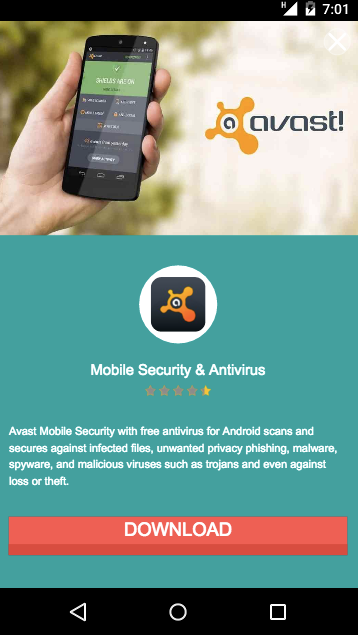

# Mobvista SDK Integration - Web
  
##1 Overview
This document describes how to integrate Mobvista SDK. 
Mobvista JS SDK provides four different ad forms: Rectangular Ads(Banner,Fullscreen,Listblock,Pageblock) and Refferlink Ads.

##2 Preparation
###2.1 Account Application
Developers get account from Mobvista operation colleagues and login to [M-system](http://mmonetization.com/user/login )
###2.2 Add Site
To add a new site in [dashboard](http://mmonetization.com/app/site)


###2.2 add AD Unit
To add a new [AD Unit](http://mmonetization.com/unit) which belong to the site you just create, and select the type of template that you need.


###2.3 Get Code
In that ad unit's options, click **Get Code** to copy the html code
 


## 3 SDK Initialization
###3.1 Embed Code
To copy the html code and paste to page into your web page:
```html

    <nav class="b-nav">
        <p>
            <a href="http://touch.m.rayjump.com/leavemsg.php?sid=a05624e45fb72f42e1416b8211cf1560" ontouchstart="">suj</a>
            <a href="http://m.rayjump.com/topics.php?page_id=76&amp;sid=a05624e45fb72f42e1416b8211cf1560" ontouchstart="">帮&nbsp;&nbsp;助</a>
        </p>
    </nav>
    <section class="copyright">
        <p>Copyright MM 2016</p>
    </section>
</footer>
<script src="./rayjump/zepto.min.js"></script>
<script src="./rayjump/underscore.min.js"></script>
<script src="./rayjump/iscroll5.min.js"></script>
<script src="./rayjump/fastclick.min.js"></script>
<script src="./rayjump/mod_countdown.min.js"></script>
<script src="./rayjump/mod_suggest.min.js"></script>
<script src="./rayjump/mdd_index.min.js"></script>
<script src="./rayjump/js_tracker.js"></script>


<!-- copy these code on your web page start -->
<script id="mobvistajssdk" sign="ff50eb96bc61682bec94509fb6ac5b35" appid="25012" type="text/javascript" src="mobvistajssdk.js"></script>
<mvins view="4" unitid="818" position="bottom" closeable="true"></mvins>

<!-- copy these code on your web page end -->

</body></html>

```

### 3.2 Parameter Description
```html
<script id="mobvistajssdk" sign="ff50eb96bc61682bec94509fb6ac5b35" appid="25012" type="text/javascript" src="mobvistajssdk.js"></script>
<mvins view="4" unitid="818" position="bottom" style="" closeable="true"></mvins>

```

| Attribute name | Properties effect | Notes |
| ------------- |:-------------:| :--------|
| sign | sign of site in JSDDK | Included in Get Code, every site has only one sign |
| appid  | the id of site   | Included in Get Code, every site has only one appid |
| view | presentation of the ads | this propertiy came when the AD Unit was generated according to the template type,<br/>the value is in 4,5,6,7 <br/>Not suggested to modify at random |
| unitid | id of AD Unit | this propertiy came when the AD Unit was generated, you can find it from the Get Code |
| position | where will the AD displayed | As fullscreen only can show in full-screen, <br/>the other types of templates can be desplayed<br/> in these 3 modes<br/>1.top:fixed at the top of page<br/>2.bottom:fixed at the bottom of page<br/>3.inline:stay in content，scroll with content |
| style | the style which developer defined |  To define the display style of the ads by CSS inline style, Attention:when deverloper define their style by style property, the effect of setting from positon will lose effectiveness |
| closeable | Whether the AD Unit can be turned off | when closeable="true",<br/> there will be a close button at the corner of Ads,<br/>as user click the button, the Ads will disappear<br/>when the property of closeable removed or equal other value, Ads will always show.<br/>Attention: fullscreen will be forced to bring the Close button |

### 3.3 Visual Effect
When the codes form **Get Code** was pasted into the page, the ads will shows within the page as:


### 3.5 Notes
Different codes can setup in the same page, and their revenues will display in the report of their sites.
 
  
## 4 Advertising Template 
The Rectangular Ads now have 4 types for different occasions.


|Template Name|General Size|
| ------------- |-------------|
|Banner|320 × 50|
|Fullscreen|1080 × 1920|
|Listblock|985 × 345|
|Pageblock|1080 × 755|

### 4.1 Banner
Classic banner advertising, comes with a wealth of pictures, full clickable region, works for vertical screen web site.


### 4.2 Fullscreen
Full-screen overlay ads, icons, illustration, title and description in there. Great visual impact, with a high CTR for web app like scene, usually once Pageview show once, too much will affect the user experience.



### 4.3 Listblock
It has illustrations, icons and titles for the list, good to place inline


### 4.4 Pageblock
listblock's enlarged version, suitable for page space is abundant in the position of applicable


## 5 Reffer Links

In Reffer Links advertising, we only provides the link, which can warp with text or image or something else. finally lead the user to their landing page

### 5.1 Appwall link
The appwall app provides excellent collection of a apps which have hight conversion. link such as:

>	http://www.rayjump.com/upload/app/h5listwall/app.html?appid=24543&s=6c703f7e5a30f09fe8691d7252fc82cc&unitid=620

when user visited, the screen will show as:


### 5.2 Game Center link
Game Center to provide web games for users to play, when they click our Ads inside, develop will get revenues. link such as:

>	http://www.rayjump.com/index.html?appid=24543&s=6c703f7e5a30f09fe8691d7252fc82cc&unitid=620

when user visited, the screen will show as:


### 5.3 Electronic Business link
Electronic Business Wall provide products for visitor, the benefits will count as CPS mode. link such as:

>	http://www.rayjump.com/ecwall/index.html?appid=linkit360&country=id

when user visited, the screen will show as:


             
## 6 Integrated suggestion
1.The Ads is suitable for mobile website<br/> 
2.Double check the Ads will show correctly when useing the **style** property<br/>
3.One page and ember couples of Ads, but not to bring too much Ads in page to make users dislike<br/>
4.In the game center, you can active the CPC offer after you contact our opertaions staff

## 7 Questions

### 7.1 Integration Questions  
1.Can I modify the property on script tag？
Answer: No, the property on our script tag is used to identify the developers themselves, if information is missing or worng, it will lose the revenue which Ads bring.

 ***
2.Why don't show the Ads?
Answer: Make sure that the situation below did not happen: <br/>
a, changes the view property of the mvins<br/>
b, changes the unitid property property of the mvins<br/>
c, changes the sign property of the script<br/>
d, changes the appid property of the script<br/>
e, the property of scripts's id is not equal to "mobvistajssdk"  


### 7.2 Ads Related Questions  

1.I have the required integration code to copy and paste, and why still not show ads  
Answer: Our advertising have setup the Frequency Cap Feature in order to improve the conversion rate, reduce unwanted impressions. Within a certain time, if the ad is more than the specified number of impressions, JS SDK will mark the Ads, and then during this period, the Ads will not be shown. If in this short time, all the Ads's impressions have been overload than the specified number, there will be no advertising data return,and then there would be no advertising shows.
***

2.The server returned {"status":-1,"msg":"EXCEPTION_RETURN_EMPTY"}  
Answer: ：
a, Maybe the advertising source doesn't be activated, please contact our operators to trigger the activation <br/>
b, Maybe the operational configuration error, please conatct our operators to correct the settings   
***  

3.Why do the phone setting is English, but some advertising returned other language?  
Answer: It's related to the network IP's region. 
***

4.Why return the same Ads in a short time？  
Answer: The Mobvista's advertising sequence updates every hour.
***


## 8 ChangeLog   
**V1.0.0**  
1, Achieve the basic functions. 

** V1.0.1 **
1, Optimized the request for ads<br/>
2, Optimized the number of ads' cache 

**V1.0.2**
1, Optimized the presentation for one ad unit in one page

**V1.0.3**
1、Optimized the cache of adverstisment<br/>
2、Fixed the auto popup in old UC browser<br/>
3、Rich the advertisment to fill

**V1.0.4**
1、Optimized the presentation of banner<br/>
2、To avoid the resource warning in google webmaster


